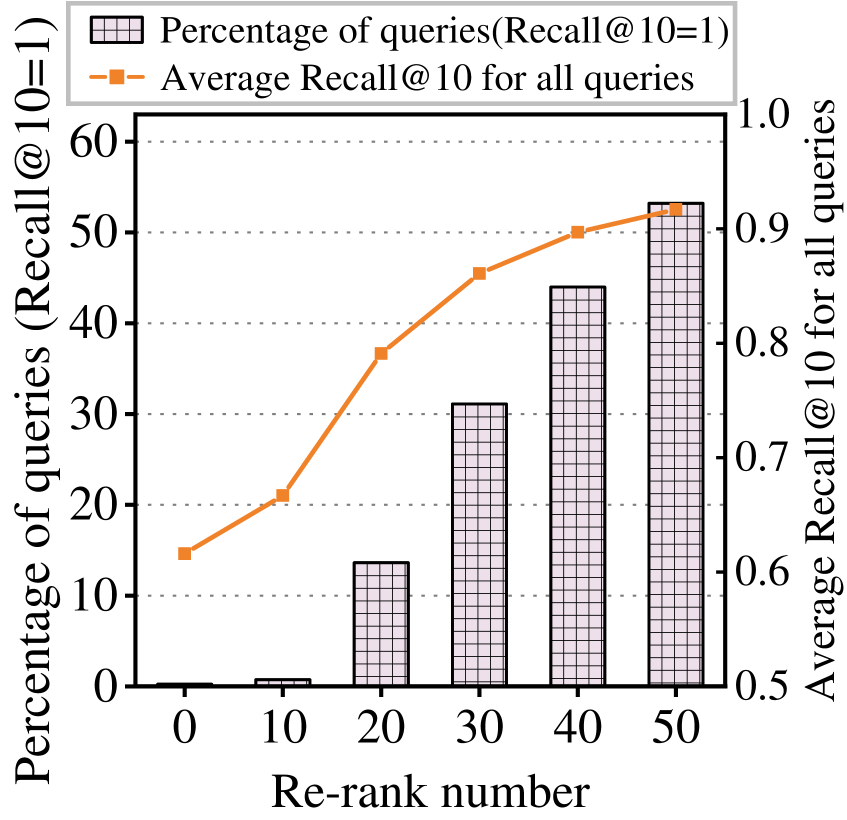

# Emerging memory technologies and their impacts on multi-modal applications

## Impacts on Multi-Model Applications


    - Faster cross-modal data retrieval(e.g., vision+text at once)
    - Easier for CPU, GPU, FPGA to share large multi-modal datasets

## Vector Search
- vector search
    - 基本流程：
        - 特征提取(Embedding): 通过BERT/CLIP等将原始数据转换为定长向量
        - 索引构建(Indexing): 为了快速查询，对vector集合建立索引(ANN - Approximate Nearest Neighbor算法)
        - 查询(Query): 
        - 相似度度量：欧氏距离，内积 或者 余弦相似度
    - ANN 算法
        - 暴力搜索 Brute-Force
        - 倒排 + PQ
        - 图结构：如HNSW（Hierarchical Navigable Small World）在图中导航快速找到近邻
        - 哈希方法(LSH)：将高维向量hash到 bucket 中，减少比较次数

## Papers

### Characterizing the Dilemma of Performance and Index Size in Billion-Scale Vector Search and Breaking It with Second-Tier Memory
```shell
Characterizing the Dilemma of Performance and Index Size in Billion-Scale Vector Search and Breaking It with Second-Tier Memory
- SJTU
- May 7 2024
```
- Key Point
    - 数据集 & 索引常存储在 SSD 上，Search受到I/O带宽限制 (the coarse-grained access of SSD **mismatches** the fine-grained random read required by vector indexes)
    - 为缓解I/O瓶颈，现有索引（图索引与聚类索引）典型做法是扩大索引规模：添加更多边或复制更多向量，以提升SSD带宽利用。但这会导致5.8–7.7×的数据膨胀（index amplification），增加存储成本
    - Motivation：RDMA/CXL 互连的远程 DRAM 或 NVM 等第二阶内存，兼具存储设备的容量与内存的细粒度访问（256 B 对比 SSD 的 4 KB），可天然契合向量索引的访问模式
    - Challenges：
        - second-tier memory access latency > local DRAM
        - 利用 RDMA/CXL等second-tier memory 细粒度的I/O优势
    - 针对图索引的优化
        - pipeline：跨查询间的异步I/O与计算并行
            - 发出内存读请求后，不等待其完成，立即切换至其他查询的distance计算
        - 细粒度存储：second-tier中不按照SSD的方式进行大块对齐和填充；改为使用CSR(Compressed Sparse Row)存储格式，减少存储碎片
    - 针对聚类索引的优化
        - 将向量与metadat分开存储，只在cluster中保存向量地址（8B），复制时仅复制地址，避免向量复制带来的开销
        - Though the decoupled layout can reduce the index size, it also decouples the original 0.1–2.2 MB I/O in to 60–68 × small random I/Os (100–384 B). 通过预处理做cluster-aware group 合并small node。回复读取的空间局部性

### CXL-ANNS
```shell
CXL-ANNS: Software-Hardware Collaborative Memory Disaggregation and Computation for Billion-Scale Approximate Nearest Neighbor Search
- ATC 2023
- KAIST
```
- Key Point
    - 传统方法要么压缩向量、降低准确度（compression approaches），要么将索引放在 SSD/PMEM 上，牺牲性能（hierarchical approaches），都无法同时兼顾高吞吐、低延迟和低存储放大
    - 利用CXL将DRAM串联成可拓展和组合的 second-tier memory pool + 使用CXL-ANNS(关系感知缓存，预取，parallel等技术) 提高性能。
    - Challenges:
        - 访问粒度与延迟不匹配：CXL access Lat > DRAM, 直接存储索引会拖慢Search
        - 大规模图遍历：ANNS 的图遍历从单一入口节点开始，随着跳数增加访问稀疏，如何识别热点节点并缓存，减少远内存访问？
        - 硬件协作设计：CXL RC 与 EP 如何协同分担计算与数据传输，最大化并行度？
        - 依赖性与调度：传统 ANNS 的 kNN 查询串行依赖严重，无法充分利用异构硬件并行能力，需重构执行依赖。
    - 核心设计：
        - 关系感知图缓存
            - ANNS 与靠近入口节点的图结构被访问的频率越高
                - 距离入口节点近的节点信息/vector等缓存在本地DRAM
                - 其他热点数据放置在CXL pool中
                - 动态 + 静态分析图访问频率，确定缓存集
            - Foreseeing Prefetch
                - 异步预取下一级节点数据到local DRAM,隐藏CXL Lat
                - 如何预测：利用图遍历的“最佳优先”特性
            - CXL 协同kNN search
            - 将kNN 查询拆分成 urgent + deferable 子任务，基于子任务优先级 + 可并行性来动态插入 deferable 子任务到计算空闲窗口

```shell
HM-ANN: Efficient Billion-Point Nearest Neighbor Search on Heterogeneous Memory
- NeurIPS 2020
- University of California, Merced
```

### 建议
- ANNS算法有哪些；根据CXL + DRAM的读写特性
- 算法的区别

### [FusionANNs](https://arxiv.org/html/2409.16576v1)
```shell
FusionANNS: An Efficient CPU/GPU Cooperative Processing Architecture for Billion-scale Approximate Nearest Neighbor Search
```
- Key Point
    - ANNS 是 高内存 + 高计算密集型 application
        - 现有方法来降低ANNS所需的内存成本
            - Hierarchical Indexing (HI)
                - CPU memory, GPU HBM, SSD
            - Product Quantization (PQ)
        - GPU 被用来加速 ANNS 中的大量distance 计算。但是随着数据增加 + HBM容量优先，I/O成为主要bottleneck
        - ANNS系统面临的挑战：
            - 为了提高Search的准确性和效率，大多数ANNS系统利用复制策略构建高质量的 IVF 索引，其中边界向量被复制到相邻的发布列表中。这可以显著扩展索引的大小，8× memory开销
            - PQ 量化会导致精度损失
            - vector的大小通常在128 Byte, 但是NVMe SSD的最小处理单位是 4KB，导致显著的读取放大
                - Re-Ranking过程需要向SSD上发送大量I/O请求
                - re-ranking 与 ANNS的准确率相关
                  
        - IVF Indexing
    - 本文解决的挑战
        - Hierarchical Indexing需要 cross 设备数据分布的设计来减少频繁的CPU - GPU 之间的数据传输
            - 将索引结构分层：
                - SSD存储 raw vectors
                - GPU-HBM 存储 PQ vectors
                - CPU memory 存储 graph indexing
        - 为了查询准确率，re-ranking 难以避免，但是re-ranking会造成大量I/O，需要在给定的准确率约束下，让每次查询都尽可能少执行re-ranking
            - Heuristic Re-ranking： 预设一个较大的re-ranking次数，但是检测到准确率满足后停止继续re-ranking
        - vector 细粒度 vs NVMe 4KB => 读放大
            - Redundant-aware I/O Deduplication: 识别并消除冗余的I/O请求

### [BANG](https://arxiv.org/html/2401.11324v4)
```
BANG: Billion-Scale Approximate Nearest Neighbour Search using a Single GPU
ArXiv 4/12/2025
```
- [Source-Code](https://github.com/karthik86248/BANG-Billion-Scale-ANN)
- Key Point
    - 结合数据压缩，CPU-GPU协同处理，内存管理，实现在单个GPU上处理十亿级ANNS的能力
    - ANNS 计算distance 计算密集型 => GPU加速
        - 基于图的ANNS算法 依赖读取graph index + vector data
        - PCIe 4.0 的峰值理论data transfor 速度 32GB/s (I/O bottleneck)
    - Graph Index
        - A graph-based ANNS algorithm runs on a proximity graph, which is pre-constructed over the dataset points by connecting each point to its nearby points. 
        - 选择效果最好的 the Vamana graph index