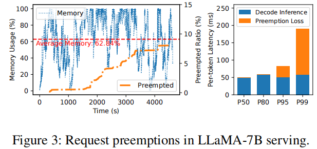
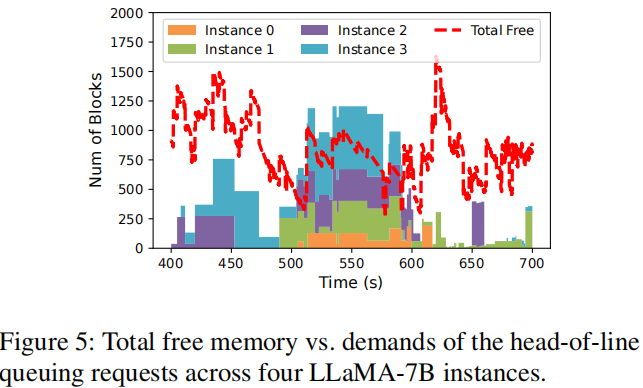
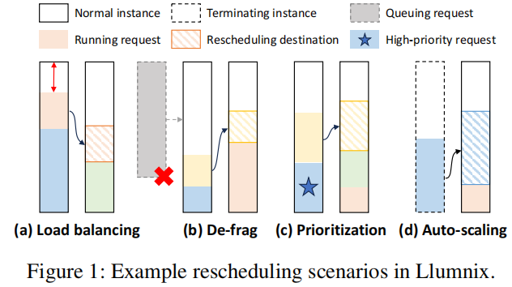
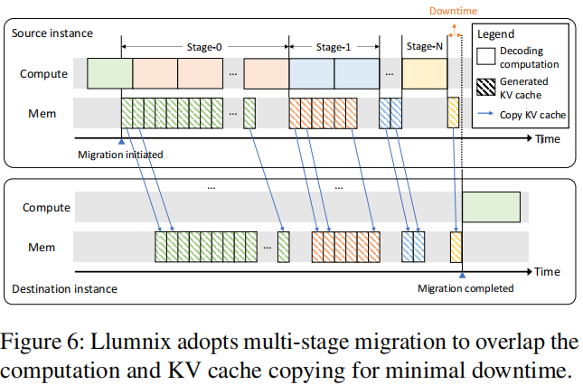
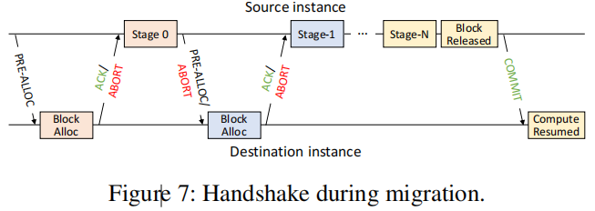
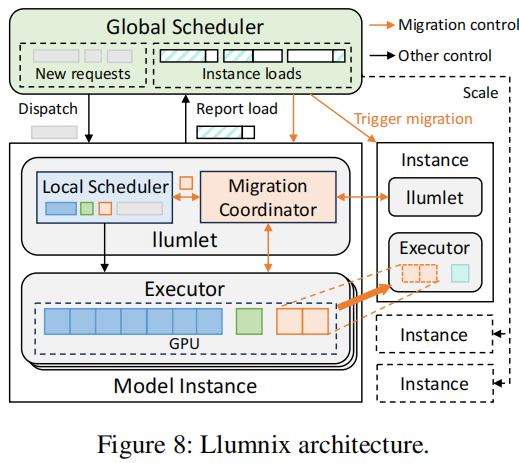
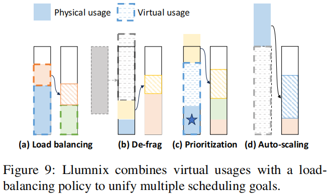

# Llumnix: Dynamic Scheduling for Large Language Model Serving
Institution: Alibaba Group
Conference: OSDI 2024
Paper Link: https://www.usenix.org/system/files/osdi24-sun-biao.pdf
Source Code: https://github.com/AlibabaPAI/llumnix
OSDI Link（contains Presentation）: https://www.usenix.org/conference/osdi24/presentation/shubha

### Kek Point
- rescheduling LLM inference requests at runtime across model instances.
- load-balance for each instance 

### Problems
- Unpredictable memory demands and preemptions
    - Test 2000 requests on vLLM, the average memory usage is 62% while 8% of the requests still being preempted.
    - 极端case: the P99 request experiences a total preemption loss of 50 seconds, be preempted twice.X

    

- interference among requests
    - focus on decode steps, with different seq-length, the batch_size will be differ, the decode latency will also change

- Memory fragmemtation
    - Even use PagedAttention, external fragmentation still exists.
    - Test a service system with 4 instance, For most of the time span, the total free memory can accommodate the queuing requests on at least three instances (sometimes all of them). The request are queuing despite enough total memory because they exceed the free space on their own instances.
        - My understanding: 不同的request被分配不同的instance，在每个instance内部，因为request 长度不同，所需的memory不同导致无法allocate。但通过re-scheduling + 全局schduling，可以在部分instance上清理出足够的memory space给对应的new requests

    

- Different emergency and priority of requests
    - requests from different applications and scenarios naturally come with different latency objectives.
    - Online chatbots vs Offline applications(like evaluation, scoring, or data wrangling)

### Motivation
- rescheduling LLM inference requests at runtime across model instances.
    - Combined with dispatching and auto-scaling

    

### Challenges
- Recompute the KV cache of historical tokens after re-scheduling is in-efficent
- Data migration Costs

- Solutions:
    - live migration
    - combine global and local scheduling to decentralize the scheduling decisions and the coordinated migration actions

### Design Details
- Live migration of LLM Requests
    - The KV cache is append-only
    - safely copy the KV cache of previous tokens in parallel with the computation for new tokens
    - borrows the key concept introduced in virtual machine(VM) live migration
    

    - New Challenges:
        - The requests finished or preempted during the data migration
        - The memory space in destination instance is not enough for data migration (decode + continus batching)

        - Solution: Handshake during migration
        

- Distributed Scheduling Architecture
    - Cluster-Level Global Scheduler
        - for new requests, determine which instance it should be allocated
            - based on request length + the freed memory size on each instance.
        - trigger migration across instance
            - just pairs the source and destination instance.
            - the llumlet will decide the requests to migrate and execute the migration automatically
        - control the instance auto-scaling

    - Instance-Level Local Scheduler & Migration Coordinator (called llumlet)
        - track and schedule the running requests
        - calculate the memory load of the instance, not only the physical memory, but also the "virtual usage".
    
    

### Dynamic Scheduling Policy
- "Virtual usage": 
    - To implemente load-balance and create-free-space-on-one-instace, Lluminix set a virtual usages of certain requests to make the instance cirtually overloaded, the the load balancing policy will be triggered to migrate the requests to other instances.
    - For high priority requests, set a "headroom" on instance to protect it's execution.
    

- Dispatching Policy:
    - high-priority & normal priority
    - scheduling high-priority requests first
    - within the same priority, use first-come-first-serve order

- Migration Policy:
    - periodically
    - set a threshold for each instance, and select the instance free-space 
        - smaller than min-threshold
        - greater than max-threshold
    - pair the lowest free-space instance with highest free-space instance repeatedly

- Auto-Scaling Policy
    - set a threshold, 长期<阈值，会release instance

