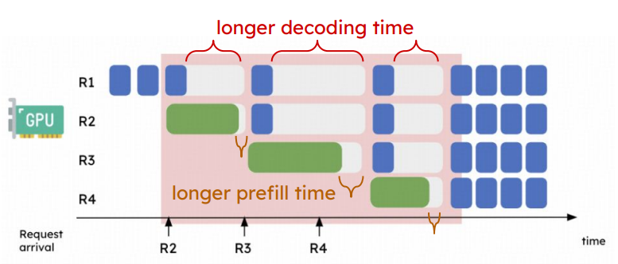
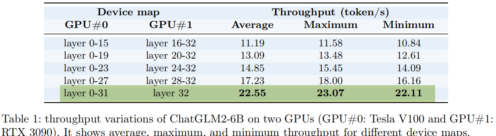
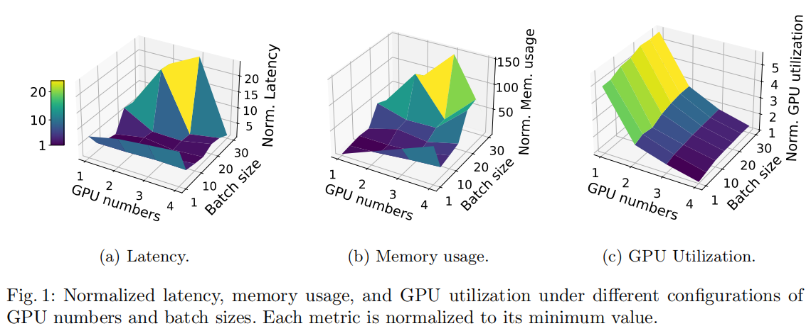
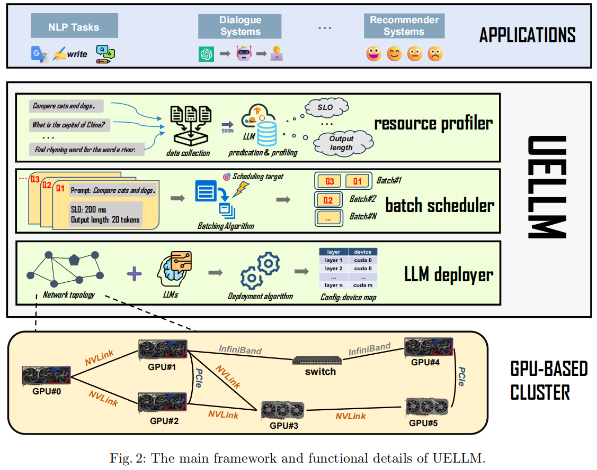
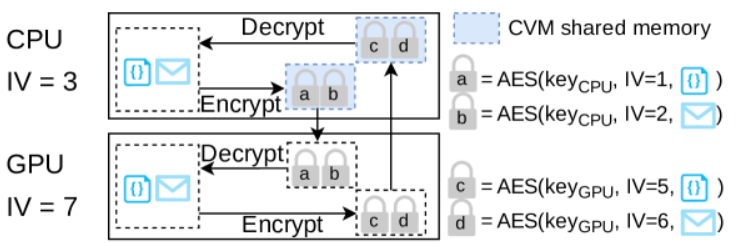
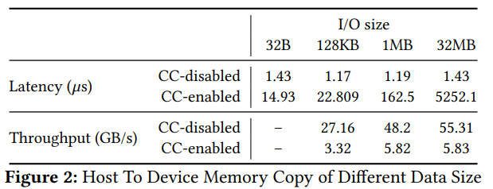
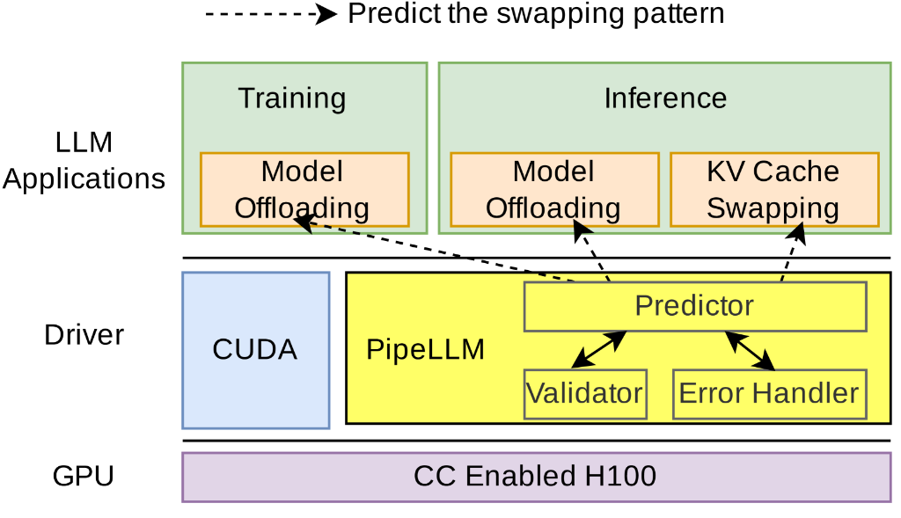

# Sequential Parallelism
- It is also used for long context requests  
[Sequential Parallelism](./Sequential-Parallelism.md)

# Complex requests
- There are relations between requests  
[Conplex-Requests](./Complex-requests.md)

# Others

### Title: Llumnix: Dynamic Scheduling for Large Language Model Serving
Institution: Alibaba Group  
Conference: OSDI 2024  
Paper Link: https://www.usenix.org/system/files/osdi24-sun-biao.pdf  
Source Code: https://github.com/AlibabaPAI/llumnix  

[Personal-Understanding](./Llumnix-OSDI2024.md)

### Title: DistServe: Disaggregating Prefill and Decoding for Goodput-optimized Large Language Model Serving
Institution: Peking University（Xin Jin） & UC San Diege  
Conference: OSDI 2024  
Paper Link: https://www.usenix.org/conference/osdi24/presentation/zhong-yinmin  
Source Code:

##### Key-Point
- Problems: 
    - the interference between prefill and decode phase

    

    - Resource and Parallelism Coupling, while the prefill and decode requires different scheduling policy
        - Prefill : compute-bound
        - Decode: memory-bound
- Solution:
    - Let the prefill and decode stage be executed on different devices.

[Personal-Understanding](./DistServe.md)

### Title: FastDecode: High-Throughput GPU-Efficient LLM Serving using Heterogeneous Pipelines
Conference: ArXiv 18 Mar 2024  
Paper: https://arxiv.org/abs/2403.11421  
Auther:   
- Jiaao He, Jidong Zhai
- Tsinghua University

### Title: MuxServe: Flexible Spatial-Temporal Multiplexing for Multiple LLM Serving 
Conference: ICML 2024   
Institution: The Chinese University of Hong Kong   
Paper Link: https://arxiv.org/pdf/2404.02015   

### Title: HexGen: Generative Inference of Foundation Model over Heterogeneous Decentralized Environment
Conference: ICML 2024   
Institution: HKUST & ETH & CMU   
Paper Link: https://arxiv.org/abs/2311.11514  

### Title: InferCept: Efficient Intercept Support for Augmented Large Language Model Inference
Conference: ICML 2024
Institution: UCSD
Paper Link: 

### Title：UELLM: A Unified and Efficient Approach for Large Language Model Inference Serving
Conference: ArXiv Sep 24 2024   
Institution: Shenzhen Institute of Advanced Technology, CAS    
Paper Link: https://arxiv.org/html/2409.14961v1

##### Key Point
- Scheduling with limited SLO
- Problems for existing real-time inference services:
    - increasing the number of GPUs may lead to a decrease in inference speed due to heightened communication overhead, while an inadequate number of GPUs can lead to out-of-memory errors. 
    - different deployment strategies need to be evaluated to guarantee optimal utilization and minimal inference latency. 
    - inefficient orchestration of inference queries can easily lead to significant Service Level Objective (SLO) violations.
- Two Challenges:
    - the challenge of efficiently batching diverse inference requests (different length)
    - the difficulty of effectively utilizing resources during LLM inference due to the extensive search space and diverse model structures.
- Onservations:
    - Slight changes in deployment configurations can have a significant impact on LLM inference performance.

    

    - Batching multiple requests can reduce the SLO violation rate of LLM inference services under a large number of inference requests.
        - Requests may arrive at different times
        - Requests may have vastly different input and output lengths.

    
- Solutions:
    - resource profier
        - key point: predict the LLM output length, 
        - use a fine-tuned ChatGLM3-6B model to predict the output length (more than 80% accuracy)

    - batch scheduler
        - batching requests with similar input lenth and output length, also considered the total latency
        - SLO-ODBS algorithm: consider the total latency $T_l$ and total output length $T_o$

        $$
        \max_{w_1,w_2}{\left(w_1*T_l+w_2*T_o\right) <= Threshold}  \\
        \\
        T_l = \sum_{i=1}^{N}{\left(\left(SLO_i+L_{CM}\right)*\left(|batch_c|+1\right)*L_1\right)} \\
        \\
        T_o = \sum_{i=1}^{N}{\left(\left(Length_i+O_{CM}\right)*\left(|batch_c|+1\right)*L_2\right)}
        $$

        - paramters
            - $batch_c$: the current batch to be combined
            - $L_{CM}$: the current maximum latency 
                - CM is the current maximum composite netrix
            - $O_{CM}$: the current maximum output length
            - $L_1$, $L_2$ represent the additional overhead due to parallel computing
            - weights $w_1$ and $w_2$ to balance the importance of these two factors

    - LLM deployer
        - arranges the layers of the LLM according to the topology of the current system’s hardware accelerators and the computational characteristics of each LLM layer.
        - => a dynamic programming problem

    

### Title: Apparate: Rethinking Early Exits to Tame Latency-Throughput Tensions in ML Serving 
Institution: Princeton   
Conference: ArXiv 23 Sep 2024   
Paper Link: https://arxiv.org/abs/2312.05385   

##### Key Point
- Problem:
    - two competing goals: ensuring high throughput given many requests, and delivering low-latency responses to support interactive applications

- Early Exist: 
    - the key premise is that certain ‘easy’ inputs may not require the full predictive power of a model to generate an accurate result.
    - results for such inputs may be predictable from the values at intermediate layers.

### Title: FIRP: Faster LLM inference via future intermediate representation prediction
Institution: Peking University & Meta AI   
Conference: ArXiv 27 Oct 2024   
Paper Link: https://arxiv.org/pdf/2410.20488   

##### Key Point
- Like Medusa
- introduce a novel speculative decoding method named
FIRP which generates multiple tokens instead of one at each decoding
step. 

### Title: PipeLLM: Fast and Confidential Large Language Model Services with Speculative Pipelined Encryption
Institution: SJTU & Northeastern   
Conference: ASPLOS 2025   
Paper Link: https://arxiv.org/pdf/2411.03357    

##### Key Point
- The security risks for LLMs; 
    - The LLM’s reliance on high-end GPUs, many businesses opt for outsourced services, such as cloud. However, these cloud infrastructures, often complex in nature, encompass a large Trusted Computing Base (TCB), which may contain vulnerabilities, both publicly reported and zeroday

    

- The heavy encrypt and Decrypt
    
    

- Solution:
    - decouples encryption tasks from the critical path of the memory swapping mechanism, by leveraging speculative pipelined encryption
    - integrating predictions, encryptions, and data transfers into a pipeline

    - Challenges: How to predict the next several memory copies and their Initialization Vectors
        - Given n the current IV and the execution context
    
    - Observation:
        - the size of memory swapping (usually > 128KB) is significantly larger than other data transfers (usually < 8KB)
        - can distinguish model offloading and KV cache swapping by calculating their sizes ahead of time based on the target LLMs
            - parameters swap follow the Repetitive pattern (FlexGen)
            - KV cache swap follows:
                - layer-wise: FIFO
                - request-wise: LIFO (最先offload的请求最不重要)
    
    