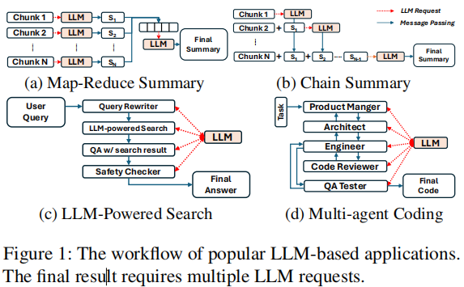

# Title: Parrot: Efficient Serving of LLM-based Application with Semantic Variable
Conference: OSDI 2024
Institution: Shanghai Jiao Tong University
Paper Link: https://www.usenix.org/system/files/osdi24-lin-chaofan.pdf
Source Code: https://github.com/MachineLearningSystem/OSDI24-ParrotServe

### Key Point

### Questions
- High-quality LLM apps often need multiple LLM requests to collaborate indifferent workflows.

    

- Existing services only observe tons of individual requests, without knowing any application=level information.

### Motivation & Challenges
- 

### Design Details