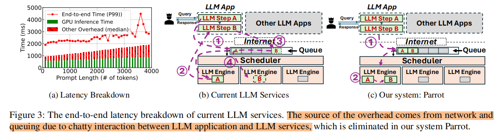
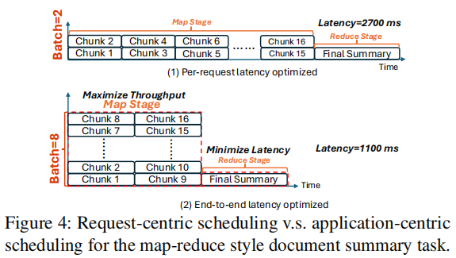

# Title: Parrot: Efficient Serving of LLM-based Application with Semantic Variable
Conference: OSDI 2024
Institution: Shanghai Jiao Tong University
Paper Link: https://www.usenix.org/system/files/osdi24-lin-chaofan.pdf
Source Code: https://github.com/MachineLearningSystem/OSDI24-ParrotServe

### Key Point

### Questions
- High-quality LLM apps often need multiple LLM requests to collaborate indifferent workflows.

    

- Existing services only observe tons of individual requests, without knowing any application-level information.

### Motivation & Challenges
- Excessive overhead of consecutive requests
    - For These long context applications, the overhead comes from network and queuing is pretty large.

    
- Misaligned Scheduling Objectives
    - the existing works focus on improve the "individual latency", But the users mainly focus on end-to-end latency.
    - disaggregation between different type's tasks

    

    - we can determine the ideal scheduling strategy, maximize the throughput.
- Redundant computations
    - Currently, most LLM-based applications exhibit a high degree of redundancy in the prompts of their requests.
    - This is why more than 94% of prefix tokens could be repetitively used across LLM requests for various users

### Design Details