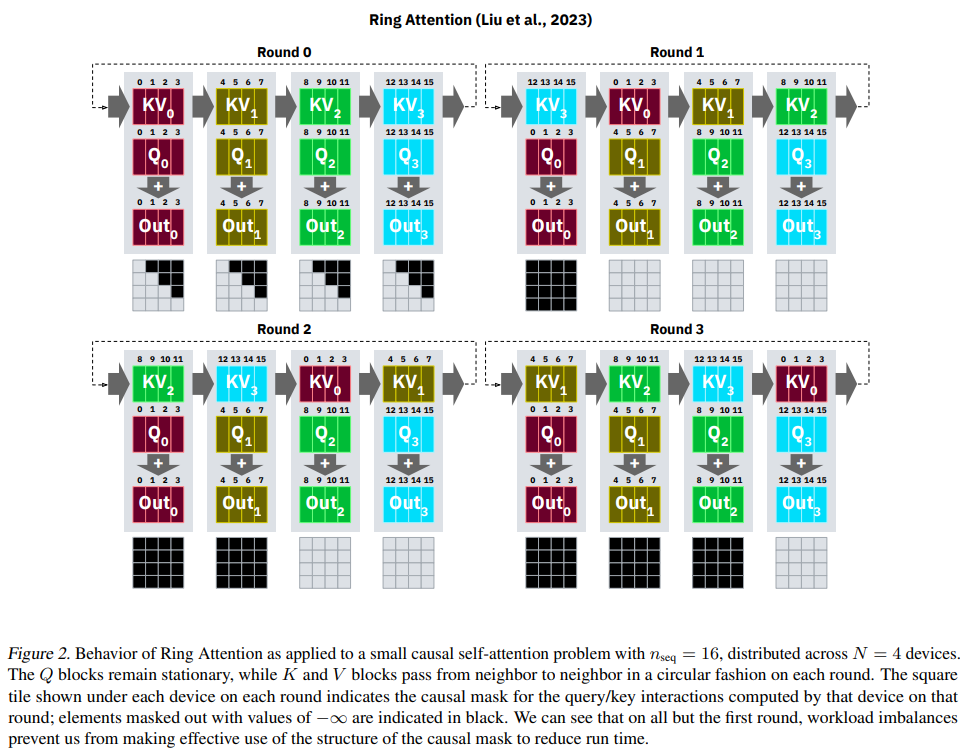
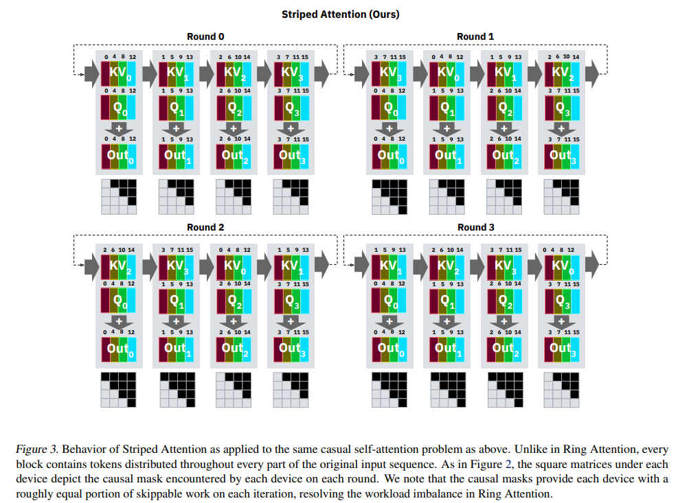
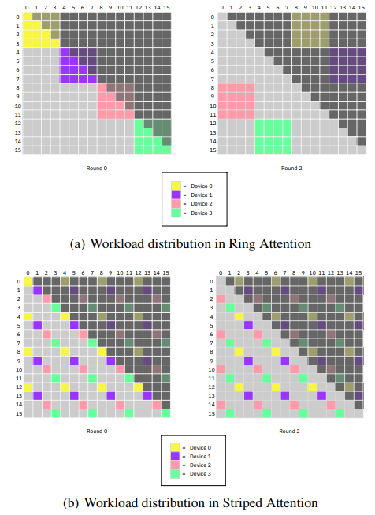
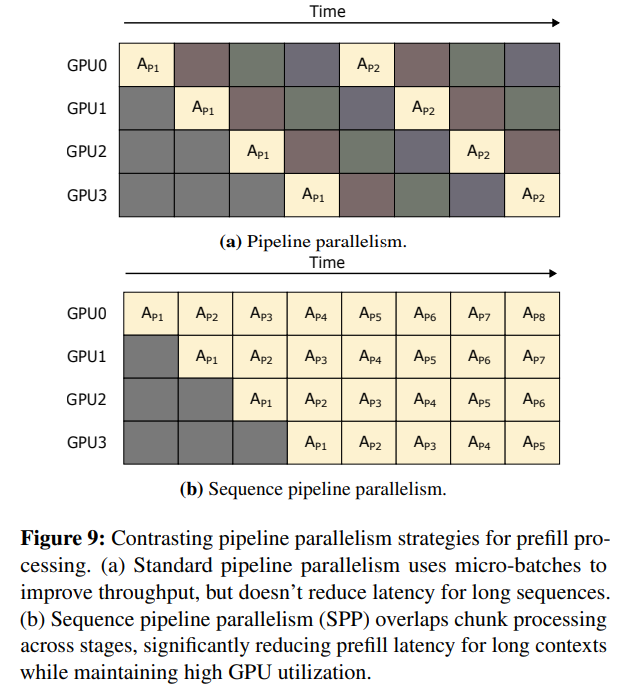
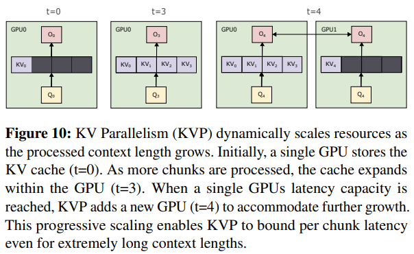
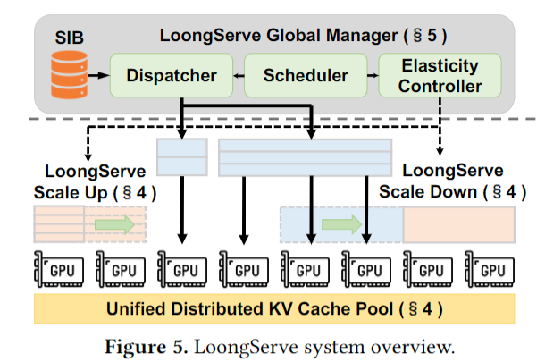
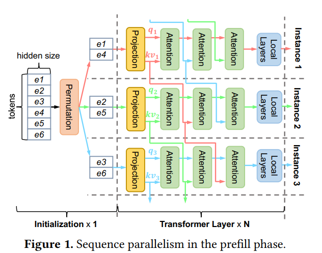

### Ring Attention with Blockwise Transformers for Near-Infinite Context 
Institution: UC Berkeley   
Conference: Arxiv Nov 27 2023   
URL: https://arxiv.org/pdf/2310.01889  

##### Key Point
- For long context, split the requests into blocks and let them be executed across multiple GPUs (For Training)
- The communication Costs

### Striped Attention: Faster Ring Attention for Causal Transformers 
Institution: MIT   
Conference: Arxiv Nov 15 2023   
URL: https://arxiv.org/pdf/2311.09431    

##### Key Point
- Do more work based on Ring Attention (For Training)
- Ring Attention will cause GPU Idle (use empty musk matrix) => workload balance

- Workloads

### Mnemosyne: Parallelization Strategies for Efficiently Serving Multi-Million Context Length LLM Inference Requests Without Approximations 
Institution: Georgia Tech, UCSD, Microsoft   
Conference: Arxiv Sep 25 2024   
URL: https://arxiv.org/pdf/2409.17264  

##### Key Point
- For LLM Inference
- Prefill Stage
    - the tokens already known, can use Sequential Pipeline Parallelism

    

- Decode Stage
    - the token is generated one by one, use KV parallelism (Based on Ring Attention, But in ring attention, the migration costs of KV cache is too large for decode stage => Keep KV cache on device, migrate and get-all Output of self-attention)
    - can insert new GPU device while resource is not enough

    

### Title: LoongServe: Efficiently Serving Long-Context Large Language Models with Elastic Sequence Parallelism 
Conference: SOSP 2024   
Institution: Peking University    
Paper Link: https://arxiv.org/pdf/2404.09526   

##### Key point
- 解决：long context场景下，1，不同request之间workload差距更大(prompt 1: 256 tokens, prompt 2: 1M tokens);   2, request prefill 和 decode 阶段的workload差距也在变大。  (KV cache带来的存储开销线性增加) 

- Existing works: DistServe 将prefill 和 decode放在不同的GPU group上: 1, data transfer的开销大，2, 静态的资源分配方式并不适配long context下的workload变化 

##### Main Idea
- Elastic Sequence Parallelism(ESP)

    

- Note: Sequence Parallelism
    - Prefill stage
        使用的Striped Attention， 
        
        将长prompt分给多个GPU，每个GPU根据分到的tokens计算去q,k,v 并得到 local attention 
        每个GPU将自己的k,v 传给下一个GPU： all-reduce 

        每个GPU接收到相邻GPU的k，v之后，更新local attention, 并继续把kv向下传递，知道每个GPU接收到全部token的KV，此时local attention就是最终的attention结果。 

        好处：prompt的KV cache存储再不同GPU device上，HBM不再成为限制context长度的原因，同时ring-reduce可以 overlap data transfer 和 computation 

        

    - Decode state:
        用了FlashDecoding的思想，KV cache依旧分布在多个GPU上，每个GPU先计算局部attention，然后在将局部attention的结果reduce到一台机器上(master - slave)，然后再master机器上计算后续的FFN。 

        这里每一块GPU可以同时是request 1，2，3，4的slave 和request 5的master。 

    - ESP：
        不再静态的将GPUs 分成prefill group 和 decode group。 而是每个GPU group都会经历 prefill 和 decode。 

        Eg: 对于group A，在prefill阶段分配了3个GPU，处理tokens: 1,2,3,4,5,6；此时GPU 1，2，3分别保存[kv1, kv4], [kv2, kv5], [kv3, kv6]；并通过ring的形式在group内传递 

        在prefill结束后，group A转为处理这批prompt的decode；此时scale down到2个GPU，此时并不引入额外的transfer开销，只需要在prefill那一轮ring的时候，GPU1选择性保留 kv3， GPU2选择性保留kv6即可。 

        Decode结束之后，group A用于处理新的request，可以scale up到3，4，5，6等任意数量 

