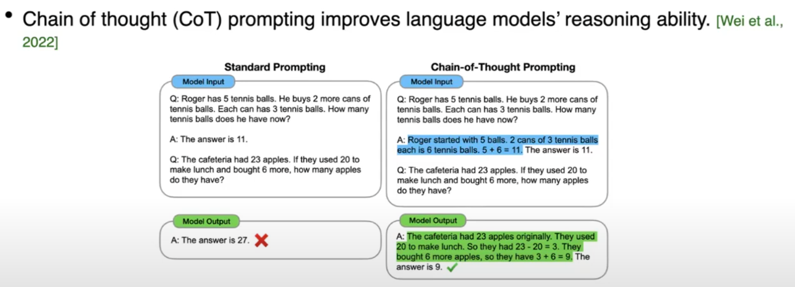
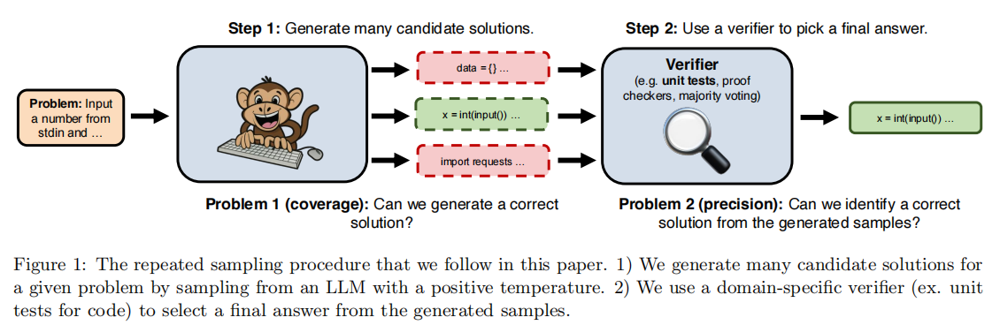
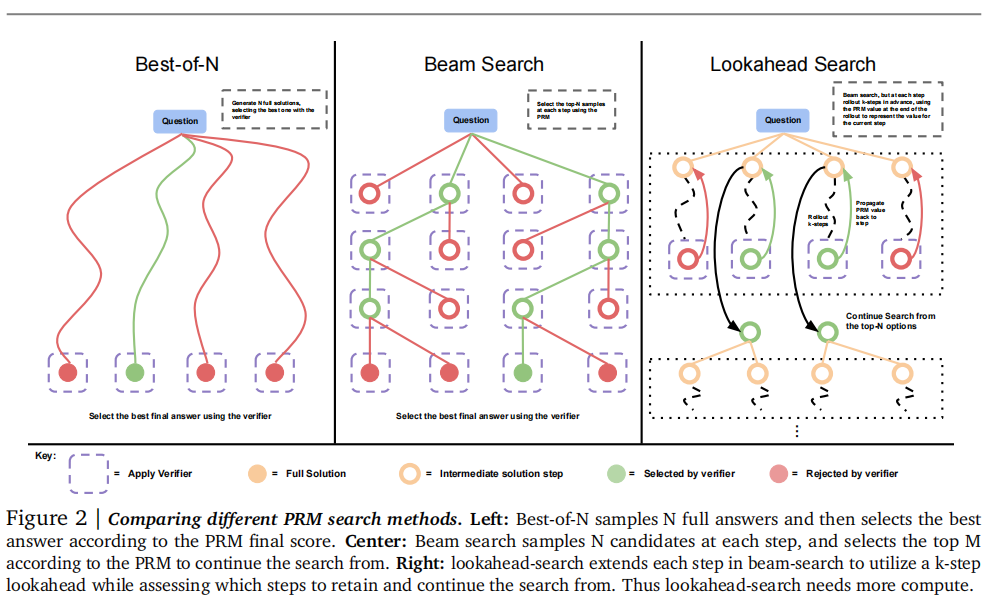
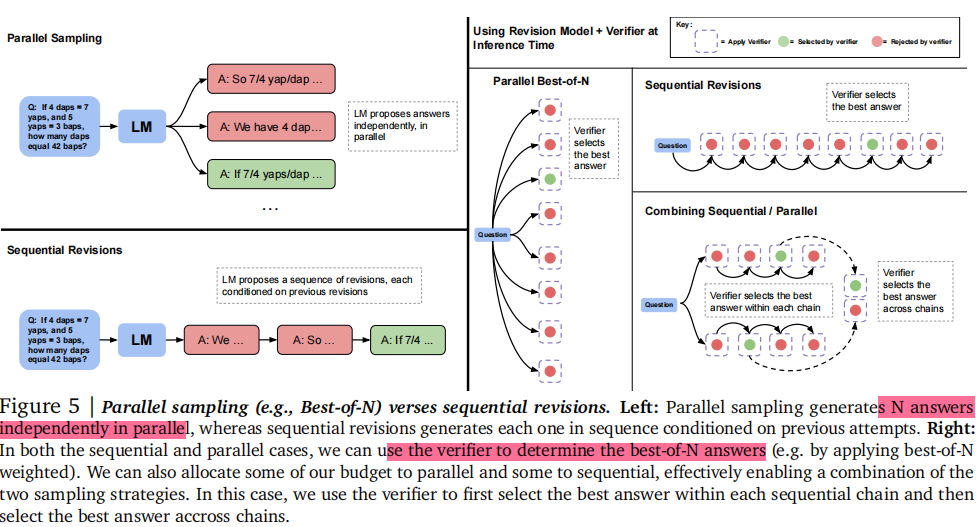
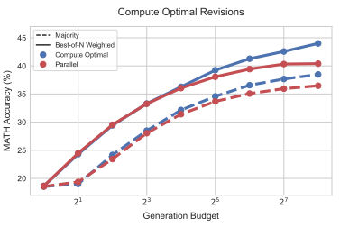
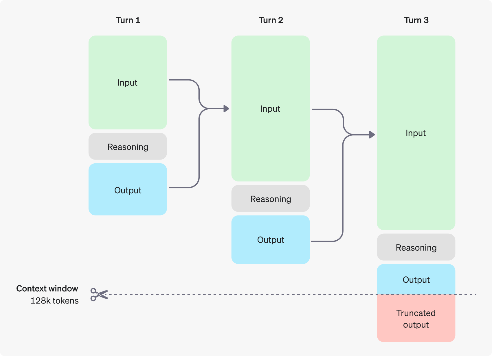

# Chain of Thought
- 2024-9-13, OpenAI 发布了新的o1推理模型，在性能上超越了GPT-4o. 并首次在语言模型领域实现了强化学习和“私密思维链”

### Title: Chain of Thought Empowers Transformers to Solve Inherently Serial Problems
Institution: Stanford & Google
Conference: ICLR 2024
Paper Link: https://arxiv.org/pdf/2402.12875
Source Code: 

##### Key Point

- Example to CoT

### Title: Large Language Monkeys: Scaling Inference Compute with Repeated Sampling
Institution: Stanford & Oxford & Google DeepMind
Conference: arXiv Sep 16
Paper Link: https://arxiv.org/abs/2407.21787
Source Code:

##### Key Point
- Use repeat sampling, the accuracy of a weaker model is better than single samples from stronger models.
    - The overall FLOPs can be decreased

### Title: Scaling LLM Test-Time Compute Optimally can be More Effective than Scaling Model Parameters 
Institution: UC Berkeley & DeepMind
Conference: arXiv Aug 6, 2024
Paper Link: https://arxiv.org/abs/2408.03314
Source Code:

##### Key Point
- Investigates how scaling test-time computation in LLMs can be more effective than increasing model size or pre-training FLOPs.
- Key Assumption: Through more test-time computation, the performance of LLMs can be promoted. (The quality of the answer)

- This paper focus on Testing: For math problems with different difficulty, test different test-time compute mechanism.
    - Use pretrained LLM Model: PaLM 2-S
    - Optiomizing a Varifier (PRMs)
        - process-based verifier reward models as step scorer + step/process search methods(step level sampling: Best-of-N-weighted, beam search, look-ahead)
        - Step-wise aggregation: use the PRM's prediction at the last step as the full-answer score.
        - Inter-answer aggregation: best-of-N weighted mathod, aggregated the score with similar final answers.
        
        

    - refining the proposal distribution/input token level
        - updating the Models distribution over a response adaptively, given the prompt at test time;
        - **finetune models to iteratively revise their answers.**

        

- Whether the assumption in this paper is correct?
    - Generation Budget: typically refers to the computational resources and constraints allocated for generating text.
        - In this paper, It is the test-time compute budget

    

- Whether is better in all-scenarios?
    - Compared to a ~14x larger pretrained models,
    - For easy questions, Test-time computing can provide a significant accuray improvement. But for hard questions, the big model can provide better accuracy. 

### Blog: Reasoning models
INstitution: OpenAI
Link: https://platform.openai.com/docs/guides/reasoning/how-reasoning-works

- The o1 models introduce reasoning tokens. The models use these reasoning tokens to "think", breaking down their understanding of the prompt and considering multiple approaches to generating a response. After generating reasoning tokens, the model produces an answer as visible completion tokens, and discards the reasoning tokens from its context.

- Here is an example of a multi-step conversation between a user and an assistant. **Input and output tokens from each step are carried over, while reasoning tokens are discarded.**

- Depending on the amount of reasoning required by the model to solve the problem, these requests can take anywhere from a few seconds to several minutes.
