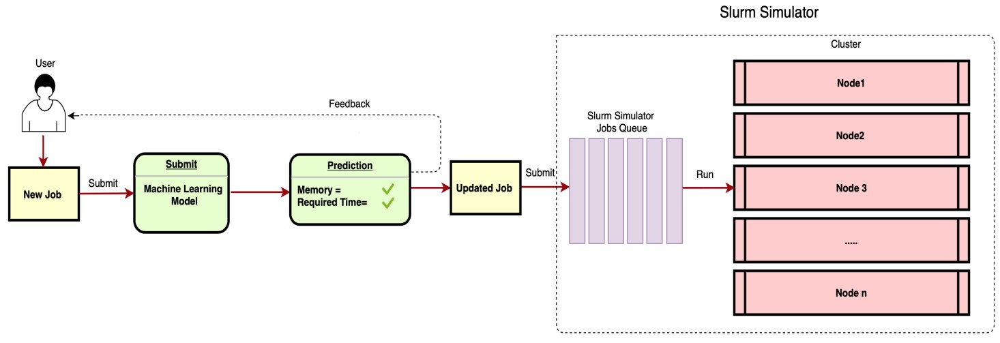
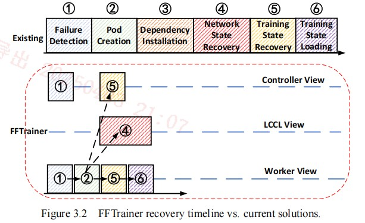
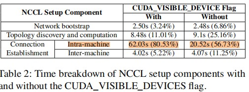
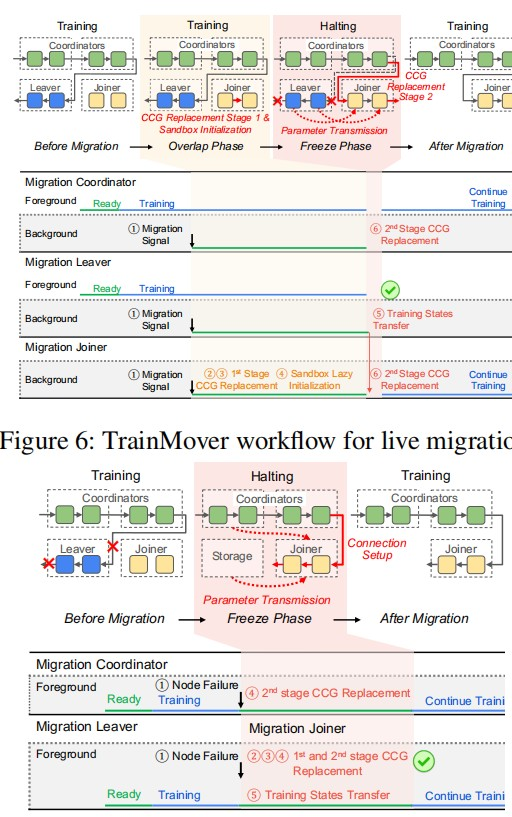

## Orion: Interference-aware, Fine-grained GPU Sharing for ML Applications
- https://dl.acm.org/doi/pdf/10.1145/3627703.3629578
- 核心内容
    - Orion通过在GPU上以单个操作符为粒度透明地调度来自多个客户端的任务，考虑每个操作符的大小、计算和内存配置文件

## Improving HPC System Performance by Predicting Job Resources via Supervised Machine Learning
- https://dl.acm.org/doi/pdf/10.1145/3332186.3333041?fbclid=IwAR1zgXKO_cS4P9GUm5ob__8vbZD8einMbnuj1CvnmARqIM7OmwoUPLEpUiI.
- 核心内容
    - 开发了一个监督机器学习模型，并将其集成到Slurm资源管理器模拟器中，用于预测作业所需的内存资源和运行时间。该模型使用了不同的机器学习算法。
    
    

## MARBLE: A Multi-GPU Aware Job Scheduler for Deep Learning on HPC Systems
- https://www.osti.gov/servlets/purl/1649080
- 核心内容
    - 多GPU环境下的DL training并非线性拓展 (增加GPU device的效果边际递减)
    - 基于FIFO的调度，允许多个DL jobs在单个node上并发运行，通过动态分配GPU资源来最小化总 jobs 完成时间

## Deep Learning Workload Scheduling in GPU Datacenters: A Survey
- https://dl.acm.org/doi/pdf/10.1145/3638757
- DL workloads & challenges
    - 资源的异构型(包括不同版本/型号的GPU device)
    - DL Training
        - Placement sensitivity: 考虑通信开销(NVLink, PCIe, 带宽争用)
        - 训练过程包括：前向，反向，参数更新；且会重复迭代多次，可以通过分析少量迭代来预测未来的GPU使用情况
        - GPU sharing： MIG，MPS，GPU虚拟化
        - 弹性训练：通过checkpoint随时暂停/恢复training job
    - DL Inference
        - 严格 latency 要求；request具有突发性和波动性，难以预测
        - GPU 利用率低；且需要以最小成本维护服务保证Lat
- Elastic Training
    - 动态改变训练job的资源分配，以提高资源利用率 和 作业效率
        - 资源弹性：动态调整GPU数量
        - 缺点：资源自动扩展的沉重抢占开销；这里的资源动态扩展也依赖checkpoint-recovery机制，当job的GPU资源变化时，首先checkpoint记录最新状态，然后调整GPU资源分配，最后在修改后的GPU分配上重建 CCL 并读取checkpoint恢复job

    - Kale: Elastic GPU Scheduling for Online DL Model Training
        - Beihang University & Kuaishou； SoCC'24
        - [论文](https://dl.acm.org/doi/pdf/10.1145/3698038.3698532?casa_token=TmphGV3SQ84AAAAA:dviLUAEyA6TAyP9upt1QRzkjd-NgxhgO5IjYmcFDWRIEfihrinH5PJ1kTUPyVPRUlSjmLOpdxL2Z)
        - 针对分布式训练中资源分配的不准确，Kale建立了新的预测模型来预测资源(结合流量，针对在线训练场景)
        - 自动扩缩容，减少了 33.1% 的停机时间
        - 基于checkpointing-recovery机制来容错和在Scale时重建训练任务

    - Unicron: Economizing Self-Healing LLM Training at Scale
        - alibaba
        - 目标：最小化GPU failure导致的停机时间 
        - In-band Error Detection
            - 在训练过程中持续监控每个训练进程的实时状态来实现带内错误检测。这是通过代理的监控线程(CPU上)完成的，这些线程跟踪训练进度、异常和通信超时。
            - 节点不可用故障：persistent connection
            - 节点内进程终止：monitor
            - 其他类型的异常：ECC；NVLink；CUDA errors
        - Efficient Transition Strategy
            - 复用部分结果
            - 最近原则
            - 说明：如果一个节点在训练过程中出现故障，Unicron会尝试利用该节点在故障前已经完成的部分计算结果，并将这些结果迁移到其他可用节点上，以继续训练
            - 
        - 备注：related work中提到了 Elasticity 解决GPU failures，通过调整parallelism setting来避免training interruptions
            - Data Parallelism: 将故障GPU上的任务重新分配给其他可用的GPU(预先分配好的)，避免训练中断
            - Model Parallelism: 当某个GPU发生故障时，系统会动态调整模型并行的分配策略，将故障GPU上的模型部分迁移到其他可用的GPU上
            - 问题：依赖checkpoint + recovery，还是需要暂停任务

# Live Migration & light Checkpoint
## CHAPTER 3 FAST-FAILOVER IN LARGE-LANGUAGE MODEL TRAINING WITH ALMOST-FREE STATE MANAGEMENT
- Problems:
    - 由于GPU的small 平均故障延迟MTBF 和 high 平均恢复延迟MTTR，是的大GPU集群训练任务极易发生failure
    - 利用现有checkpoint-recovery方法：
        - 1，checkpoint size大 & 跨多个iteration才建立checkpoint，可能丢失进度；
        - 2，failure detection依赖 communication timeout (slow); 
        - 3, 线性sync recovery开销大
- Solutions
    - instant checkpointing (每个iteration都创建checkpoint)
        - compress checkpoint size (1/10 甚至更小)
        - 利用 空闲带宽 异步将GPU A上的checkpoint 迁移到相邻的GPU B (neighboring reduendancy)
        - 仅在需要recovery时才持久化 checkpoint (lazy backup)
        - 基于Razor 和 Snapshot
    - failure detection
        - use heartbeat 来检测 Device 故障，减少failure detection Lat
    - 抽象 LCCL 层来管理 Network State Recovery 和 节点间通信
        - 将模型加载 与 network 重建 overlap
        

- Existing works
    - checkpoint技术
        - CheckFreq[50]、DeepFreeze[51]、TorchSnapshot[52]、LightCheck[53] 和 Gemini[11] 将检查点过程与其他训练步骤重叠，从而减少了检查点大小并消除了状态冗余。但是，它们无法支持当今具有数据和模型并行性的 LLM 训练。
        - Dlrover[10]、DataStates-LLM[9] 和 TRANSOM[54] 利用异步多级检查点来支持具有 3D 并行性的训练，从而允许饱和磁盘带宽。但是，这些方法尚未实现即时检查点。状态分片技术。
        - 在数据并行中，同一并行组中的所有设备都持有相同的模型分区，导致 GPU 内存浪费。 ZeRO[55-56] 和 FSDP[57] 等技术通过采用状态分片解决了这个问题，其中优化器状态、梯度甚至模型权重根据用户设置分布在设备之间（例如 DeepSpeed 中的第 1-3 阶段）。虽然状态分片可以节省内存，但它为状态恢复带来了挑战，因为如果节点发生故障，每个设备上的唯一状态可能会丢失。

## TrainMover: Efficient ML Training Live Migration with No Memory Overhead
- Problems
    - GPU disrupt 运行中的的tasks (from alibaba, 60%的大规模训练任务都遭遇了disrupted； 增加了 35%的训练时间； LLama3 训练过程中，平均没2.7个小时，就会遭遇一次MTTF)
    - cold checkpoint 开销大
        - checkpoint + replace + restart
        - jobs 要停下来： 为新的node创建网络连接 (NCCL ring)
    - HPC 的特点：
        - 资源共享，多个用户或者任务共享一个高性能集群
        - 资源分配按照作业调度系统(如Slurm)进行管理，任务需要排队
        - 资源使用通常是长期的，蛇和长时间运行的计算任务
        - 通常使用专用硬件: 如InnifiBand 网络, GPU集群
        - 依赖于并行计算框架

- Solutions
    - Live Migration: 尽可能任务不停
    - Member replacement of collective communication groups
        - 将新增节点 和 当前网络中的节点分组来看：只需要将added node创建局部CCL ring，然后将added node与原网络中的故障node 1-to-1替换即可
        - partial added nodes CCL 重建 可以不影响training任务，与training任务并行
        - global nodes CCL 重建
        - 注意： intra-connenction的CCL 重建开销更大

        

    - Sandbox lazy initialization
        - 现有的初始化，因为考虑到GPU node只计算large model的一个部分；无法确定初始化时需要加载哪些libs，以及计算图的生成；需要在第一次调用时初始化 (依赖其他GPU的输出)
        - 借助checkpoint来 异步初始化
        - 通过checkpoint 在job的第一个iteration时，记录每个GPU node的正向和反向数据 (intra-node的中间值可以不存；warm-up并不依赖具体的值(全0也可以)，可以减少checkpoint的size)
        - 按照added node 和 source node 1-to-1的映射关系，可以让node分配完资源即可开始initiation

        

## Live Migration & Checkpoint
问题：
- 由于GPU的small 平均故障延迟MTBF 和 high 平均恢复延迟MTTR，是的大GPU集群训练任务极易发生failure。
    - 数据：from alibaba, 60%的大规模训练任务都遭遇了disrupted (HPC cluster的数据)； 增加了 35%的训练时间； LLama3 训练过程中，平均没2.7个小时，就会遭遇一次MTTF。
- 现有的checkpoint-recovery方法需要停止任务 - 重新分配资源 - 从checkpoint恢复 - 继续训练，造成不小的停机时间

思路：live migration + light-weight checkpoint 最小化停机时间
- light-weight checkpoint
    - 问题1：跨多个iteration checkpoint会丢失数据；
    - 问题2：checkpoint size的大小太大
    - 问题3：checkpoint的存储：存储在GPU上占GPU内存，需要放到CPU/Memory Pool 中 => 恢复时的开销
    - 思路：
        - checkpoint per iteration (GPU压缩算法 NVcompression，GPU state)
        - compression
        - 异步传输：带宽使用
        - checkpoint 分片 + 从分片checkpoint恢复
        - multi-tier 存储
        - 传输 & compression 协同 (overlap & pipeline)
        - 传输优化算法：带宽，压缩computation cost，checkpoint size
        - 强调 ML (任务特征的区别)
- live-migration
    - 问题：需要动态调整资源时 或者 GPU设备故障时，通过live migration最小化迁移时间
    - 计划内事件(如维护，资源重平衡等)
        - leaver节点可正常工作，可以在原地继续训练
        - 并行化 warmup + CCL reinstantiation 和 训练
        - 注意：训练阶段leaver上更新的参数也需要同步给 added device (incremental update)
    - 计划外事件(如GPU Device故障)
        - leaver节点无法正常工作
        - warmup 与 CCL reinstantiation 并行执行
        - 中间数据的复用
        - data parallelism 场景下, 将请求发送给其他节点
        - model parallelism 场景下，怎么讲上游/下游的device用起来？

    - 分阶段recovery：failure detection - Scheduling(资源分配) - Job launching - Checkpoint loading - CCL reinstantiation - lazy initialization
- fail-detection/monitor
    - 问题：依赖于NCCL 超时时间来判断node loss，有延迟；如何实时的detect node fail
    - 通过heartbeat / moniter来监听GPU
    - 故障分级：有些故障是否可以原地重启，比如GPU thread killed (验证)

# https://www.one-tab.com/page/1QOuUfuYT6S3-RLg7WK55w