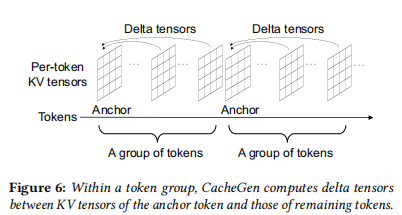
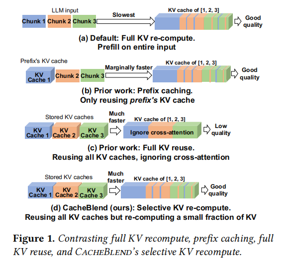
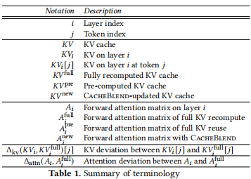
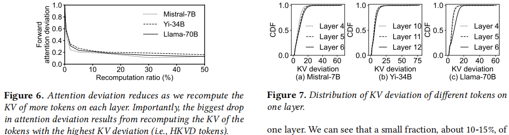
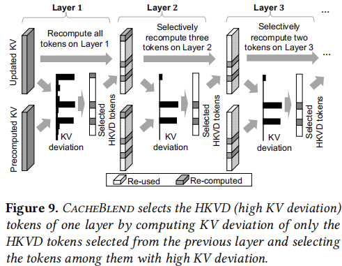

### Title: CacheGen: KV Cache Compression and Streaming for Fast Large Language Model Serving
Institution: University of Chicago
Conference: SIGCOMM 2024
Paper Link: https://arxiv.org/pdf/2310.07240
Source Code: https://github.com/LMCache/LMCache

##### Key Point
- reusing the KV cache of a context across different inputs, but it will cause data-migration costs
- unlike prior systems that optimize the KV cache in GPU memory, CacheGen focuses on the network delay for sending the KV cache.
- not keep the tensor format of KV cache, just use bitstreams
    - KV Cache encoding & decoding
        - Insights 1: with the same layer and channel, tokens in closer proximity have more similar KV tensor values compared to tokens that are further apart
            - similar with [KV-Cache Merge](https://arxiv.org/pdf/2407.08454)
        - Insight 2: The output is more sensitive to the KV cache of the shallower layers than the deeper layers
        - Insight 3: The imformation gain of grouping by their channel and layer is much higher than the information gain of grouping by their token positions
        - Delta-based encoding & decoding
            - split to groups, in each group, use first token as anchor token, other tokens only keep delta values
            - use different froups can help decode in parallel
        

### Title: CacheBlend
Institution: University of Chicago
Conference: EuroSys 2025
Paper Link: https://arxiv.org/pdf/2405.16444
Source Code: https://github.com/LMCache/LMCache

##### Key Point
- For RAG applications
    
    - the prefill in RAG applications requires necessary contexts, and not alway in the prefix, so can not be totally reused.
    
- Motivation: 
    - Goal is "When an LLM input includes nultiple re-used text chunks, how to quickly update the pre-computed KV cache, such that the forward attention matrix(and the subsequently the output text) has minimum difference with the one produced by full KV recompute"
- Ques: Does it work?
    - Selecting which tokens to recompute
        - Definition: 
            - KV deviation: $\triangle_{kv}(KV_{i}, KV_{i}^{full})[j]$ measures how much different the given KV cache on a particular token(j) and layer(i) compared to the full-prefilled KV cache.
            - Attention deviation: $\triangle_{attn}(A_{i}, A_{i}^{full})$ is the L-2 Norm of it's difference with the attention matrix $A_{i}$ and the full recomputed $A_{i}^full$
            
            

        - Insight 1:On layer i, recomputing the KV of token j who has a higher KV deviation($\triangle_{kv}(KV_{i}, KV_{i}^{full})[j]$) reduces the attention devation($\triangle_{attn}(A_{i}, A_{i}^{full})$) by a greater amount.
        
        

        - Insight 2: Tokens with the highest KV deviations on one layer are likely to have the highest KV deviations on the next layer.
    
- Solutions:
    - For first layer, re-compute all of the tokens and get HKVD tokens.
    - For the following layers, only re-compute the selected HKVD tokens.

    
