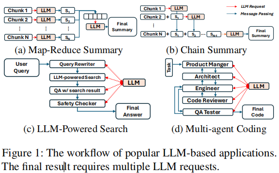
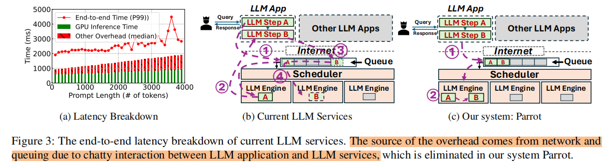
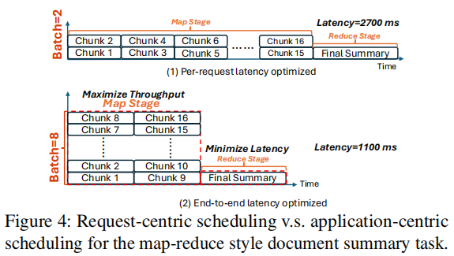
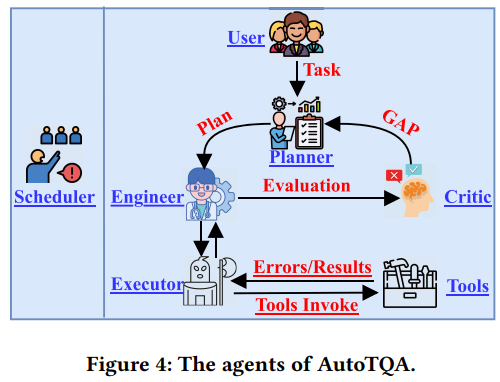
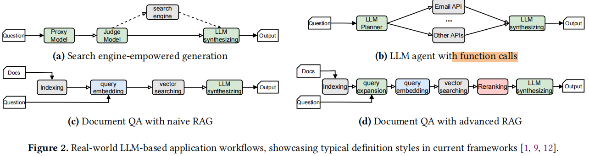
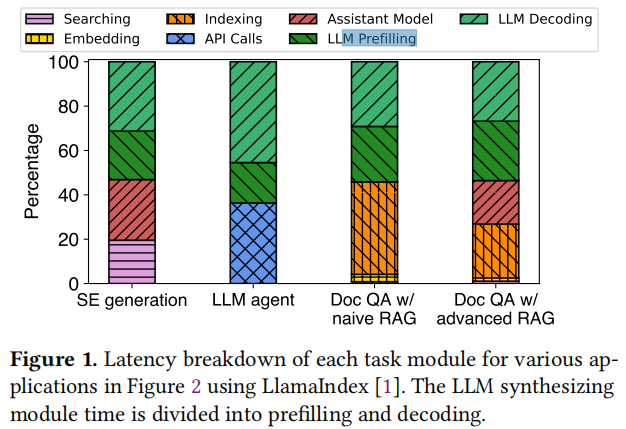
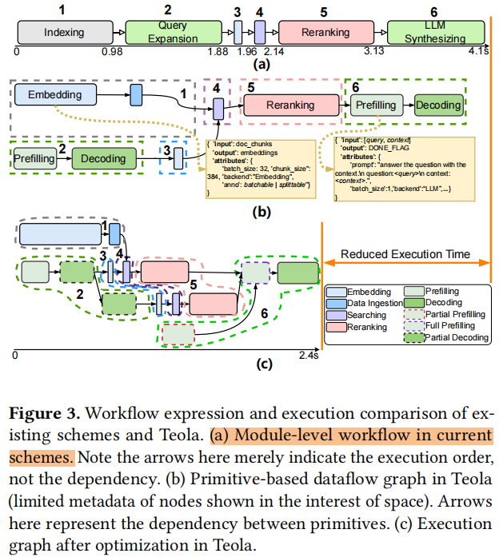
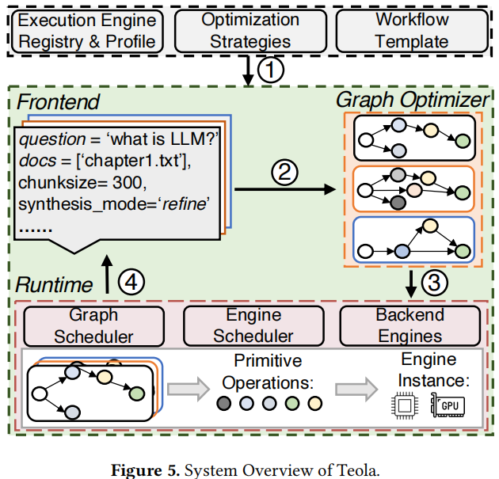
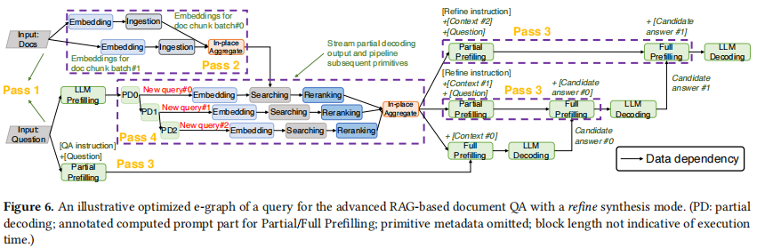
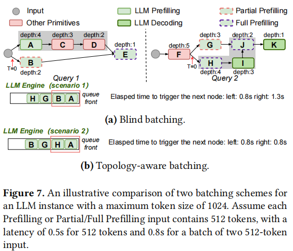

### Title: Parrot: Efficient Serving of LLM-based Application with Semantic Variable
Conference: OSDI 2024  
Institution: Shanghai Jiao Tong University  
Paper Link: https://www.usenix.org/system/files/osdi24-lin-chaofan.pdf  
Source Code: https://github.com/MachineLearningSystem/OSDI24-ParrotServe  

##### Questions
- High-quality LLM apps often need multiple LLM requests to collaborate indifferent workflows.

    

- Existing services only observe tons of individual requests, without knowing any application-level information.

##### Motivation & Challenges
- Excessive overhead of consecutive requests
    - For These long context applications, the overhead comes from network and queuing is pretty large.

    
- Misaligned Scheduling Objectives
    - the existing works focus on improve the "individual latency", But the users mainly focus on end-to-end latency.
    - disaggregation between different type's tasks

    

    - we can determine the ideal scheduling strategy, maximize the throughput.
- Redundant computations
    - Currently, most LLM-based applications exhibit a high degree of redundancy in the prompts of their requests.
    - This is why more than 94% of prefix tokens could be repetitively used across LLM requests for various users

### Title: ALTO: An Efficient Network Orchestrator for Compound AI Systems 
Conference: arXiv 7 Mar 2024   
Institution: Stanford   
Paper Link: https://arxiv.org/pdf/2403.04311  

### Title: AutoTQA: Towards Autonomous Tabular Qestion Answering through Multi-Agent Large Language Models 
Conference: VLDB 2024   
Institution: East China Normal University  
Paper Link: https://www.vldb.org/pvldb/vol17/p3920-zhu.pdf   

##### Key Point
- Use multi-agent to solve TQA tasks
- Problems: a type of tasks called tabular question answering(TQA)
    - TQA focusing on providing answers from tables in response to a user’s natural language (NL) inquiry
        - tables have complex forms, especially when tasks relys on multi-tables
- Multi-Agent:
    - the User, responsible for receiving the user’s natural language inquiry;
    - the Planner, tasked with creating an execution plan for the user’s inquiry; 
    - the Engineer, responsible for executing the plan step-by-step;
    - the Executor, provides various execution environments (e.g., text-toSQL) to fulfll specifc tasks assigned by the Engineer; 
    - the Critic, responsible for judging whether to complete the user’s natural language inquiry and identifying gaps between the current results and initial tasks. 
- More complicated: a cycle with feedback

    

### *Title: Teola: Towards End-to-End Optimization of LLM-based Applications 
Conference: June 29 2024 
Institution: The Chinese University of Hong Kong 
Paper Link: https://arxiv.org/pdf/2407.00326 

##### Key Point
- Problems:
    - LLM-based applications consist of both LLM and non-LLM components
        
        

    - Previous works focus on LLMs' latency, but the non-LLM modules also contributing to the end-to-end latency.
        - in some case(Document question answering with RAG) even more than 50%

        

- Motivations:
    - Now, each module is executed independently with backend engines; but across smaller granularity, some process can be executed in parallel
        - LLMs and query-expansion(use LLMs to generate more related querys for searching) can be split into : prefilling and decoding
    - In query-expansion, generating multiple querys can also be: each generating a new query and sending it to the subsequent primitive (embedding creation) right away without waiting for all queries to come out.  =>  <spin stype="color:red">*primitives*</spin>

    

- Architecture
    - Offline:
        - Developers register the execution engine for their App (1):
            - embedding models
            - LLMs
            - database operations
            - the latency profiles for various input sizes (batch size and sequence length)
            - a workflow template (the app's components like query extension and LLM generation, and their execution sequence)
        - Developer can also provide optimization strategies (Optional)
    - Online
        - Teola create a primitive-based dataflow graph(p-graph) based on the input query with specific input data and workflow configurations (2)
        - Teola applies relevant optimizations to generate the execution graph(e-graph) and submit it to the Runtime (3)
        - The Runtime scheduling the e-graph's primitives on the appropriate backends, and return the output back to frontend.(4)

    

    - CPU-based engine (not involve DNN models, like databases); Other NN-based components be execute on GPU.

    - Graph Optimizer
        - p-Graph: a sub-primitive-level graph with <spin style="color:red">*well-defined dependencies*</spin>
        - Optimization Goals: maximizing the parallelism in distributed executions(primitives)
            - primitive parallelism
            - pipeline parallelism
        - Optimization:
            - Dependency pruning:
                - exemining each task primitive's inputs with it's current unstream primitives
                - pruning unnecessary dependencies
                - **ensure only data dependencies in the remaining edge(DAG)**
            - Stage decomposition:
                - For batchable primitives, **split big batch into multiple sub-micro-batch**
                - after each sub-micro-batch finished, directly send to next primitives rather than waiting.
            - LLM prefilling split:
                - In LLM prefill, some prompt parts may be available in advance while others still waiting for upstreams primitives finish(RAG, APIs)
                - **pre-compute available parts**.
            - LLM decodiing pipelining:
                - Like the new rewritten sentence in query expansion, **once a coherent output is available, it can be promptly forwarded to downstream primitives**, avoiding waiting for full decoding.
        - after optimization, get the e-Graph

        

    - Runtime Scheduling
        - two-tier scheduling
        - Graph Scheduler
            - tracking the status of each query’s e-graph and issues primitive nodes as their dependencies are met(the in-degrees of nodes)
            - dispatching the node itself

        - Engine Scheduler
            - a query may dispatch multiple primitive nodes simultaneously to an engine scheduler or have several pending primitive nodes in the queue, especially when components share the same engine.
            - In following figure, batch A and B is not efficient because the task B is not the bottleneck to query 1, so we can batch A and H, so the query 1 and query 2 both can get progress. (**Topology-aware batching**)

        