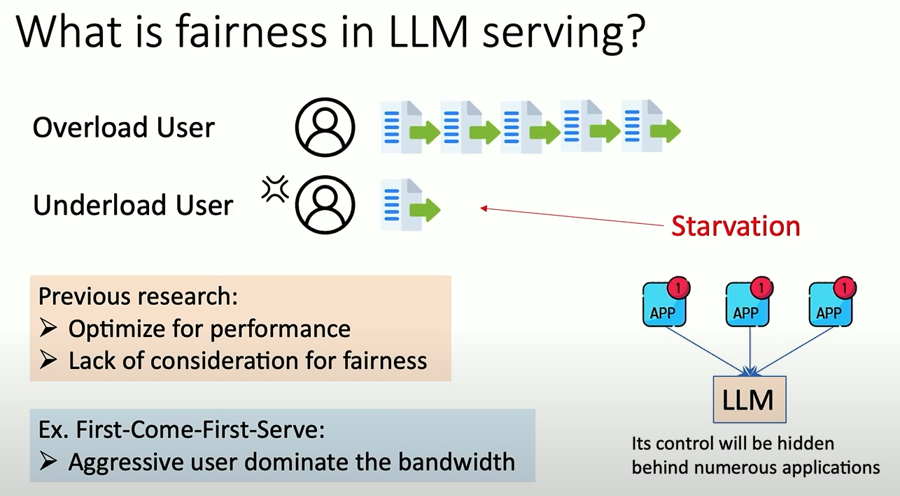
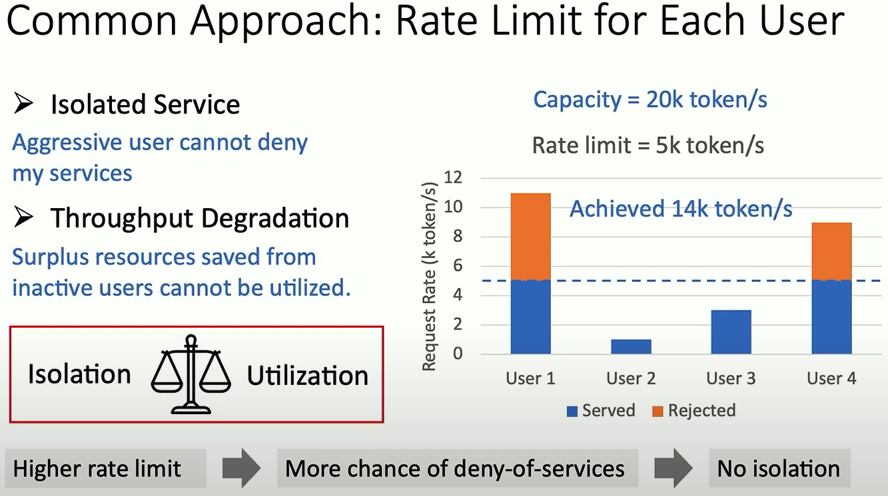

### Title: Fairness in Serving Large Language Models
Author: Ying Sheng
Institution: UC berkeley and Stanford University
Conference: OSDI 2024
Paper Link: https://www.usenix.org/conference/osdi24/presentation/sheng
Source Code: https://github.com/Ying1123/VTC-artifact

##### Key Point
- Existing works not focus on the fairness in LLM Serving
- What is the fairness in LLM serving
    - FCFS policy treat the requests from overload users and underload users "fairly", which is not fair.
        - underload users get starvation
    
    

    - Existing Method: Rate Limit for each User also can not avoid starvation

    

- The challenges （Diff with sample OS Fairness）
    - Unknown generation length  =>  Unknown resource requirement
    - Heterogeneous costs per token
        - the compute cost per token in prefill is much less than decode, because the parallelism
        - the network cost and cpu time costs is fixed because no matter the sequence length, the activations of LLM(Even between layers) has fixed size.
    - No arbitrary preemption

- The standard of Fairness in this paper:
    - 基于token而不是基于requests， 因为LLM requests workload 不同.
    - 基于历史一段时间 $t_{1}, t_{2}$
    - prefill 和 decode per token的workload不同，加上不同的权重
    $W(t_{1}, t_{2}) = w_{p}n_{p} + w_{q}n_{q}$