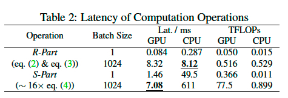
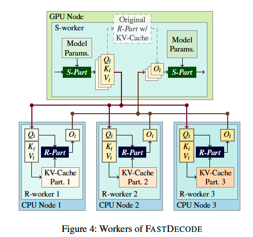
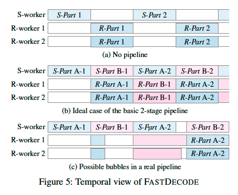
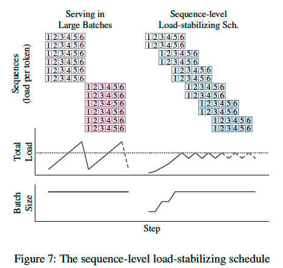

## FastDecode: High-Throughput GPU-Efficient LLM Serving using Heterogeneous Pipelines

### Paper Information
Conference: ArXiv 18 Mar 2024
Paper: https://arxiv.org/abs/2403.11421
Auther: 
- Jiaao He, Jidong Zhai
- Tsinghua University

## 论文理解
### Key Point
- 异构系统实现高效的LLM推理服务 (Heterogeneous)
- 将Transformer模型分解成两部分：将计算密集型的操作放在GPU上，将KV-Cache访存相关 且 非计算密集型的放到CPU上

### Try to Solve
问题：
  - LLM Inference阶段的GPU利用率不高；要想提高GPU的利用率，需要加大batch_size，但是KV Cache size限制了使用大的batch size
  - 观察的 R-Part 和 S-Part 表现出不同的计算和存储特征：
  
R-Part vs S-Part
- R-Part: The auto-Regressive computation related to preceding tokens in the sequence, as A = Normalize{Q * K} and O = A * V in self-attention. Each sequence is processed independently with its own KV-cache. It benefits little from enlarging batch size, but introduces huge memory footprint. Notably, no model parameter is involved in R-Part.
- S-Part: Rest of the model where sequences Share the same parameters. It mainly consists of fully connected layers. GPU utilization can be significantly increased by batching tokens in more sequences together in S-Part.

主要的挑战是：使用GPU-CPU异构系统来处理LLM Inference
1，CPU is busy but slow
2，The pattern of workload variation
3, Careful orchestration is needed to balance the performance of both types of hardware. Bottleneck may be either of the GPU or CPU, because they are tightly coupled.

### 论文中的几个点
#### 1, 如何解决上面的挑战：
1, We employ multiple out-of-chassis remote CPUs for KV-cache and the related computation.
2, We invent a sequence-level load-stabilizing schedule to minimize idling and better utilize both types of hardware
3, We adopt a model-guided approach to orchestrate the GPU with CPUs.

#### Section 2.3：Memory-bound workload Fits CPU
- 虽然CPU比GPU算的慢，但是S-Part本身就并不 Compute sensitive
- CPU的带宽也很高，Memory 容量很大
- CPU的成本低，可以作为外部存储提供给GPU使用
- CPU的最大功耗要比GPU低很多

#### Table 2: 表示在大的batch_size下，R-Part下 GPU 和 CPU取得了近似的Lat 和 TFlops

#### 主要的架构图：GPU分配多个CPU节点

#### 将R-Part 和 S-Part放到不同的设备上处理，带来新的问题：When one type of worker is working, the other idles.
- 本文通过Pipeline的方式来重叠 S-Part 和 R-Part
- 使用两个mini-batch A 和 mini-batch B

#### the workloads of R-Part and S-Part changes differently depending on the length of the generated sequence.
- Latency of S-Part is only related to the batch sizes
- Latency of R-Part is related to the total length of the sequences.
- 两个阶段 Workload 的变化会相互影响
- 对于R-Part，当request长度很长时，Latency会边长，因为load KV cache的时间变长了，本文通过控制每次pipeline的sequence的总长度
  - 用到了Mini Batch

