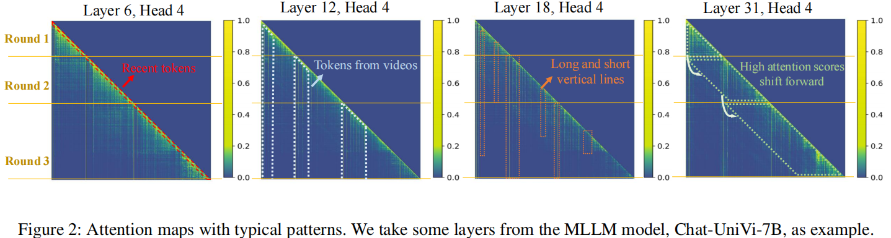
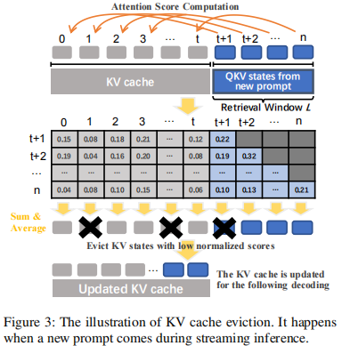
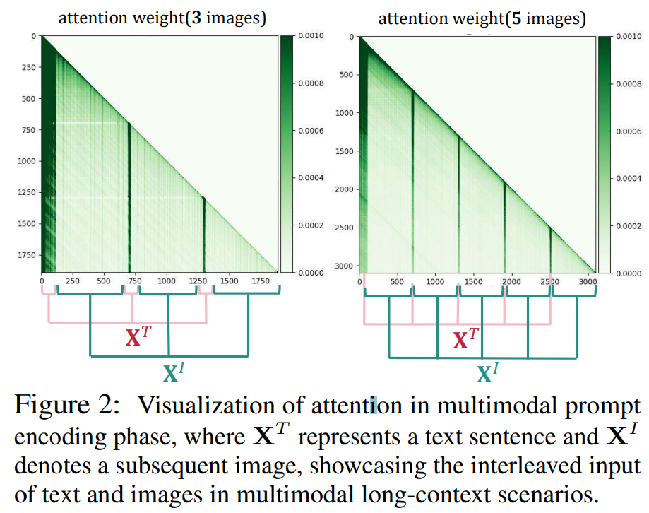

## MLLM hardware-software co-design
[Reading-Notes](./Hardware-Software-Codesign.md)

## MLLM Training
[Reading-Notes](./MLLM-Train.md)

## MLLM Inference
### Inf-MLLM: Efficient Streaming Inference of Multimodal Large Language Models on a Single GPU
Institution: Shanghai Jiao Tong University
Conference: ArXiv Sep 11 2024
Paper List: https://arxiv.org/pdf/2409.09086
Source Code:

##### Key Point
- efficient streaming inference of MLLMs on a single GPU

##### Challenges & Observations
- Challenges
    - Quadratic computation complexity of attention, (to the KV cache size)
    - High memory consumption for storing KV cache.
        - some multimodel inputs may transformed into a large number of tokens. like a several-minute-long video can be converted into thousands of tokens 
    - Context length limitation of pre-trained LLMs, like 4096 for LLaMA 2
    - Long-term reasoning capacity

- Observation in MLLM (Attention Patterns)
    - recent tokens have high attention scores
    - tokens converted from videos typically receive high attention scores
        - In some VLMs, the initial tokens of the video even share over 40% of attention scores
        - But since the position of videos is unknown beforehand in the multi-round conversation, an effective method is required to identify important visual tokens dynamically.
    - high attention scores are also distributed among tokens scattered in the sequence. These tokens are attended to for dozens or hundreds of decoding steps
    - high attention scores shift forward as the multi-round inference progress
        - When a new prompt comes, the distribution of attention scores changes significantly
    
    

- Motivation
    - Based on the observation 1,2,3; these tokens with high attention scores(Attention Saddle), Inf-MLLM designs an new KV cache eviction policy, delete less important token
        - Eviction & Compression
        - always keep max length of L (num of tokens)
    
    
    
    - For the character in observation 4, insert Attention Bias to dynamically update and get the "shift" character

### LOOK-M: Look-Once Optimization in KV Cache for Efficient Multimodal Long-Context Inference
Institution: The Ohio State University
Conference: ArXiv 26 Jun 2024
Paper List: https://arxiv.org/abs/2406.18139

##### Key Observation
- Use KV cache compression
- the model exhibits greater attention to the textual components during the multimodal prompt encoding process.

### Title: PyramidDrop: Accelerating Your Large Vision-Language Models via Pyramid Visual Redundancy Reduction 
Institution: USTC, Shanghai AI labs   
Conference: ArXiv 22 Oct 2024   
Paper Link: https://arxiv.org/abs/2410.17247   
Source Code: https://github.com/Cooperx521/PyramidDrop   

##### Key Point
- For LVLM (vision-LLM), The number of image tokens increases quadratically with the resolution, driving the sequence length into the tens of thousands. which result in large computational costs
- Observation: the LVLMs are sensitive toward token dropping on shallow layers, regardless of the dropping ratio. And in deeper layers, image tokens gradually become less critical to the final results. 
    - at the middle or deep layers, the attention shows a sparse pattern and mainly focuses on the question related image local parts.

- Main Idea:
    - 从浅层到深层讲LLM model分成4个阶段，每个阶段使用压缩率 $\lambda$ 来减少vision token的数量，从而实现更深的层有更深的压缩率。
 
 

### Title: IPL: Leveraging Multimodal Large Language Models for Intelligent Product Listing 
Institution: Alibaba, Fudan University   
Conference: ArXiv 22 Oct 2024   
Paper Link: https://arxiv.org/pdf/2410.16977   

##### Key Point
- 这是一篇偏应用的MLLM论文，主要利用MLLM + RAG来生成产品列表

 
### Title: Skipping Computations in Multimodal LLMs
Institution: Sorbonne University    
Conference: ArXiv Oct 12 2024    
Paper Link: https://arxiv.org/pdf/2410.09454  

##### Key Point
- mainly for pre-trained LLMs
- from the 4th layer, start to skip some blocks / parallelism
    - Skip whole layer
    - Skip FFN
    - Skip Self-Attention
    - processing the FFN and Attention in parallelism
    - processing nearlest layers in parallelism
 - Based Observations
    - highlights the slowly changing embeddings for both textual and perceptual tokens, a phenomenon that has been observed with LLMs
 

Title: MM-LLMs: Recent Advances in MultiModal Large Language Models 
Institution: Tencent AI Lab   
Conference: ArXiv 28 May 2024   
Paper Link: https://arxiv.org/abs/2401.13601 

 

 

Title: Apparate: Rethinking Early Exits to Tame Latency-Throughput Tensions in ML Serving 
Institution: Princeton   
Conference: ArXiv 23 Sep 2024   
Paper Link: https://arxiv.org/abs/2312.05385   
