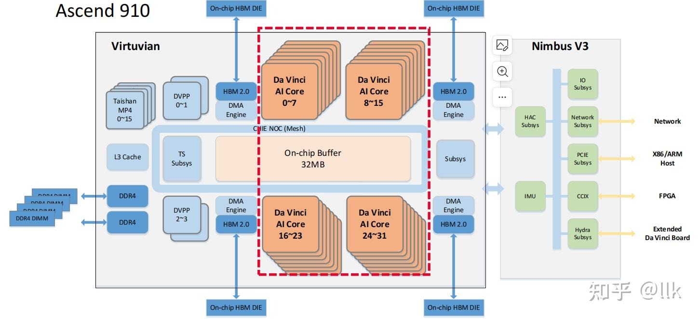

## Ascend 910B
- 910B vs. Nvidia A100

|metrix|910B|A100|
|--|--|--|
|Tensor FP16(TFLOPS)|400|624|
|HBM|64GB|80GB|
|IO-GPUs|HCCS 392GB/s|nvlink 600GB/s|
|IO-CPU|64 GB/s|64 GB/s|

- 架构：
    - A100 6912 个 CUDA 流处理核 (SM cuda core)
    - 910B 25个 DaVinci AI Core (固定size 16 * 16 的计算核心)
        - 一条指令完成 2个 16 * 16 矩阵乘法
        - 缺点：固定size，对小kernel不友好
 


- 实际压测数据
    - 910B - Qwen3-32B

    ```shell
    
    ```