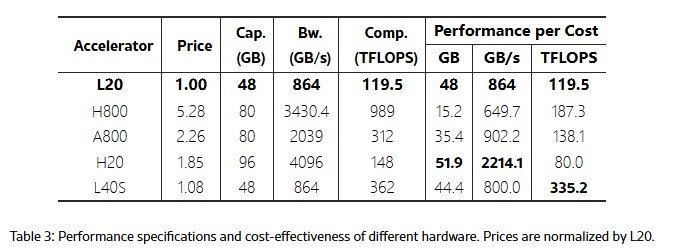

## MoE Inference Acceleration

## Existing works
### PD分离
#### [MegaScale-Infer](https://arxiv.org/pdf/2504.02263)
```shell
ByteDance Seed & Peking University
ArXiv 4.2025
```
- MoE的稀疏激活架构将FFN从compute sensitive转变为memory sensitive
    - 增加的稀疏度导致分配给每个experts的token更少
- 将Attention模块与Experts模块分解，将其分配到单独的GPU上
    - 优势1，针对不同模块的特点，使用不同的并行策略：data parallelism for transformers + expert parallelism for FFN
    - 通过增加transformer模块的部署(增加batchsize)，使每个experts 的token增加，带来更高的GPU利用率
    - 优势2，异构部署(transformers 依赖KV cache，需要memory + 带宽； FFN纯compute sensitive)
    - 缺点：网络开销(M2N,N2M) + pipeline的设计


- ping-pang pipeline 方法：将大batch 拆分成多个micro-batch, 通过pipeline parallelism来隐藏通信开销

    

- 异构部署: 为不同的模块选择合适的硬件
    - H20拥有较大的内存容量和较高的单位成本带宽，适合做transformers
    - L24S GPU适合做MoE experts
    

- 网络开销：
    - NCCL不适合做 M2N/N2M 的数据传输；提出了自己的通信库

#### 

### MoE Experts 相关优化
#### [Speculative MoE](https://arxiv.org/html/2503.04398)
```shell
ArXiv 3.2025
```
- 传统EP产生 all-to-all 通信开销 (将每个token的中间激活tensor在不同的GPU之间来回调度；占据>50%的inference开销)；
- 通过预测即将激活的 token 的 expert 路径，将token和expert预调度到目标设备上 (预测误差会带来额外的通信开销)


- speculative expert grouping
    - 离线基于 intra-layer（同层专家间）和 inter-layer（跨层专家间）的语义亲和度，以及 token-expert 激活共现频率;通过求解平衡的 token-expert balanced co-clustering, 将高亲和的experts调度到同一设备上
- speculative token shuffling
    - 预测 cluster：利用前几层的expert id来预测当前层会选择哪个cluster？
    - 离线得到表：每个token ID最可能激活的expert groups (cluster)
    - 减少通信开销：
        - 传统的MoE在TP(transformers) 和 EP 阶段之间，需要先做一个allreduce (同步token激活) -> 供计算gate experts，然后在做allgather(收集experts ID).
        - 通过上面的预测，直接将token发给对应的cluster，减少全局的all to all 开销。(每个GPU上计算发过来的token的gate)


#### [MoEShard](https://arxiv.org/html/2503.08467v1)
```shell
McGill University Canada & EPFL
ArXiv 3.2025
```
- EP部署下，因为token路由高度偏斜 + all-to-all 通信 造成同步阻塞，是的部分GPU常常空闲，推理延迟上升
- 面临的挑战：
    - 动态偏斜的 token 路由：不同批次、不同层的激活分布差异大，难以用静态分配避免负载不平衡。
    - 全局 all-to-all 通信瓶颈
    - 如何优化GPU资源利用率
- 思路：对experts weights tensor进行分片：将experts的两级FFN weights W1按列分片，W2按行分片；在每个GPU device上保存所有experts的一个分片，使得无论token路由多偏斜，每张卡都可以并行处理所有token的部分计算。
- 问题：增加网络开销

### 量化与压缩
#### [HOBBIT](https://arxiv.org/html/2411.01433v1)
```shell
SJTU
ArXiv 11.2024
```
- 针对内存受限设备上的MoE模型推理；混合精度experts卸载系统
- 当GPU HBM无法完整存储 experts weights, 需要从下一级memory种加载experts，开销占到整体推理开销的>85%.
- 离线量化 + 动态选择：DRAM/SSD种存储了FP16，INT8，INT4 等不同精度的模型；动态选择experts的重要性，对于重要性低的experts，使用更低精度的experts
- Layer-wise 自适应experts预取：预测下一层可能被调度的experts
- Sequential-Level多维度experts缓存：结合"frequency", "last accessed", "精度切换成本"等多种维度来自适应缓存experts，有限从HBM种删除低重要性的experts


## MoE Inference in Distributed System
- 解决什么问题？
    - 目的是优化distributed system中的MoE推理加速(提升GPU利用率)
    - 问题：1，EP 下，数据传输开销高(allreduce - gate - allgather) 产生2次all-2-all 传输开销；2，MoE experts之间负载不均衡，且负载pattern随之间变化. => 增加长尾延迟、降低整体吞吐
    - 现有的工作：
        - GShard/Switch Transformer 模型在训练中采用Top-1 路由（每个token只选1个专家）来简化路由算法，减少通信和计算开销. 优点是实现了7倍以上的预训练速度提升；代价是在推理部署时加剧了专家负载的不均衡：由于每个token只能使用一个专家，热门专家更容易超载，而其他专家资源浪费。(路由失衡+资源利用不充分)
        - GShard/Switch Transformer 增加capacity上限，丢弃溢出tokens
        - MoETuner对experts静态分组（离线解析地优化专家到GPU的映射来同时平衡计算负载和通信开销），减少all-2-all的频次：把经常“合作”的专家尽量放在同一设备或相邻设备。 => 缺点：静态优化，缺少应对动态负载变化的能力
        - ExFlow 则利用跨层专家亲和性分析，将经常连续被同一批token访问的专家放到同一GPU，减少层间需要传输的token数
        - Speculative MoE (s-MoE) 通过投机执行来减少专家并行中的通信瓶颈. 在Experts分组 (根据历史或先验预测，将经常一起被激活的专家预先分组部署在同一GPU上) 的基础上，加上动态预测分组 (预测token的被路由到哪个experts上，并按照预测结果重组token顺序并发送给对应设备)，提前加载experts.  => 最小化跨设备通信
        - MoEShard 聚焦于Expert负载均衡，通过将experts切分成块(按行+列)，均匀分布在全部GPU上；确保工作负载在GPU之间均匀分布. 优点是降低了TTFT，缺点是在每层需要引入额外的全局规约通信来汇总分片计算结果，可能增加一定通信开销。
        - FasterMoE 引入拥塞感知的动态路由策略：当检测到某些专家/GPU过载时，动态调整部分token改由其他专家处理，以缓解网络拥堵，缺点是选择其他专家会影响准确性
        - Lina 系统采用两阶段调度：在每层MoE计算前预测各专家即将接收的token量（基于跨层路由的模式；提前为热门专家申请更多GPU资源或副本，从而在通信开始前完成资源重分配，提升并行效率；在推理阶段动态复制热门专家到多卡并优先调度拥塞的all-to-all流量
- Motivation？
    - 使用expert分组的方式，可以减少网络开销，但是会导致负载聚集 => 可能导致部分GPU block整体inference性能 (expert分组需要有创新)
    - 为了负载均衡，需要将高负载的experts分开部署，但是这样会增加网络传输开销(top K)
    - 在这两者之间做trade-off；最大化系统的吞吐量
    - 结合：expert分组 + 动态调度 + 带宽感知

- 有哪些挑战？
    - GPU 负载失衡与资源空闲并存
        
    - 跨节点 all-to-all 通信瓶颈
    - 专家激活分布偏斜与尾部延迟
        - MoE 路由通常遵循长尾分布：少数专家可能接收了大部分的token，而多数专家只处理少量token。当某个专家在某一时刻被过多token选中时，会出现队列堵塞现象——该专家所在GPU需要依次处理海量token，其计算延迟成为系统的尾部延迟决定因素。即使其他专家很快处理完各自token，仍需等待最繁忙专家完成才能进行下一层/下一步。
        - 传统解决办法是设置每个专家的容量上限（如Switch Transformer使用 capacity factor 限制每专家每批最多处理多少token），超出的token要么被丢弃要么延后处理。但丢弃会影响模型准确率，延后则损及延迟SLO，均非理想方案。

- 设计细节？
    - 考虑pipeline parallelism，将experts computes 和 data transfer overlap起来
    - 如何实现动态调整 + 带宽调整

- Motivation Tests
    - 采用现有的expert cluster方法下，GPU的负载空闲情况
    - all-2-all data transfer开销的占比
    - 带宽使用情况：随时间变化的分布图
    - 垂直领域的 Experts的 激活分布

- Benchmark & 实验设计
    - 主要考虑吞吐量
        - qps
        - tps
        - tps_decode