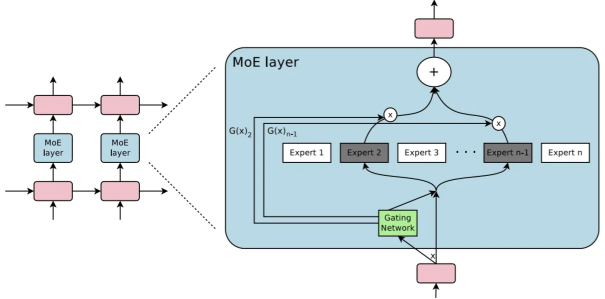
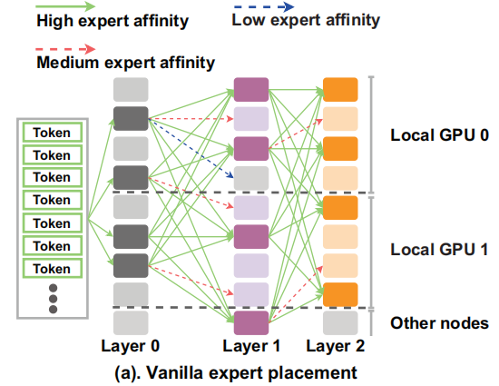
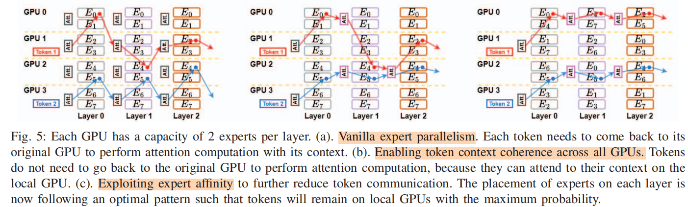
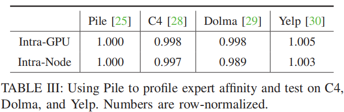
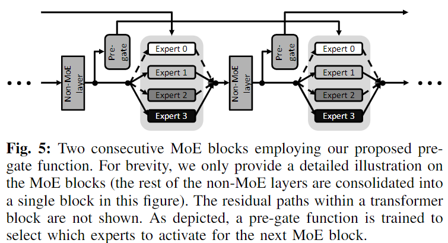

# MoE
- the FFN layer in LLM be changed with multiple export models

### Title:  Mixture-of-Experts (MoE): The Birth and Rise of Conditional Computation
Institution: Rice University  
Paper Link: https://cameronrwolfe.substack.com/p/conditional-computation-the-birth  

### Title:  AdapMoE: Adaptive Sensitivity-based Expert Gating and Management for Efficient MoE Inference
Institution: Peking University & Beijing Advanced Innovation Center for Integrated Circuits  
Paper Link:https://arxiv.org/abs/2408.10284  

### Title: SwapMoE: Serving Off-the-shelf MoE-based Large Language Models with Tunable Memory Budget
Conference: ACL 2024  
Institution: Shanghai Jiao Tong University  
Paper Link: https://aclanthology.org/2024.acl-long.363.pdf  

### Title: Exploiting Inter-Layer Expert Affinity for Accelerating Mixture-of-Experts Model Inference
Conference: IPDPS 2024  
Institution: The Ohio State University  
Paper Link: https://ieeexplore.ieee.org/stamp/stamp.jsp?arnumber=10579139  

##### Key Point
- Problem
    - For MoE architecture, arrange export models to multiple GPU device may cause extensive all-to-all communication (2 all-to-all communication).
        - self-attention -> selected Export models
        - Export models  -> self-attention
    - Because at cluster scenario, the used self-attention and the selected Export model may located on different GPU device, or even different node.

    

- Observation
    - the routing decision in previous layers will largely affect the later layer's routing decisions, and this is true for any layers in the model.

- Motivation & Designs
    - Based on the observation, We can get the correlation between different export models at different layers (the probability of being used together). Called as export affinity.
    - Let those export models with high affinity be located at same GPU device; (and if single GPU is not enough, at least let them be located at the same node to avoid acorss node communication).

    

    - Static arrangement: the export affinity is obtained in advance based on dataset Pile. The author find the affinity is insensitive to the tokens.

    

##### The following paper also based on similar observation
- Title: Pre-gated MoE: An Algorithm-System Co-Design for Fast and Scalable Mixture-of-Expert Inference
    - Conference: ISCA 2024
    - Institution: KAIST
    - Paper Link https://arxiv.org/abs/2308.12066

    - Pre-gated MoE use the layer i-1 to predict which export layers will be used in layer i.

    