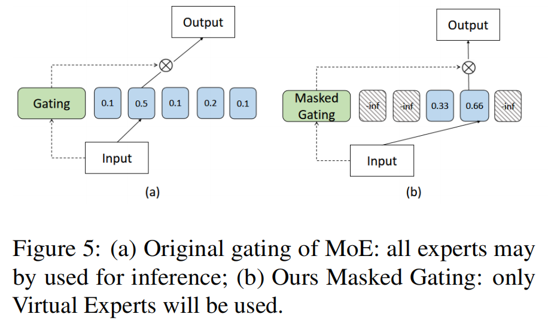
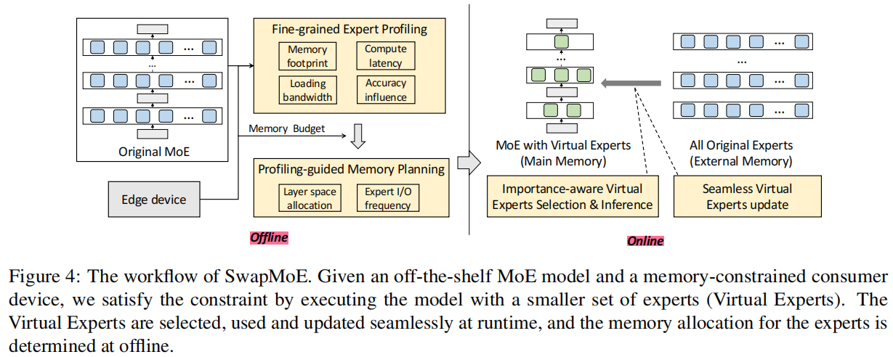
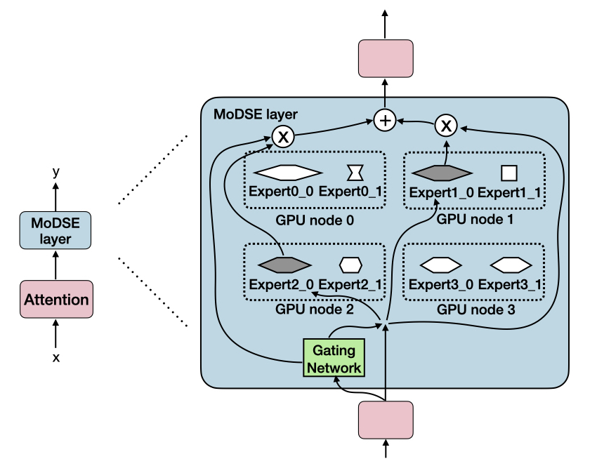
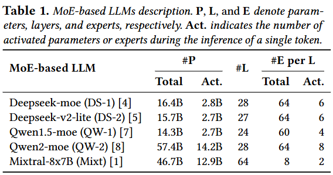
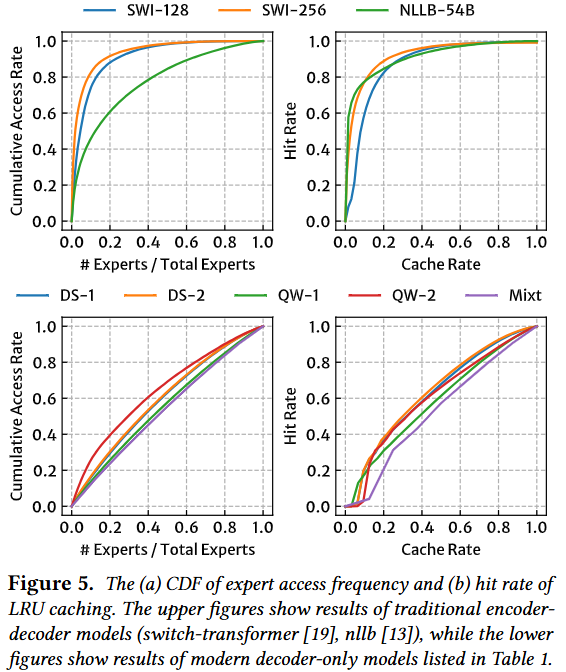
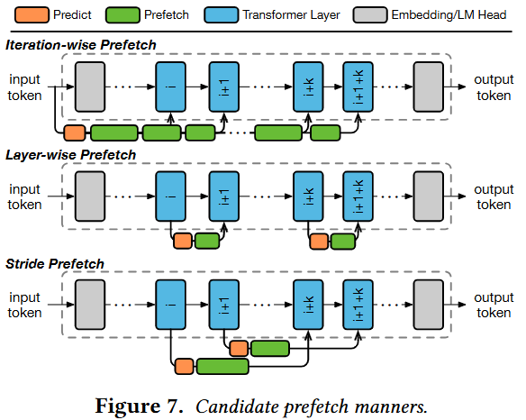

# MoE
- the FFN layer in LLM be changed with multiple export models

### Title:  Mixture-of-Experts (MoE): The Birth and Rise of Conditional Computation
Institution: Rice University  
Paper Link: https://cameronrwolfe.substack.com/p/conditional-computation-the-birth  

### Title:  AdapMoE: Adaptive Sensitivity-based Expert Gating and Management for Efficient MoE Inference
Institution: Peking University & Beijing Advanced Innovation Center for Integrated Circuits  
Paper Link:https://arxiv.org/abs/2408.10284  

### Title: SwapMoE: Serving Off-the-shelf MoE-based Large Language Models with Tunable Memory Budget
Conference: ACL 2024  
Institution: Shanghai Jiao Tong University  
Paper Link: https://aclanthology.org/2024.acl-long.363.pdf  

##### Key Point
- Problem
    - The high memory consumption of MoE; 
    - With limited resources, dynamically loading/unloading the parameters from/to the external memory can be a good choice.
    - Which will caose frequency parameter migration (with different requests, the selected Export models may also be different).

- Observation
    - The activation locality: 
        - the generated tokens in decode stage mostly belong to the same semantic context.
        - the AI models are usually deployed in a fixed environment and used for serving an individual user or organization

- Motivation
    - At runtime, loading the important experts into the main memory, and the unimportant experts out.
    - Keep a small dynamic set of important experts, namely Virtual Exports, in the main memory for inference.
        - All original experts be stored in external memory (Actual Exports).
        - dynamic map and migration between Virtual Exports and Actual Exports; and the related parameter migration.
    - The high loading/unloading time may block computation when running MoE with layer-wise memory swapping. 
    
    - Personal understanding
        - the Virtual Experts is similar with container (with export model architectures), 
        - the Actual Experts is like a real value in the Virtual Experts 

- Designs
    - How to select the most important experts
        - based on expert importance score function to calculate the importance per Exports
        $importance(E_i, X) = \sum_{x}^{X}||x||*||G(x)_i||*||E_i||$
    
    - Offline
        - Consider the resouce and performance requirement, the author conduct fine-grained expert profiling in advance
        - gather information related to hardware memory usage, inference latency, accuracy, and I/O bandwidth
        - based on these information, to get: Profilling-guided Memory Planning

    - Online
        - Execute the model with a smaller set of experts at each time
            - Use Masked Gating to replace original gating
            
            

        - When the importance changed, use asynchronous loading to update each layers' expert model parameter.
        - **Will cased Accuracy reduce**.

        

### Title: Exploiting Inter-Layer Expert Affinity for Accelerating Mixture-of-Experts Model Inference
Conference: IPDPS 2024  
Institution: The Ohio State University  
Paper Link: https://ieeexplore.ieee.org/stamp/stamp.jsp?arnumber=10579139  

##### Key Point
- Problem
    - For MoE architecture, arrange export models to multiple GPU device may cause extensive all-to-all communication (2 all-to-all communication).
        - self-attention -> selected Export models
        - Export models  -> self-attention
    - Because at cluster scenario, the used self-attention and the selected Export model may located on different GPU device, or even different node.

    

- Observation
    - the routing decision in previous layers will largely affect the later layer's routing decisions, and this is true for any layers in the model.

- Motivation & Designs
    - Based on the observation, We can get the correlation between different export models at different layers (the probability of being used together). Called as export affinity.
    - Let those export models with high affinity be located at same GPU device; (and if single GPU is not enough, at least let them be located at the same node to avoid acorss node communication).

    

    - Static arrangement: the export affinity is obtained in advance based on dataset Pile. The author find the affinity is insensitive to the tokens.

    

##### The following paper also based on similar observation
- Title: Pre-gated MoE: An Algorithm-System Co-Design for Fast and Scalable Mixture-of-Expert Inference
    - Conference: ISCA 2024
    - Institution: KAIST
    - Paper Link https://arxiv.org/abs/2308.12066

    - Pre-gated MoE use the layer i-1 to predict which export layers will be used in layer i.

    

# Different Architecture of MoE

### Title: Mixture of Diverse Size Experts 
Conference: ArXiv 18 Sep 2024
Institution:  Xiaomi AI Lab 
Paper Link: https://arxiv.org/pdf/2409.12210  

##### Key Point
- Problem:
    - In current MoE designs,  all experts have the same size, limiting the ability of tokens to choose the experts with the most appropriate size for generating the next token

- Motivation:
    - Design Diverse Size Exports
        - We assign experts a range of parameter sizes by setting the dimensions of the hidden layers to various lengths
        - the depth of Expert model is not changed, only dementions will be changed
    
    

- Load Balance
    - For different model size, use expert-pair allocation.
    - The token routing selection: MoDSE exhibits an equally even distribution as the baseline. 

### Title: ProMoE: Fast MoE-based LLM Serving using Proactive Caching
Institution: SJTU & Zhejiang University    
Conference: ArXiv 29 Oct 2024    
Paper Link: https://arxiv.org/html/2410.22134v1    

##### Key Point
- Their main idea is similar to pre-gated MoE
- Predict the expert of layer i+K based on the activations in layer i, then prefetch parameters from CPU memory.
    - MoE activate only a subset of the experts

    

    - consumer-grade GPU with limited capacities(HBM)
- Observation:
    - for traditional encoder-decoder MoE models, the access frequencies of different experts follow a power-law distribution, with a small number of experts accessed more frequently than others. 
    - modern decoder-only MoE models exhibit a more uniform access pattern

    

- Existing works:
    - Iteration-wise Prefetch
        - previous works indicate that the selection of experts in one iteration is highly related to the input token id
        - static predict at the beginning of the iteration
        - Shortage: low predict accuracy, especially for deeper layers(less than 50%). => because the input token id lacks the context information of the entire sequence,
    - Layer-wise Prefetch
        - predicting the experts of 𝑖 + 1-th layer at the time of 𝑖-th layer.
        - like pre-gate MoE
        - high predict accuracy (> 90%)
        - Shortage: can only predict the experts for one layer ahead, leaving less chance for prefetching to complete in time. => Low prefetch rate.
    - Stride Prefetch
        - This paper's work
    
    

- Solutions
    - Proactive Caching moves data transfers out of the critical path, allowing them to overlap with inference.
    - compared with **LRU** strategy
    - Two component (on CPU)
        - Prefetcher: Sliding-windows Prefetching
            - Main problem: Predict Accuracy
        - Predictor
            - a small neural network (MLP), higher accuracy
    - Coordination of Prefetching and Inference
        - Priority:
            - low-priority speculative prefetch tasks provided by the predictor
            - high-priority precise prefetch tasks triggered by cache misses during LLM inference.
        - Chunked Prefetch
            - Due the limitation of CUDA's asychronous copy mechanism, current copy task can not be preempted, the high-priority prefetch tasks must be wait for current tasks. => Cache miss & Inference Idle
            - split expert parameters into chunks, and add them to the prefetch queue as low priority tasks.
        - Early Preemption
            - When required expert not in HBM, in traditional, the cache miss are only detected and handled when the corresponding expert is accessed during inference. => waiting for parameters transfer from CPU memory
            - Actually, the required expert set is determined all at once when the gate operation completes. 
            - Instead of triggering a cache miss when each individual expert is accessed, let the system preempt the prefetch queue in advance when it knows which experts will be used after the gate operation.
        - Reordered Inference
            - In the inference process of LLMs, existing frameworks typically execute computations for different experts in the order of their IDs. => fails to fully utilize the cache status of experts
            - The experts alreeady in the cache are prioritized,
            - Then the experts currently being prefetched (if any)
            - the experts whose prefetch has not yet begun are orderd last.