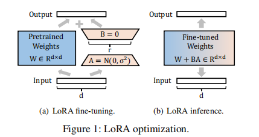
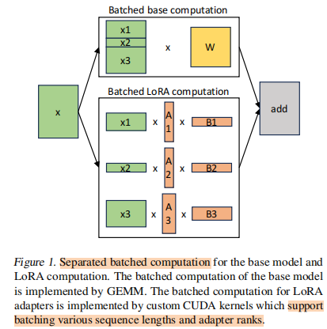
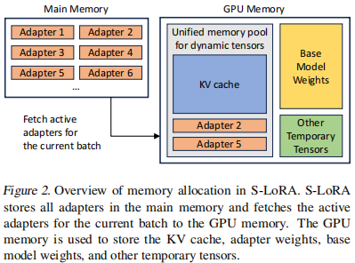
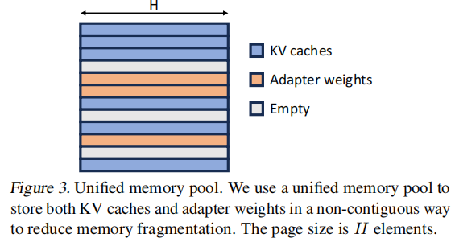
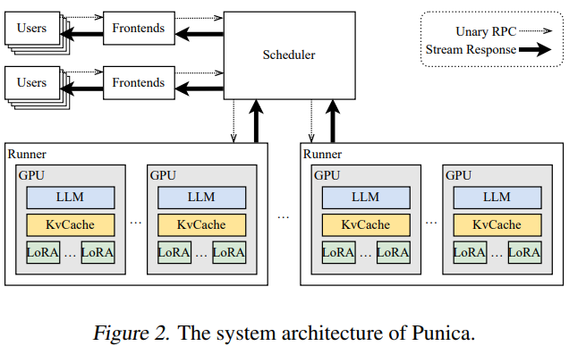

### LoRA: Low-Rank Adaptation of LLMs
[SourcePaper 2021](https://arxiv.org/pdf/2106.09685)

- Explain of Low-Rank
    - The rank of a matrix is the number of linearly independent rows or columns in the matrix.
    - Low-rank Approximation of Matrix
        - A matrix $M$ of size $m x n$ and rank $r$ can be decomposed into a pair of matrices $L_k$ and $R_k$ 
        - When $k = r$, the matrix $M$ can be exactly reconstructed from the decomposition.
        - When $k < r$, then the decomposition provides a low-rank approximation $\hat{M}$ of $M$.

        

- LoRA
    - for pre-trained parameters, using low-rank decomposition, add these low-rank adaptation to each layer.
    - When finetuning, freezes the parameters of pre-trained LLMs, only update the added adaptations
    - For inference, choose different adaptation based on the user/requests.

    

- whether LoRA parameters can be merged into the pre-trained parameters?
    - form dLoRA
    - Yes, At the inference time, as shown in Figure 1(b), LoRA can merge the multiplied matrix $B×A$ (i.e., ∆W) into W to eliminate extra inference overhead.
        - No additional inference overhead
        - but longer queuing delya
    - Or we can execute the pre-trained parameter $W$ and adapters ($A_i, B_i$) seperately
        - Shorter queuing delay
        - but extra computational costs

- Whether LoRA only works for FFN Layer?
    - No, The original paper applying LoRA for transformer, use LoRA for $W_q, W_k, W_v, W_o$
    - Typically, this adjustment is only applied to the query, key, value, and output projection matrices in the self-attention module, excluding the feed-forward module.

### S-LoRA: Serving Thousands of Concurrent LoRA Adapters 
Institution: UC Berkerlay 
Conference: MLSys 2024
Paper Link: https://arxiv.org/abs/2311.03285 

##### Key Point
- In LoRA, swapping adapters by adding and subtracting LoRA weights from the base model. It significantly reduces overall serving throughput and increases total latency when serving multiple adapters concurrently.
- Especially for batching

##### Observations
- adapters with varying sizes and operations</spin>
- the dimention of LoRA parameters is (R, H), H is the hidden size. While the KV Cache's dimention is (S, H), S refers sequence length. has similar dimention size H.

##### Challenges for many LoRA adapters
- adapters with varying sizes</spin>, coupled with the dynamic allocation and deallocation of KV cache, can lead to memory fragmentation and I/O overhead.
- the separated computation of many adapters with distinct ranks in noncontiguous memory is challenging to batch and demands the development of new computation kernels.

##### Design Overview
- seperate the computation of base-model and LoRA parameters

- store all LoRA adapters in Host memory, only fetch used LoRAs to GPU.
- To increase GPU utilization, use large batch-size and reduce the number of actived adapters: prioritize batching requests that use the same adapter
    - Use Dynamic Batching

- For challenge 1: memory management
    - Challenges:
        - memory fragmentation caused by the dynamic loading and offloading adapter weigts(variable size)
            - which adapter is active depends on the requests
        - the migration latency of loading/offloading
    - Solutions:
        - 1, based on Observation 2 and pagedAttention, use Unified Paging to manage KVCache and Adapter's parameters.
            - the memory pool is managed in pages
            - each page contains a verctor of H (hidden-size)
            - KV cache contains S page, Adapter contains R page.
        - 2, prefetching adapter weights
            - While running the current decoding batch, we predict the adapters required for the next batch based on the current waiting queue.
        

### dLoRA: Dynamically Orchestrating Requests and Adapters for LoRA LLM Serving 
Conference: OSDI 2024 
Institution: PKU 
Paper Link: https://www.usenix.org/conference/osdi24/presentation/wu-bingyang 

##### Challenges
- Merged inference (directly merge LoRA parameters to pre-trained Models) may cause low GPU utilization.
    - Observation show only 50% GPU utilization
    - Reason: when one LoRA adapter is processing, the requests in batch relys on other LoRA adapters need to be wait. (Longer Queuing delay)
    - Merged inference only works for single adapter scenario
- Severe load imbalance
    - The burst of variable requests leads to severe load imbalance under staitc LoRA placement
    - Input and output lengths of requests are highly variable

##### Design Overview
- dynamically orchestrate requests and LoRA adapters
    - cluster level
    - process requests to different LoRA adapters in a single batch
- For challenge 1:
    - dLoRA can dynamically merge and unmerge LoRA adapters with the base model in each worker replica.
    - New Challenges: 
        1, How to decide when to merge and unmerge adapters;
        2, Switching overhead + scheduling overhead
            - Switching overhead >= decoding iteration time
            - Complex scheduling at the granularity of the iteration incurs overhead
- For challenge 2:
    - dLoRA can dynamically migrate LoRA adapters and requests between worker replicas.
    - New Challenges: 1, How to decide which adapters and requests to migrate;

- Overview:
    - dLoRA deploys a set of workers in a cluster, each replica contains a subset of LoRA adapters and one base model on several GPUs
    - Intra-replica, use dynamic batching
        - decoding across several iterations, even though the switch overhead is bigger than decoding iteration time, still can be amortized.
        - use historical: set break point on iteration granularity; 
            - Upon reaching a break point, the algorithm tunes the thresholds based on the data collected from the preceding period
            - based on the throughput of adapters
    - Inter-replicas, use dynamic balancing
        - proactive mechanism
            - In the long term, The workload pattern exhibit predictablity and periodicity, such as low load at midnight and high load during day time.
            - Based on this, preload needed LoRA adapters to GPU memory
        - reactive mechanism
            - the load imbalance caused by variable input and output length
            - use dynamic adapter-request co-migration
                - migrate LoRA adapters and requests (with intermediate states) from over-loaded replicas to others.

### Punica: Multi-Tenant LoRA Serving
Conference: MLSys 2024  
Institution: University of Washington & Duke University  
Paper Link: https://arxiv.org/pdf/2310.18547  
Source Code: https://github.com/punica-ai/punica  

##### Key Point
- <spin style="color:red"> LoRA has very low storage and memory overheads. Each fine-tuned model only adds 0.1% to 1% of the model weight</spin>
- Serve multiple LoRA models in a shared GPU cluster
    - Here, execute the LoRA and base model seperately; and A user request contains the identifier of the LoRA model and a prompt.
    - Each GPU loads the backbone pre-trained LLMs
    - Only the LoRA components of models are swapped in from remote storage when serving.

    

- Challenges & Solutions
    - How to run multiple LoRA models efficiently on a GPU?
        - a new CUDA kernel for adding the LoRA addons to the backbone computation in a batched manner (Segmented Gather Matrix-Vector Multiplication (SGMV))

    - how to design an efficient system on top of SGMV for multi-tenant LoRA model serving?

### CaraServe: CPU-Assisted and Rank-Aware LoRA Serving for Generative LLM Inference
Conference: ArXiv 20 Jan 2024
Institution: HKUST  
Paper Link: https://arxiv.org/pdf/2401.11240  
