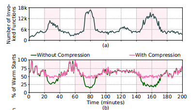

### Title: ServerlessLLM: Low-Latency Serverless Inference for Large Language Models
Institution: University of Edinburge & NTU
Conference: OSDI 2024
Paper Link: https://www.usenix.org/system/files/osdi24-fu.pdf
Source Code: 

### Title: CodeCrunch: Improving Serverless Performance via Function Compression and Cost-Aware Warmup Location Optimization
Conference: ASPLOS 2024
Institution: Northeastern University
Paper Link: https://dl.acm.org/doi/pdf/10.1145/3617232.3624866
Source Code: : https://zenodo.org/doi/10.5281/zenodo.8347244

##### Key-Point
- Problems
    - function cold starts time can constitute 40%~75% of the execution time.
    - warm-start: occupy space in memory
- Shortages of Existing Warm-up starts
    - during periods of high function invocation load, the fraction of warm starts can drop significantly due to high memory pressure.
    - The trade-off on recent platforms are not exploit
        - the keep-alive cost on ARM processors is significantly lower than on x86 processors.
        - On the x86 platform, compression is favorable (decompression time < cold start time) for 42% of all evaluated functions. On ARM, this percentage is 46%, where almost all the compression-favorable functions on x86 are a part of compression-favorable functions on ARM. For 38% of all evaluated functions, ARM is a more performant processor choice, and 60% of these 38% functions are compressional-favorable functions on ARM.
- Solutions
    - In-memory compression
        - by using compression, each function requires less memory space to keep-alive, and more functions can be stored. (51% -> 61%)

        

        - the de-compression latency falls on the critical path of function execution
    - Challenges:
        - deciding how long to keep functions alive after their invocation
        - deciding when and which functions to compress in memory
        - exploiting servers with x86 and ARM processors for performance and keep-alive cost.

- Details
    - Sequential Random Embedding optimization (SRE)
    - Compression : lz4 algorithm

### Title: Sabre: Hardware-Accelerated Snapshot Compression for Serverless MicroVMs
Conference: OSDI 2024
Institution: MIT & Intel
Paper Link: https://www.usenix.org/conference/osdi24/presentation/lazarev