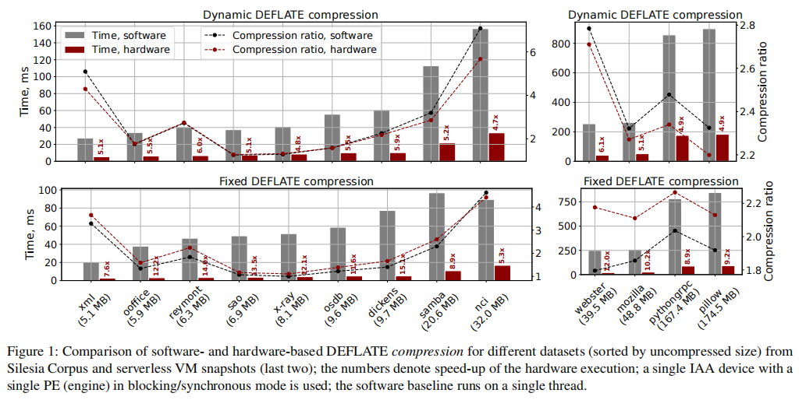

# Sabre: Hardware-Accelerated Snapshot Compression for Serverless MicroVMs
Conference: OSDI 2024
Institution: MIT & Intel
Paper Link: https://www.usenix.org/conference/osdi24/presentation/lazarev

### Key Point

### Problems
- MicroVM snapshotting significantly reduces the cold start overheads in serverless applications.
    - Snapshotting enables storing part of the physical memory of a microVM guest into a file
    - Prefetching can also reduce the cold-start
- The efficacy of prefetching depends on the size of the memory that needs to be restored.
- The cold starts of Serverless

### Motivation & Challenges
- Hardware Compression: the In-Memory Analytics Accelerator(IAA) in Xeon CPUs
    - Compare the Hardware compression vs Software compression

    