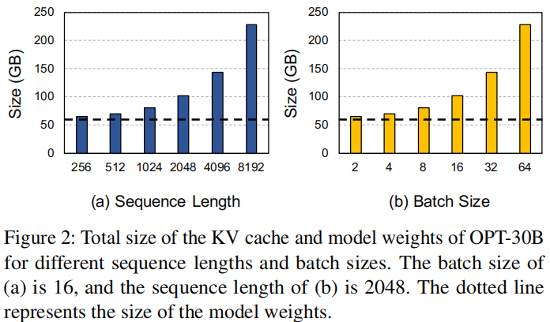
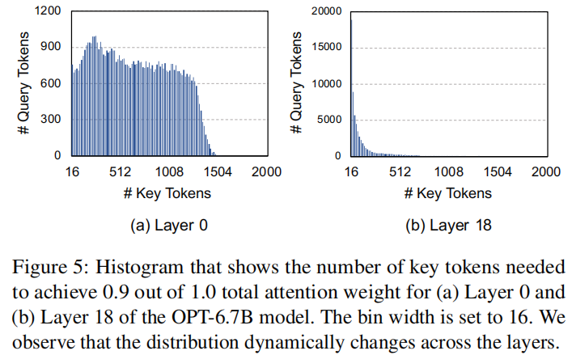

# InfiniGen: Efficient Generative Inference of Large Language Models with Dynamic KV Cache Management 

- Conference: OSDI 2024 
- Institution: Seoul National University 
- Paper Link: https://www.usenix.org/system/files/osdi24-lee.pdf 
- Source code: https://github.com/snu-comparch/InfiniGen 

### Key Point
- Support offloading data to the CPU memory to efficient serve LLMs inference within the hardware budget.

### Problems
- the size of VK cache scales with the sequence length and batch size.
- current LLM models support long-contexts: Claude 3 and Gemini 1.5 can process up to 1 million tokens.

### Motivations
- Use CPU memory
- speculate and chooses the KV cache entries that are critical to produce the next output tokens, dropping the non-critical ones. (conduct a minimal rehearsal of attention computation)
- leverages the CPU memory capacity and maintains the KV cache pool on the CPU. ensuring that the critical KV cache values can be identified for all outputs and layers with a large window size.

### Observations in LLMs
- Outliers in LLMs:
    - the outliers refer to the elements with substantially larger magnitudes than the other elements.
    - these outliers appears in a few fixed channels (i.e columns in a 2D matrix) across the layers
    - Prior works shows: these outliers are caused by the property of models (e.g., large magnitudes in a few fixed channels of layer normalization weights)
        - refs two paper: 
            - Gpt3.int8(): 8-bit matrix multiplication for transformers at scale
            -  Outlier suppression: Pushing the limit of low-bit transformer language models
- skewing the query and key matrices to make a small number of channels much larger than others and using only those channels to compute the attention score matrix can effectively predict which tokens are important.
 
- the attention inputs of consecutive attention layers are highly similar in LLMs.
    - the outliers
    - the layer normalization (LayerNorm)

### Challenges
- In H2O, researchers assume that the attention pattern does not change across iterations. But it is not the case in practice. (At different iteration, the important tokens may changed): 
    - 1, the "unimportant" KV-Cache at current iteration can not be delete from the system, It may be required for subsequent iterations.
    - 2, For prefetch, need to know which tokens are important.

- For different layer, the number of required KV cache is different. (Different sparsity rate across layers: the deeper layer with higher sparsity rate)

- Within sessions (prompt + generated tokens), the number of required KV cache is different across different Querys(tokens). 
    - H2O set a very limit fixed windows length.
    - Observation:  for example, the 500th, 1000th, 1500th, and 2000th tokens need 80, 146, 160, and 164 key tokens, respectively, to reach a cumulative attention weight of 0.9.

### Design Details
- Use CPU Memory
- use the attetion input of previous transformer layer to predict the important tokens for current layer, and prefetch the related KV cache.