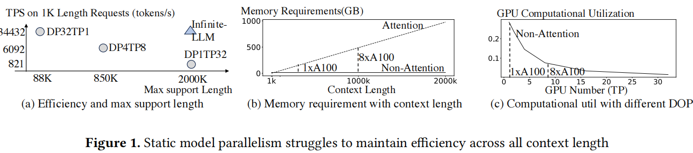

Infinite-LLM: Efficient LLM Service for Long Context with DistAttention and Distributed KVCache 

- Conference: Arxiv July 4 
- Institution: Alibaba Group & Shanghai Jiao Tong University 
- Paper link: https://arxiv.org/abs/2401.02669 

### Key Point
- In LLM inference, the request length changes from a few to 2M tokens, which leads to unpredictable and dynamic task workloads.
- Disaggreagates the attention layers from the non-attention layers, allowing them to employ independent parallel strategies and resource scheduling policies. 

### Problems
- 1, different context length between requests. (auto-regressive also generate different length of output.)
- 2, there are significant differences between attention layer with others: attention layers are dynamic and sensitive to context length, while the others are static and only sensitive to batchsize.

##### details
- the unpredictable length of requests, pre-assigning resources accurately becomes unfeasible, leading to highly varied demands for computing and memory resources. => varying workload requirements
    - the memory utilizaion is determined only by the total KV cache
    - the compute utilization largely depends on the batch size.
- the model parallelism strategy required for processing requests with short or normal-length contexts differs from that for long contexts.
    - For Llama2-7B, process 1K tokens require 15GB memory (can be handled within 1 A100); whle process 1M tokens, requires 500GB memory (need at least 7 A100).

### Motivations

- decouple the attention layers from the rest of the LLMs
- For different part, use different resource management and parallelism strategies.
    - attention layer: the memory needs
    - FFN: the computation requiremends.
- using the entire cluster's GPU memory as a pooled resourcem, allowing instances with surplus memory caacity to support long context requests.

### Challenges
- Observation1: Instances with a higher numberof GPUs are capable of supporting long-context tasks but perform poorly on normal-text tasks.
    - DP1TP32 means one instances with 32X GPU, DP32TP1 means the 32X GPU shared by 32 instance, each with 1 GPU.
    - DP1TP32 was setted for long context requests, it use model parallelism to support coordinate across GPUs. but for uniform-length requests, the efficiency will decrease. 

- For Decode state:
    - For long context lengths, the computional utilization of GPU significantly decrease
    - For short context, with insufficient GPU memory utilization.
    - Reason: the HBM size limits the max batch_size on GPU in long-context scenario

### Design Details

- DistAttention
    - subdivides attention and the KV cache into regular small sub-blocks, and allowing these attention layers be distributed and compute across multiple instance.
    - for long context requests, use sequence parallelism: each GPU only keeps a block of KV cache, and the input & output vector is transfored between Devices.

- Cluster-scale resource manage
    - balance the KV cache and the batch sizes across instances
    - GPU X can handle the mamory requests from itself and other devices.

