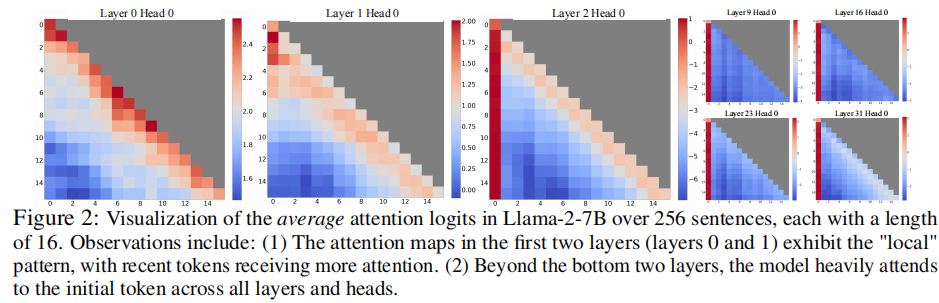

# LLM-Compression

## Parameter Compression
- Here mainly focus on post-training Sparse, not consider the method which requires finetune or re-train
- Neurons
    - based on the dynamic contextual sparsity (in FFN): activates a subset of parameters in FFNs for each new token during the decoding phase without hurting model accuracy
    - treating each row in the first layer of an FFN and the corresponding column in subsequent layers as a neuron
    - keep the entire parameters in DRAM or SSD, predict and load required neurons to GPU.

- Paper: Harnessing Your DRAM and SSD for Sustainable and Accessible LLM Inference with Mixed-Precision and Multi-level Caching 
    - Ref
        - Institution: USTC&Arizona    
        - Conference: ArXiv 23 Oct 2024     
        - Paper Link: https://arxiv.org/pdf/2410.14740 
    
    

## KV-Cache Compression
### Channel Compression
- Channel Sparsity: only a few attention channels have a significant impact on outputs
    - the channel sparsity exhibits relatively static behavior
    - utilizes offline calibration to pre-determine outlier channels for each transformer layer.
    - the offline calibration me4thod: Awq: Activation-aware weight quantization for llm compression and acceleration
- Shortage of channel compression
    - After identifying the outlier channel indices, it becomes crucial to access them efficiently. Reading these channels directly from the Key cache can lead to non-contiguous memory accesses. (low L1/L2 cache hit rate)

#### Paper:
- Post-Training Sparse Attention with Double Sparsity  
    - Ref
        - Conference:  Arxiv Aug 11 2024  
        - Institution: UC Berkeley  
        - Paper Link: https://arxiv.org/pdf/2408.07092 
        - Source code: https://github.com/andy-yang-1/DoubleSparse

- Key-Point
    - token sparsity: evict un-important tokens, like H20
    - channel sparsity: for KV vectors, also with sparsity in channels.
    - to solve the non-contiguous memory accessing
        - keep selected outlier channel as label cache
    - the entire KV cache is keeped in CPU memory, only the label cache is keeped on GPU HBM
    - prefetch KV cache through layer-pipelining
        - use embedding similarity to predict the requred tokens for next layer 
        - overlap the computation of current layer with the tokens(KV cache) prefetch of the next layer 

    

### Token Compression
#### Static Method: discards earlier tokens
- Key Idea
    - Since the first few tokens is important, some works keep these tokens as "attention sink"
    - slide windows
- Paper: StreamingLLM: EFFICIENT STREAMING LANGUAGE MODELS  WITH ATTENTION SINKS 
    - Ref
        - Conference: Arxiv Apr 7 2024 
        - Institution: Meta AI & Nvidia 
        - Paper link: https://arxiv.org/pdf/2309.17453 
        - Source code: https://github.com/mit-han-lab/streaming-llm 
    - Key Point
        - To handle infinite-length inputs without sacrificing performance

    -  Problems
        - the excessive memory usage for KV cache. 
        - a sliding windows can be used to split the inserted requests. But it follows with accuracy decrease.
            - attention sink

    - Motivations

        - For Llama2-7B model
            - For bottem two layers, the model focuses on local tokens
            - For other deeper layer, the model focus on the initial tokens acorss all layers and heads.

        

        - In this paper, the auther select first 4 tokens as Attention Sink.
        - combine with “local” tokens

#### Dynamic Method: selectively drops tokens based on previous attention score

- paper: H2O: [My Notes](./H2O-SorceCode.md)
- Paper: InfiniGen: [My Notes](./InfiniGen-OSDI2024.md)

#### Execute first few layers
- For token compression, in order to get the attention score of previous tokens, all the tokens need to be executed in the prefill stage
    - With observation: when serving a query, LLMs often find the necessary information in the early layers, even before generating the answer.

- Paper: Discovering the Gems in Early Layers: Accelerating Long-Context LLMs with 1000x Input Token Reduction
    - Ref
        - Conference: ArXiv 25 Sep 2024  
        - Institution: Wisconsin & U of Hong Kong  
        - Paper List: https://arxiv.org/pdf/2409.17422   
        - Source Code: https://github.com/SalesforceAIResearch/GemFilter  

    - Problems to solve
        - There are already many works like H2O reduce the KV cache size to improve decoding latency and GPU memory usage; But for prompt prefill stage, these works not works.
        
    - Observation
        - We observe that when serving a query, LLMs often find the necessary information in the early layers, even before generating the answer.
        - Eg. for LLaMA 3.1, the information needed can be distilled from the attention matrix in any of the 13th-19th layers.

        

    - Main Idea
        - run the LLM inference twice
        - first pass: run only the early layers of the LLM to select the key input tokens (based on attention matrix and select top K tokens)
        - second pass:  we feed the selected tokens to the full LLM and run the generation function

        

#### Keep the entire KV cache for few layers
- reduce tokens for every layer affect the accuracy
- select some layers to keep the entire KV cache

- paper: Inference-Friendly Models With MixAttention 
    - Ref
        - Conference: ArXiv 23 Sep 2024 
        - Institution: Databricks, Stanford 
        - Paper Link:https://arxiv.org/abs/2409.15012
    
    - Observation:
        - Having a few standard attention layers is crucial for the model’s long context abilities. In  particular, having the standard KV cache computed in the deeper layers is more important for long context abilities than the standard KV cache of the first few layers.
        - KV cache of standard attention layers can be shared between non-consecutive layers without any observed degradation in long context abilities.

    