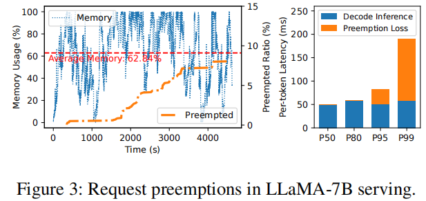
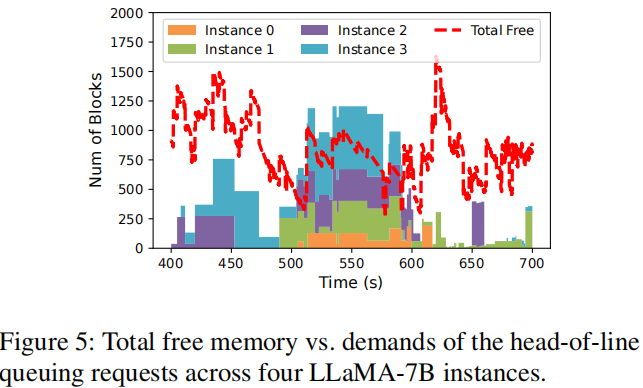

# Llumnix: Dynamic Scheduling for Large Language Model Serving
Institution: Alibaba Group
Conference: OSDI 2024
Paper Link: https://www.usenix.org/system/files/osdi24-sun-biao.pdf
Source Code: https://github.com/AlibabaPAI/llumnix

### Kek Point
- rescheduling LLM inference requests at runtime across model instances.
- load-balance for each instance 

### Problems
- Unpredictable memory demands and preemptions
    - Test 2000 requests on vLLM, the average memory usage is 62% while 8% of the requests still being preempted.
    - 极端case: the P99 request experiences a total preemption loss of 50 seconds, be preempted twice.X

    

- interference among requests
    - focus on decode steps, with different seq-length, the batch_size will be differ, the decode latency will also change

- Memory fragmemtation
    - Even use PagedAttention, external fragmentation still exists.
    - Test a service system with 4 instance, For most of the time span, the total free memory can accommodate the queuing requests on at least three instances (sometimes all of them). The request are queuing despite enough total memory because they exceed the free space on their own instances.

    

- Different emergency and priority of requests
    - requests from different applications and scenarios naturally come with different latency objectives.
    - Online chatbots vs Offline applications(like evaluation, scoring, or data wrangling)

### Motivation
- rescheduling LLM inference requests at runtime across model instances.
    - Combined with dispatching and auto-scaling

- Goals
    - Load balancing
    - de-fragmentation
    - prioritization
    - auto-scaling

### Challenges

### Design Details