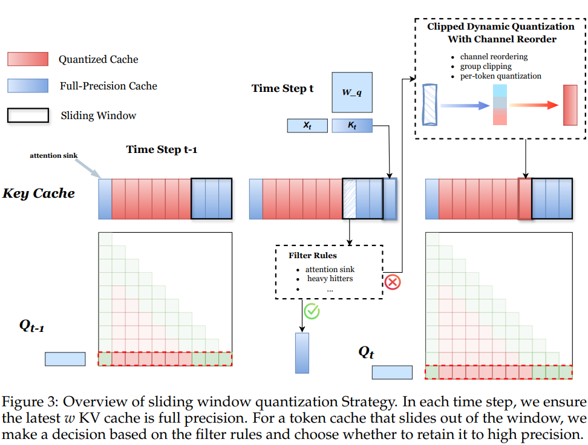
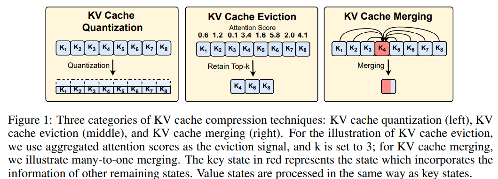
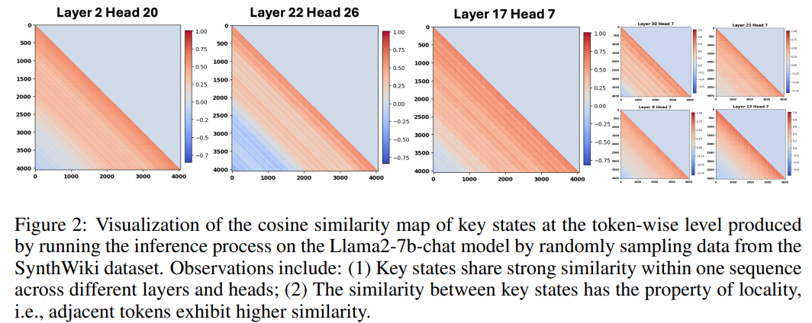
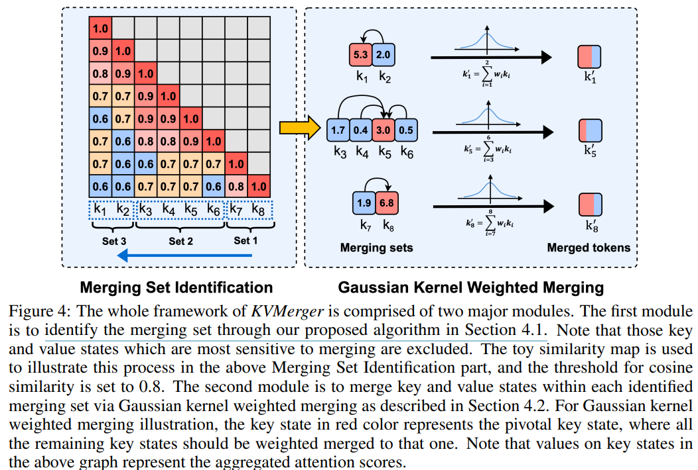
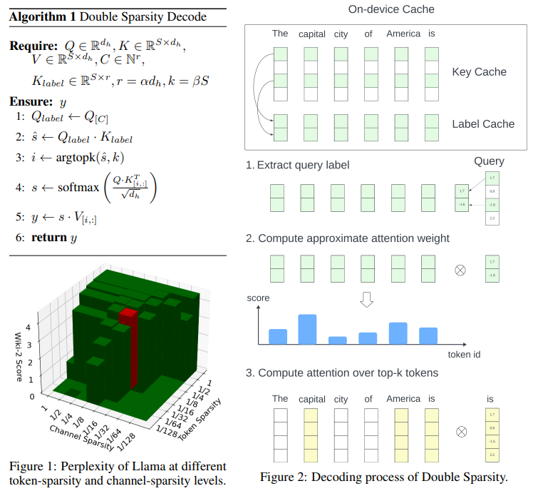

### Title: SKVQ: Sliding-window Key and Value Cache Quantization for Large Language Models
Institution: Shanghai AI Lab & SJTU
Conference: COLM 2024
Paper Link: https://openreview.net/pdf?id=nI6JyFSnyV
Source Code:

##### Key-Point
- KV Cache quantization
- For the token in attention sink and local sliding windows, keep high-bitwidth float value. 
- For other tokens:
    - There are outliers across channels, use channel reorder to group clipping
    - per-token quantization
    

### Title: Model Tells You Where to Merge: Adaptive KV Cache Merging for LLMs on Long-Context Tasks
Institution: Georgia Institution of Technology & UIUC
Conference: ArXiv Jul 21 2024
Paper Link: https://arxiv.org/pdf/2407.08454

##### Key-Point

- ***For KV cache eviction, a significant drawback of eviction methods is their potential to accidentally and permanently remove important tokens, leading to context damage and adversely affecting their effectiveness in long-context tasks that heavily rely on context information.***
- Observations:
    - Key states share strong similarity within one sequence across different layers and heads.
    - The similarity between key states has the property of locality, i.e., adjacent tokens exhibit higher similarity

    

- Main Idea:
    - Split to different Set: Across tokens, identify the merging set (the key&value vectors with most sensitive to merging)
    - within the set, use Gaussian Kernel Weighted merging to merge

    

### Title: Post-Training Sparse Attention with Double Sparsity  
Conference:  Arxiv Aug 11 2024  
Institution: UC Berkeley  
Paper Link: https://arxiv.org/pdf/2408.07092 
Source code: https://github.com/andy-yang-1/DoubleSparse

##### Key-Point
- token sparsity: evict un-important tokens, like H20
- channel sparsity: for KV vectors, also with sparsity in channels.

### Title: Taming Throughput-Latency Tradeoff in LLM Inference with Sarathi-Serve
Institution: Microsoft & Georgia Institute of Technology
Conference: OSDI 2024
Paper Link: https://www.usenix.org/system/files/osdi24-agrawal.pdf
Source Code: https://github.com/microsoft/sarathi-serve

[Personal-Understanding](./Sarathi-Serve-OSDI2024.md)

### Title: Llumnix: Dynamic Scheduling for Large Language Model Serving
Institution: Alibaba Group
Conference: OSDI 2024
Paper Link: https://www.usenix.org/system/files/osdi24-sun-biao.pdf
Source Code: https://github.com/AlibabaPAI/llumnix

[Personal-Understanding](./Llumnix-OSDI2024.md)