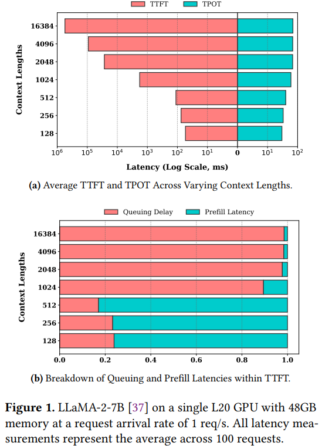
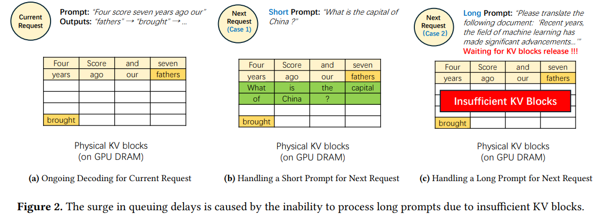
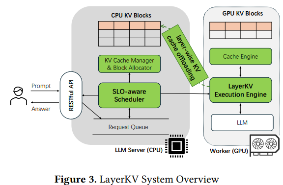

## Compression & Sparsification

### Title: SKVQ: Sliding-window Key and Value Cache Quantization for Large Language Models
Institution: Shanghai AI Lab & SJTU
Conference: COLM 2024
Paper Link: https://openreview.net/pdf?id=nI6JyFSnyV
Source Code:

##### Key-Point
- KV Cache quantization
- For the token in attention sink and local sliding windows, keep high-bitwidth float value. 
- For other tokens:
    - There are outliers across channels, use channel reorder to group clipping
    - per-token quantization
    

### Title: Model Tells You Where to Merge: Adaptive KV Cache Merging for LLMs on Long-Context Tasks
Institution: Georgia Institution of Technology & UIUC
Conference: ArXiv Jul 21 2024
Paper Link: https://arxiv.org/pdf/2407.08454

##### Key-Point

- ***For KV cache eviction, a significant drawback of eviction methods is their potential to accidentally and permanently remove important tokens, leading to context damage and adversely affecting their effectiveness in long-context tasks that heavily rely on context information.***
- Observations:
    - Key states share strong similarity within one sequence across different layers and heads.
    - The similarity between key states has the property of locality, i.e., adjacent tokens exhibit higher similarity

    

- Main Idea:
    - Split to different Set: Across tokens, identify the merging set (the key&value vectors with most sensitive to merging)
    - within the set, use Gaussian Kernel Weighted merging to merge

    

## Trunk-Prefill & Sequence Parallelism

### Title: Taming Throughput-Latency Tradeoff in LLM Inference with Sarathi-Serve
Institution: Microsoft & Georgia Institute of Technology
Conference: OSDI 2024
Paper Link: https://www.usenix.org/system/files/osdi24-agrawal.pdf
Source Code: https://github.com/microsoft/sarathi-serve

[Personal-Understanding](./Sarathi-Serve-OSDI2024.md)

### Title: LoongServe: Efficiently Serving Long-Context Large Language Models with Elastic Sequence Parallelism 
Conference: SOSP 2024 
Institution: Peking University (Xin Jin)
Paper Link: https://arxiv.org/pdf/2404.09526 

[Personal Understanding](../Cluster-LLM/LoongServe-SOSP2024.md)

### Title: LayerKV: Optimizing Large Language Model Serving with Layer-wise KV Cache Management 
Institution: Ant Group   
Conference: Arxiv Oct 7 2024   
URL: https://arxiv.org/pdf/2410.00428   

##### Key Point
- Improve the SLOs
- Observation: 
    - 1, TTFT exhibits a quadratic increase as context length extends, while TPOT scales linearly.
    - 2, As the context length increases to 1024, queuing delay becomes the dominant factor in TTFT. 
        - this phenomenon stems from the growing allocation demands for KV cache, which clash with limited GPU KV cache blocks

    

- Motivation
    - Use PagedAttention to manage KV cache; the resource for storaging KV cache is limited
        - For the initiation of PagedAttention (the page is pre-allocated), to determine the amount of memory to allocate for KV blocks, the system profiles the available GPU memory during initialization based on the maximum configured input size.
        - As context windows become longer, maximum input configurations correspondingly expands, less KV blocks is allocated.
    - When scheduling new requests, as shown in (b) and (c)
        - within the iterative batch processing approach, the system allows new requests to initiate the prefell stage earlier if suffcient KV blocks are available,
        - if requests have shorter prompts, they can be scheduled immediately
        - if if requests have longer prompts, they must wait until KV blocks are released (at least one request finished)
    
    

- Designs
    - refine the granularity of the KV cache to a layer-wise level
    - implementing layer-wise allocation and KV cache offloading  => the demand of GPU KV cache is reduced, but 为新request分配memory may affect the TPOP(and affect the SLO)

    

    - SLO-aware scheduler
        - to determine the maximum number of prefill phases that can be scheduled without violating the TPOT SLO of requests currently in the decoding phase.
        - based on the historical informations (the already used decode time$T_{past}^i$ and the already generated tokens$N_{past}^i$)
    - Layer-wise KV Blocks Allocation
        - overlap the KV cache offlaoding and the prefill execution(multiple layers)
    - Layer-wise KV cache management
        - allows computation to overlap with transmission overhead.
        - eg: , in an 8-layer model, if 4 layers of KV cache are kept on the GPU, we retain the 1st, 3rd, 5th, and 7th layers on the GPU, while the 0th, 2nd, 4th, and 6th layers are offloaded to the CPU. 

### Title*: POD-Attention: Unlocking Full Prefill-Decode Overlap for Faster LLM Inference 
Institution: Microsoft   
Conference: ArXiv 23 Oct 2024   
Paper Link: https://arxiv.org/pdf/2410.18038   
Source Code: https://github.com/microsoft/vattention/tree/main/pod_attn   

##### Key Idea
- 从CUDA的角度，实现prefill任务和decode任务的同时执行
- SM-aware CTA Scheduling