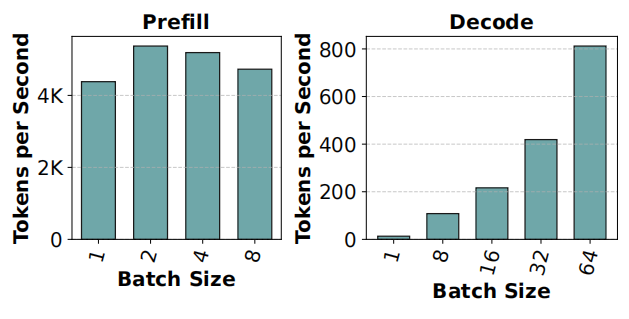
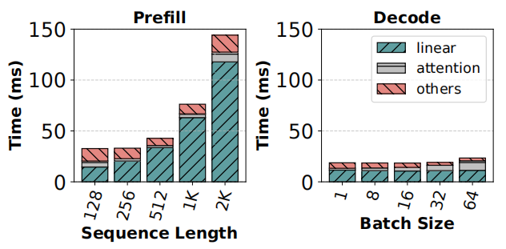
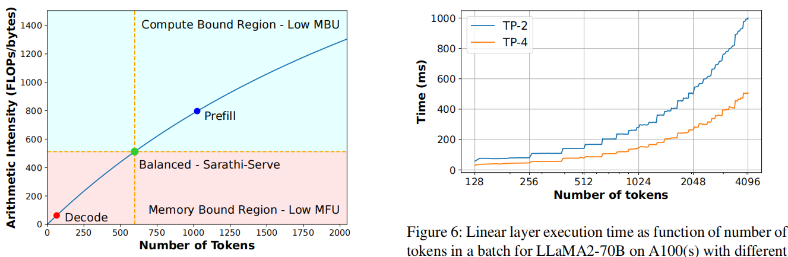
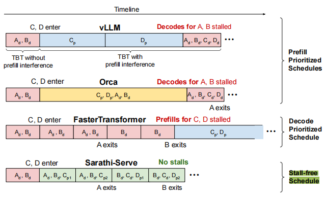
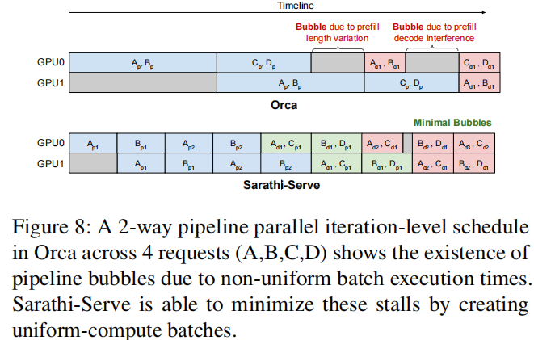

# Taming Throughput-Latency Tradeoff in LLM Inference with Sarathi-Serve
- Institution: Microsoft & Georgia Institute of Technology
- Conference: OSDI 2024
- Paper Link: https://www.usenix.org/system/files/osdi24-agrawal.pdf
- Source Code: https://github.com/microsoft/sarathi-serve

### Key Point
- To balance the throughput-latency tradeoff for scalable online LLM inference serving.
- Two key Idea:
    - **Chunked-prefills** splits a prefill request into equal compute-sized chunks and computes a prompt’s prefill phase over multiple iterations (each with a subset of the prompt tokens).
    - **Stall-free scheduling** allows new requests to join a running batch without pausing ongoing decodes.

### Problems
- The difference between Prefill and Decode stage
    - Prefill stage is compute-bound
    - Decode stage is memory-bound. 
    - Batching highly effective for decode and consequently for overall throughput
- decodes benefit significantly from batching because larger batches can use GPUs more efficiently whereas prefills do not benefit from batching.

- Existing Works:
    - prefill-prioritizing scheduling, (Orca, vLLM, et.al)
        - Continues Batching: Whenever GPU memory becomes available, schedule a new requests to start prefill
        - low latency per requests because it cause interferes with ongoing decode.
    - decode-prioritizing scheduling, (FastTransformer)
        - first compute the decode phase, only when the entire batch finish their decode, the new requests can be processed(Prefill).
        - defect: the early finished requests, low throughput

- The interferance between prefill and decode because of varing length prefills and decodes. called pipeline bubbles

### Motivations
- Batching boosts decode phase throughput immensely but has little effect on prefill stage

    

- More tokens can be processed along with a decode batch without significantly increasing its latency
    - Linear operators contribute to the majority of the runtime cost, while attention cost grows quadratically with sequence.

        

    - as long as the batch is in a memory-bound regime ($T_{mem} > T_{math}$), but linearly afterwards i.e., when the batch becomes compute-bound ($T_{mem} < T_{math}$). **If the number of tokens < 256, the latency of GPU compute increases linearly**

        

- The trade-off between throughput and latency

    

- The Pipeline Bubbles
    - The reasons for causing pipeline bubbles:
        - the varying number of prefill tokens in two consecutive micro-batches
        - the different comput time of prefill and decode stages when one is followed by the other
        - the difference in decode compute time between micro-batches since the attention cost depends on the size of KV cache and varies across requests.

    

### Design Details

- Chunk-Prefill
    - Similar with DeepSpeed-FastGen: https://arxiv.org/pdf/2401.08671

- Stall-free batching
    - like Orca and vLLM, the prefill-prioritizing scheduling will stall the existing decode to execute prefills.
    - let prefill and decode execute within one batch