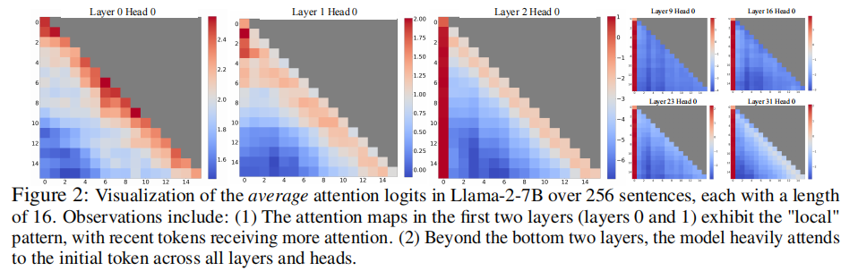

# EFFICIENT STREAMING LANGUAGE MODELS  WITH ATTENTION SINKS 

Conference: Arxiv Apr 7 2024 
Institution: Meta AI & Nvidia 
Paper link: https://arxiv.org/pdf/2309.17453 
Source code: https://github.com/mit-han-lab/streaming-llm 

### Key Point
- To handle infinite-length inputs without sacrificing performance
- 这一篇论文主要关注对 KV-cache的分析

### Problems
- the excessive memory usage for KV cache. 
- a sliding windows can be used to split the inserted requests. But it follows with accuracy decrease.
    - attention sink

### Motivations

- For Llama2-7B model
    - For bottem two layers, the model focuses on local tokens
    - For other deeper layer, the model focus on the initial tokens acorss all layers and heads.

- In this paper, the auther select first 4 tokens as Attention Sink.
- combine with “local” tokens