- Example of MLLM
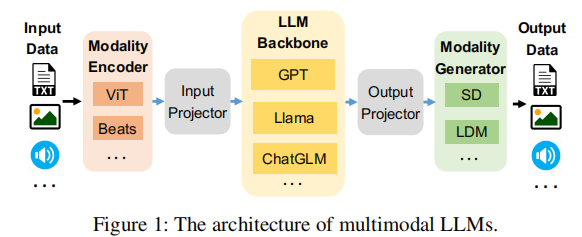

- different encoder/decoder for different data. 

### *Title: DISTMM: Accelerating Distributed Multimodal Model Training 
Conference: NSDI 2024   
Institution: The Ohio State University  
Paper Link: https://www.usenix.org/conference/nsdi24/presentation/huang     

##### Key Point
- Solve the heterogeneity in MLLM
- Select suitable parallelism strategy for MLLM(sub-models)
- design new pipeline parallelism strategy 

##### Problems
- As the input data type are different, the architecture and the scale of the submodules(encoder) vary accordingly
    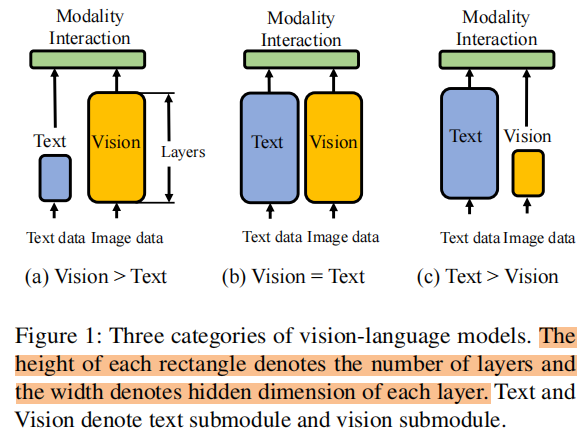

- Depending on the modaility type, the input sizes can vary significantly as well.
    - in CLIP training, the text input length is 77 words while the image input size is 512*512

- Parallelism Shortages
    - Data Parallelism: the heterogeneity and imbalanced input sizes among different submodules lead to uneven computation scales and hardware utilization.
    - Tensor Parallelism: Since the smaller submodule only contributes little to the entire model’s memory consumption, tensor parallelism will overly partition the smaller submodule, leading to unnecessary overhead

    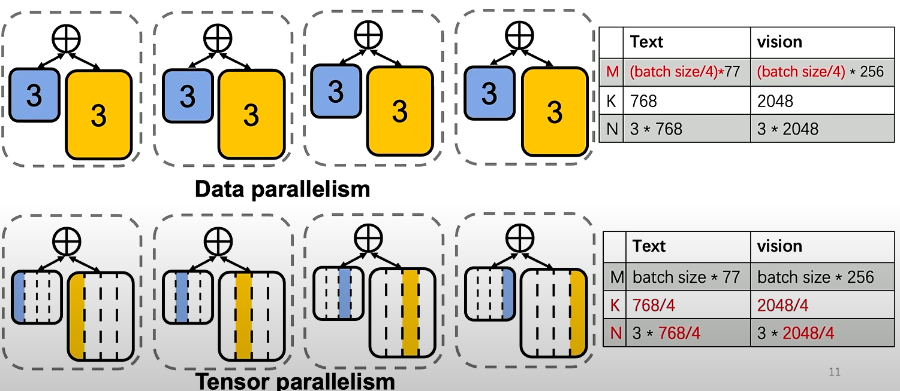

    - Pipeline Parallelism: prior study [6] shows that training with a larger number of negative and positive samples not only converges faster but converges to a model that performs better, no matter how long it is trained. Existing pipeline parallelism strategy will affect the performance of MLLM training.
        - interaction between batch

    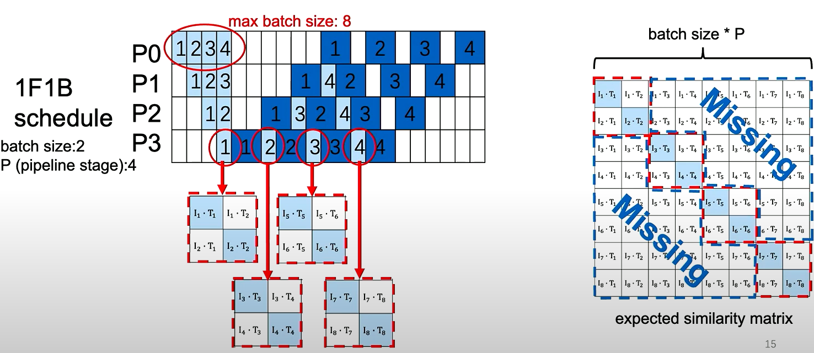

##### Motivation & Designs
- treats submodules withiin a model separately with independent parallelism strategies.
- design new pipeline strategy (across multi mini-batch)

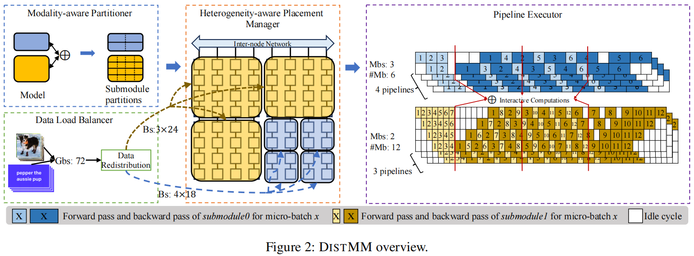

### Title: Optimus: Accelerating Large-Scale Multi-Modal LLM Training by Bubble Exploitation 
Conference: arXiv Aug 7 2024    
Institution: Harvard University & Bytedance     
Paper Link: https://arxiv.org/html/2408.03505v1  
Source code:    

##### Key Point
- In existing systems, there are substantial GPU bubbles caused by the heterogeneous modaility models and complex data dependency.
- Use these bubbles, scheduling the encoder computation within the LLM bubbles to accelerate the MLLM training

##### Heterogeneous & Bubbles
- the collection of GPU bubbles when using Megatron-LM
    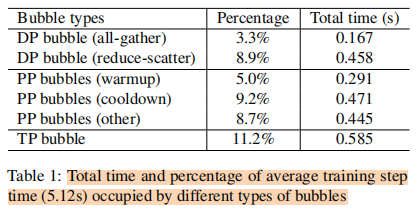

- The reason of these GPU Bubbles:
    - Communication in Data Parallelism(DP)
    - Data dependency in Pipeline Parallelism(PP)
    - Communication in Tensor Parallelism(TP)

    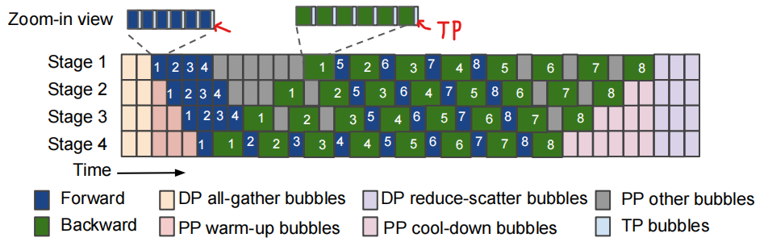

##### Challenges
- Background
    - In multimodal LLMs, **the LLM backbone has a significantly larger number of parameters compared to other components** such as encoders and projectors.
    - Dependency:
        - During the forward pass, encoders must complete the generation of encoded features before the LLM backbone can proceed with forwarding.
        - During the backward pass, the LLM backbone calculates gradients before the encoders initiate the backward pass.
- Challenge 1, In current training system, Only a frew GPUs have both encoder and LLM model states. (caused by PP)
- Challenge 2, The dependency in MLLM(in forward, only encoder finish their execution, the, the LLM can start.)
- Challenge 3, The GPU bubbles exhibit a wide range of duration, spanning from sub-milliseconds (TP bubbles) to hundreds of milliseconds (DP bubbles).

##### Design Overview
- For challenge 1, colocate encoders and LLM with seperate parallelism, let each GPU retains both encoder and LLM models

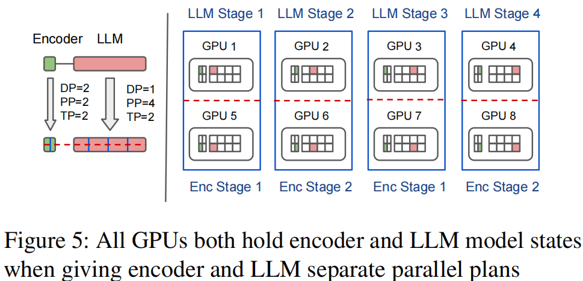

- For challenge 2, designed dual-stage dependency management
    - Local scheduling: schudling useful bubbles for encoder computation.
    - Global ordering:  ensures microbatch-level dependency between encoders and LLM by sequencing the encoder’s ending times forward and the encoder’s starting times backward across microbatches

- For challenge 3, Decomposing the encoder layer into kernels enables efficient utilization of sub-millisecond bubbles

### Title: DistTrain: Addressing Model and Data Heterogeneity with Disaggregated Training for Multimodal Large Language Models 
Conference: arXiv 15 Aug 2024   
Institution: PKU    
Paper Link: https://arxiv.org/abs/2408.04275    

##### Problems
- the model heterogeneity and data heterogeneity
- the pipeline bubbles
    - caused by model heterogeneity
        - the execute time for different submodules is different
        - for small figure, the generator's latency smaller than LLM
        - for large figure, the generator's latency bigger than LLM
        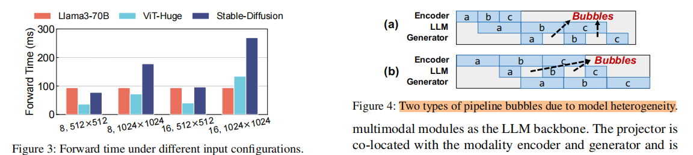
    - caused by data heterogeneity and DP
        - data distribution in LAION-400M dataset
        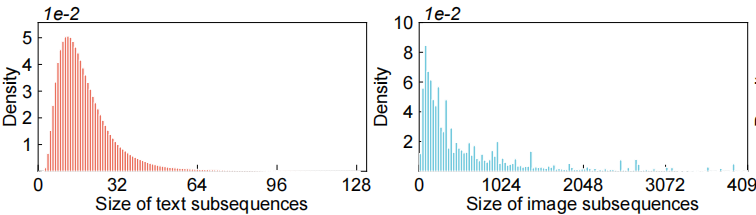
        - the computational imbalance stemming from data heterogeneity
            - intra-minibatch
            - inter-minibatch
        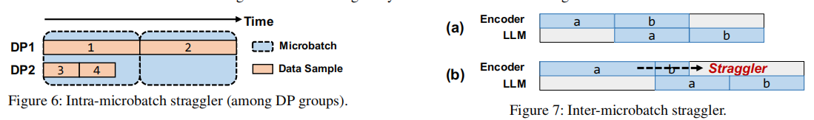

### Title: EE-MLLM: A Data-Efficient and Compute-Efficient Multimodal Large Language Model 
Conference: Sep 9 2024 
Institution: BUPT, PKU and THU 
Paper Link:  

- proposed a new MLLM architecture, in algorithm area.