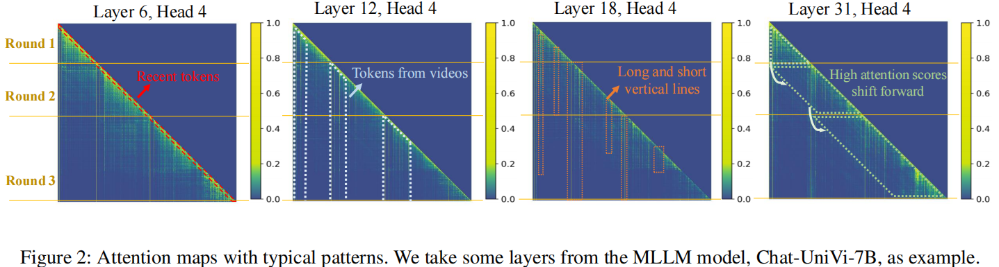
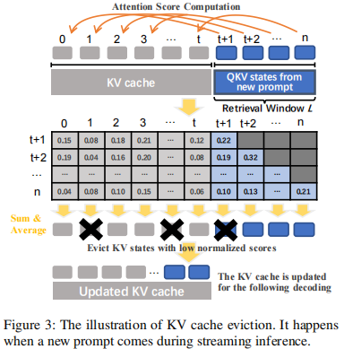

## MLLM Training
[Reading-Notes](./MLLM-Train.md)

## MLLM Inference
### Inf-MLLM: Efficient Streaming Inference of Multimodal Large Language Models on a Single GPU
Institution: Shanghai Jiao Tong University
Conference: ArXiv Sep 11 2024
Paper List: https://arxiv.org/pdf/2409.09086
Source Code:

##### Key Point
- efficient streaming inference of MLLMs on a single GPU

##### Challenges & Observations
- Challenges
    - Quadratic computation complexity of attention, (to the KV cache size)
    - High memory consumption for storing KV cache.
        - some multimodel inputs may transformed into a large number of tokens. like a several-minute-long video can be converted into thousands of tokens 
    - Context length limitation of pre-trained LLMs, like 4096 for LLaMA 2
    - Long-term reasoning capacity

- Observation in MLLM (Attention Patterns)
    - recent tokens have high attention scores
    - tokens converted from videos typically receive high attention scores
        - In some VLMs, the initial tokens of the video even share over 40% of attention scores
        - But since the position of videos is unknown beforehand in the multi-round conversation, an effective method is required to identify important visual tokens dynamically.
    - high attention scores are also distributed among tokens scattered in the sequence. These tokens are attended to for dozens or hundreds of decoding steps
    - high attention scores shift forward as the multi-round inference progress
        - When a new prompt comes, the distribution of attention scores changes significantly
    
    

- Motivation
    - Based on the observation 1,2,3; these tokens with high attention scores(Attention Saddle), Inf-MLLM designs an new KV cache eviction policy, delete less important token
        - Eviction & Compression
        - always keep max length of L (num of tokens)
    
    
    
    - For the character in observation 4, insert Attention Bias to dynamically update and get the "shift" character

## Servey
### A Survey on Multimodal Large Language Models
Institution: USTC   
Conference: IEEE TRANSACTIONS ON PATTERN ANALYSIS AND MACHINE INTELLIGENCE    
Paper Link: https://arxiv.org/pdf/2306.13549    
Source Code: https://github.com/BradyFU/Awesome-Multimodal-Large-Language-Models    

##### The architecture of MLLM
- MLLM: use powerful LLMs as a brain to support different tasks, like Text, Image, Video, Audio, et.all
- Typically Architecture:
    - Pre-trained Encoders
        - taking inputs of multiple modalities, and transform these raw multi-model data into features that the LLM can understand.
        - contains multiple encoders: 
            - image raw data  -  image encoder
            - audio raw data  -  audio encoder
            ......
    - Connectors
        - for bridging the gap between different modalities, since the LLM model can only perceive text.
        - a learnable model (the Encoder and LLMs are usually use pretrained models provided by big company)
            - the Q-Former style approaches (in Figure) compress visual tokens into a smaller number of representation vectors
            - MLP Models
            - LLM 
    - Pre-trained LLMs
    - Generator

- Training:
    - A common approach is to keep pre-trained modules (e.g. visual encoders and LLMs) frozen and train a learnable interface.
    - Some method also un-freeze the encoder for training

- Inference:
    - for example: describe a picture; MLLM take a text peompt: "Please describe the picture" and a picture as input. generate a context.
    - For the image/video -> text tasks, The encoder only execute once, while the LLM use auto-regression.

### Title: A SURVEY OF RESOURCE-EFFICIENT LLM AND MULTIMODAL FOUNDATION MODELS 
Conference: arXiv Sep 23 2024 
Institution:  
Paper Link: https://arxiv.org/pdf/2401.08092  
Open Source: https://github.com/UbiquitousLearning/Efficient_Foundation_Model_Survey 

