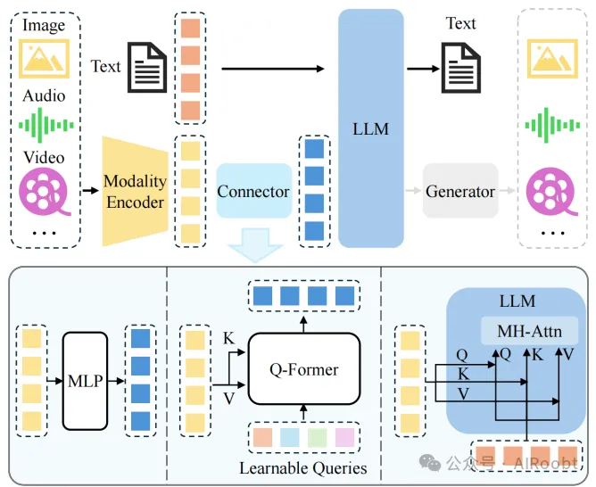
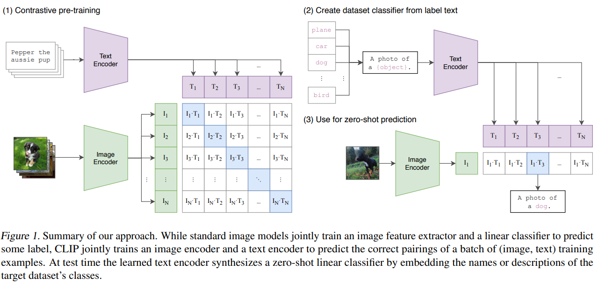
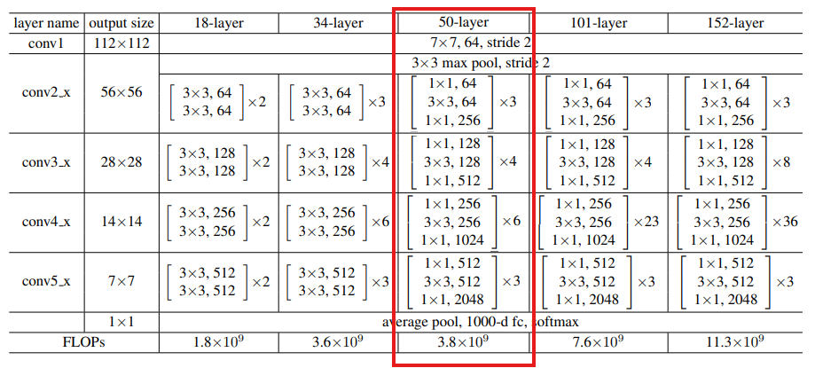
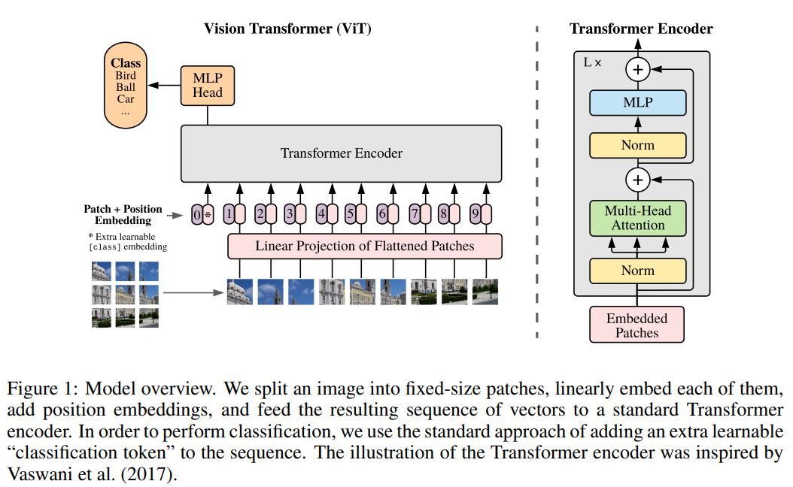
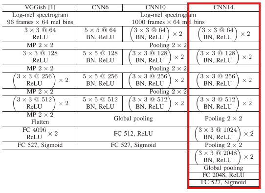
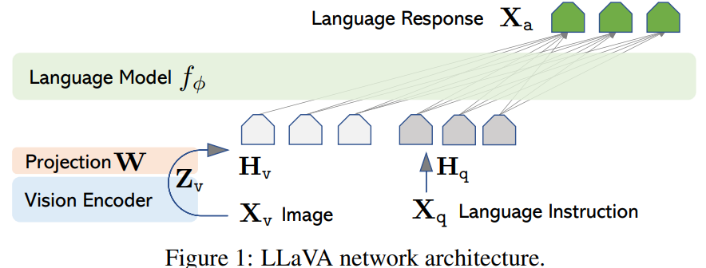
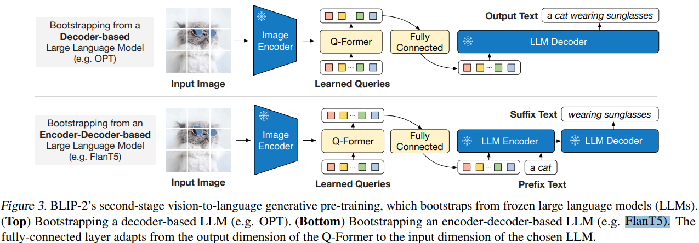
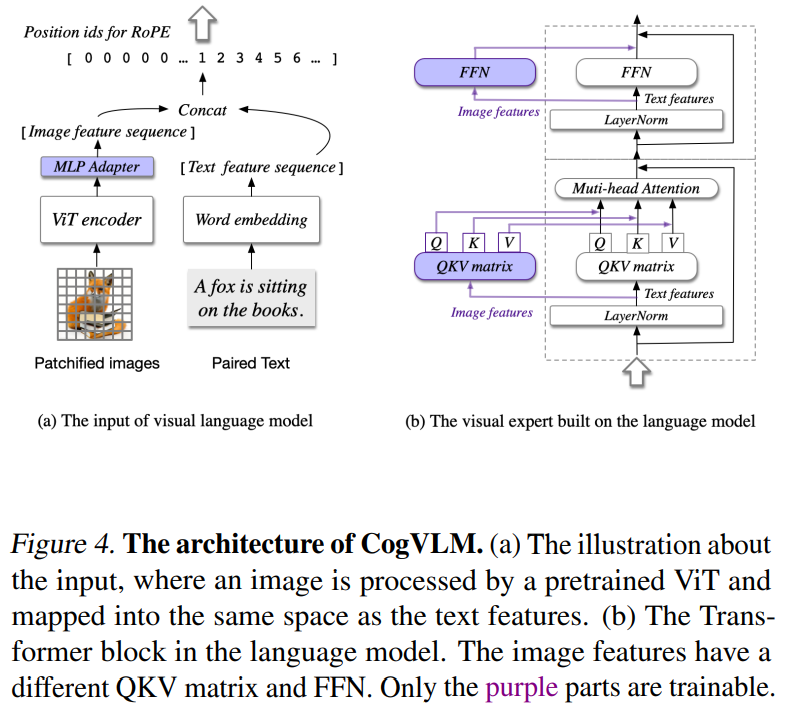

## Servey

- A Survey on Multimodal Large Language Models
Institution: USTC   
Conference: IEEE TRANSACTIONS ON PATTERN ANALYSIS AND MACHINE INTELLIGENCE    
Paper Link: https://arxiv.org/pdf/2306.13549    
Source Code: https://github.com/BradyFU/Awesome-Multimodal-Large-Language-Models    

- Title: A SURVEY OF RESOURCE-EFFICIENT LLM AND MULTIMODAL FOUNDATION MODELS 
Conference: arXiv Sep 23 2024  
Institution:   
Paper Link: https://arxiv.org/pdf/2401.08092   
Open Source: https://github.com/UbiquitousLearning/Efficient_Foundation_Model_Survey  

### The architecture of MLLM
- MLLM: use powerful LLMs as a brain to support different tasks, like Text, Image, Video, Audio, et.all
- Typically Architecture:
    - Pre-trained Encoders
        - taking inputs of multiple modalities, and transform these raw multi-model data into features that the LLM can understand.
        - contains multiple encoders: 
            - image raw data  -  image encoder
            - audio raw data  -  audio encoder
            ......
    - Connectors
        - for bridging the gap between different modalities, since the LLM model can only perceive text.
        - a learnable model (the Encoder and LLMs are usually use pretrained models provided by big company)
            - the Q-Former style approaches (in Figure) compress visual tokens into a smaller number of representation vectors
            - MLP Models
            - LLM 
    - Pre-trained LLMs
    - Generator

- Training:
    - A common approach is to keep pre-trained modules (e.g. visual encoders and LLMs) frozen and train a learnable interface.
    - Some method also un-freeze the encoder for training

- Inference:
    - for example: describe a picture; MLLM take a text peompt: "Please describe the picture" and a picture as input. generate a context.
    - For the image/video -> text tasks, The encoder only execute once, while the LLM use auto-regression.




##### Characters (Observation from previous papers)
- Model heterogeneity
- Data heterogeneity
- Dependency between Encoder and LLM

### Modality Encoder

##### Text Encoder
- Text Embedding

    - Source code of [nn.Embedding](https://pytorch.org/docs/stable/_modules/torch/nn/modules/sparse.html#Embedding)


##### Image Encoder
- Title: Learning Transferable Visual Models From Natural Language Supervision
Institution: Open AI (Ilya Sutskever)    
Conference: ICML 2021   
Paper Link: https://proceedings.mlr.press/v139/radford21a/radford21a.pdf   
Source Code: https://github.com/OpenAI/CLIP   

- Architecture

```shell
# image_encoder - ResNet or Vision Transformer
# text_encoder - CBOW or Text Transformer
# I[n, h, w, c] - minibatch of aligned images
# T[n, l] - minibatch of aligned texts
# W_i[d_i, d_e] - learned proj of image to embed
# W_t[d_t, d_e] - learned proj of text to embed
# t - learned temperature parameter
# extract feature representations of each modality
I_f = image_encoder(I) #[n, d_i]
T_f = text_encoder(T) #[n, d_t]
# joint multimodal embedding [n, d_e]
I_e = l2_normalize(np.dot(I_f, W_i), axis=1)
T_e = l2_normalize(np.dot(T_f, W_t), axis=1)
# scaled pairwise cosine similarities [n, n]
logits = np.dot(I_e, T_e.T) * np.exp(t)
# symmetric loss function
labels = np.arange(n)
loss_i = cross_entropy_loss(logits, labels, axis=0)
loss_t = cross_entropy_loss(logits, labels, axis=1)
loss = (loss_i + loss_t)/2
```



- Encoder Architecture:
    - ResNet-50 (Kaiming He, 2016: https://arxiv.org/pdf/1512.03385)
        - parameters: 23.5M

        

    - ViT (*Vision Transformer, Google Research ICLR 2021, https://arxiv.org/pdf/2010.11929)
        - parameters:
            - ViT-Base 12 layer  86M
            - ViT-Large 24 layer 307M
            - ViT-Huge 32 layer 632M

        


##### Audio Encoder
- Title: Clap learning audio concepts from natural language supervision    
Institution: microsoft    
Conference: ICASSP 2023    
Paper link: https://ieeexplore.ieee.org/stamp/stamp.jsp?arnumber=10095889&casa_token=YeGVGLICY-EAAAAA:THqWF2ASniv_syR7E0lr1v7esbTMpLVgf9y63OVJcnRgF0u0jS5eLN_feCN5mbHD-b08poa5QQ&tag=1    

      

- Inspired by CLIP
- Audio Encoder: [CNN14](https://ieeexplore.ieee.org/stamp/stamp.jsp?arnumber=9229505&casa_token=d08PoGodn1IAAAAA:QL7ZlNvlR3WsbkhMN8Inu0TwN2gBVQP-fbWo--VIarHE9IYHTkZKpYoNfRG35HCPhxpA7A9WOA&tag=1) 
    - parameters: 80M

    

- Text Encoder: BERT based Transformers
    - parameters: 110M


### Modality Interface (Connecter)
- For different modality data, after processed by Encoder, the vector also need alignment with text embedding.

##### MLP
- Title: Visual Instruction Tuning (LLaVA)
Institution: University of Wisconsin-Madison, Microsoft Research   
Conference: NeurIPS 2023  
Paper Link: https://arxiv.org/pdf/2304.08485    
Source COde: https://llava-vl.github.io   



- LLaVA use pre-trained CLIP visual encoder VIT-L/14
- LLaVA use Vicuna as core LLM

- source code of [llava](https://github.com/huggingface/transformers/blob/main/src/transformers/models/llava/modeling_llava.py)

```python
# text encoder:
self.language_model.get_input_embeddings()
inputs_embeds = self.get_input_embeddings()(input_ids)

# image encoder:
self.vision_tower = AutoModel.from_config(config.vision_config)
image_outputs = self.vision_tower(pixel_values, output_hidden_states=True)

# connecter
image_features = self.multi_modal_projector(selected_image_feature)
# multi_modal_projector: two layer MLP
class LlavaMultiModalProjector(nn.Module):
    def __init__(self, config: LlavaConfig):
        super().__init__()

        self.linear_1 = nn.Linear(config.vision_config.hidden_size, config.text_config.hidden_size, bias=True)
        self.act = ACT2FN[config.projector_hidden_act]
        self.linear_2 = nn.Linear(config.text_config.hidden_size, config.text_config.hidden_size, bias=True)

    def forward(self, image_features):
        hidden_states = self.linear_1(image_features)
        hidden_states = self.act(hidden_states)
        hidden_states = self.linear_2(hidden_states)
        return hidden_states

# merge text input with image features
inputs_embeds, attention_mask, labels, position_ids = self._merge_input_ids_with_image_features(
        image_features, inputs_embeds, input_ids, attention_mask, labels
)

# finally, send input_embeds to LLMs
outputs = self.language_model(inputs_embeds=inputs_embeds, ...)
```

##### Q-former
- Title: Blip-2: Bootstrapping language-image pre-training with frozen image encoders and large language models
Institution:Saleforce Research   
Conference: ICML 2023  
Paper Link: https://arxiv.org/abs/2301.12597  
Source Code: https://github.com/salesforce/LAVIS/tree/main/projects/blip2  



- Image encode: (1) ViT-L/14 from CLIP, and (2) ViT-g/14 from EVA-CLIP.
- LLMs: (1) OPT, (2) FlanT5

```python
# image encoder
self.vision_model = Blip2VisionModel(config.vision_config)
vision_outputs = self.vision_model(pixel_values=pixel_values, ...)
image_embeds = vision_outputs[0]

# combine text_tokens and image_embeds
query_embeds = self.embeddings(
    input_ids=input_ids,
    query_embeds=query_tokens,  # query_tokens comes from image embeds
)
# embeddings = self.word_embeddings(input_ids)
# embeddings = torch.cat((query_embeds, embeddings), dim=1)

# q-former
text_output = self.qformer(query_embeds=query_embeds, ...)

# extract text_embeds and image_embeds(normalize)
# text_projection and vision_projection is single layer MLP
question_embeds = text_outputs[0]
text_embeds = nn.functional.normalize(self.text_projection(question_embeds[:, 0, :]), dim=-1)
image_embeds = nn.functional.normalize(self.vision_projection(image_embeds), dim=-1)

# send to LLMs
return Blip2ImageTextMatchingModelOutput(
    text_embeds=text_embeds,
    image_embeds=image_embeds,
    ... 
)
```

- parameter size:
    - BLIP: 583 M
    - BLIP-2:  188M


##### Cross Attention
- Title: Cogvlm: Visual expert for pretrained language models
Institution: Tsinghua University   
Conference: 4 Feb 2024  
Paper Link: https://arxiv.org/pdf/2311.03079  
Source Code: https://github.com/THUDM/CogVLM  

- Try to solve
    - The authors suggest that the root cause of the poor performance of shallow alignment methods is the lack of deep fusion between visual and verbal information.
- Main Idea
    - Add QKV matrix and FFN layer for each layer in pretrained LLMs to handle vision imformation
- Observations
    - Based on the source code, the vision_mlp and vision_OKV will be skipped when doing decode.



- parameter size:
    - CogVLM2-19B
        - Envocer: EVA-CLIP-E  4.8B
        - LLM: LLaMA-3  8B
        - MLP Adapter + trainable QKV + trainable FFN  6.2B
            - MLP Adapter: two layer's MLP
- SourceCode: [code](https://huggingface.co/THUDM/cogvlm2-llama3-chat-19B/blob/main/modeling_cogvlm.py)
```python
class VisionExpertAttention(nn.Module):
    def __init__(self, config):
        super().__init__()
        self.config = config
        self.hidden_size = config.hidden_size
        self.num_attention_heads = config.num_attention_heads
        self.num_multi_query_heads = config.num_multi_query_heads
        self.hidden_size_per_attention_head = self.hidden_size // self.num_attention_heads
        self.stride = [self.num_attention_heads, self.num_multi_query_heads, self.num_multi_query_heads]
        self.qkv_size = self.hidden_size + self.hidden_size_per_attention_head * self.num_multi_query_heads * 2
        self.head_dim = self.hidden_size // self.num_attention_heads
        self.max_position_embeddings = config.max_position_embeddings
        self.rotary_emb = FastRotaryEmbedding(dim=self.head_dim, pos_idx_in_fp32=False, base=500000)
        # Image QKV
        self.vision_expert_query_key_value = nn.Linear(self.hidden_size, self.qkv_size, bias=True)
        self.vision_expert_dense = nn.Linear(self.hidden_size, self.hidden_size, bias=False)
        # Text QKV
        self.language_expert_query_key_value = nn.Linear(self.hidden_size, self.qkv_size, bias=False)
        self.language_expert_dense = nn.Linear(self.hidden_size, self.hidden_size, bias=False)

    def forward(
            self,
            hidden_states: torch.Tensor,
            token_type_ids: torch.LongTensor,
            position_ids: torch.LongTensor,
            attention_mask: Optional[torch.Tensor] = None,
            past_key_value: Optional[Tuple[torch.Tensor]] = None,
            output_attentions: bool = False,
            use_cache: bool = False,
    ) -> Tuple[torch.Tensor, Optional[torch.Tensor], Optional[Tuple[torch.Tensor]]]:
        bsz, q_len, _ = hidden_states.size()

        # vision_token_mask = torch.zeros_like(token_type_ids, dtype=torch.bool)
        # vision_token_mask[:, :-1] = (token_type_ids[:, :-1] == VISION_TOKEN_TYPE) & (token_type_ids[:, 1:] == VISION_TOKEN_TYPE)
        # language_token_mask = ~vision_token_mask
        vision_token_mask, language_token_mask = get_expert_mask(token_type_ids)

        shape = list(hidden_states.shape)
        shape[-1] = self.qkv_size
        mixed_raw_layer = torch.empty(shape, dtype=hidden_states.dtype, device=hidden_states.device)
        mixed_raw_layer[vision_token_mask] = self.vision_expert_query_key_value(hidden_states[vision_token_mask])
        mixed_raw_layer[language_token_mask] = self.language_expert_query_key_value(hidden_states[language_token_mask])

        # query_states, key_states, value_states = torch.split(mixed_raw_layer, self.hidden_size, dim=-1)
        factor = mixed_raw_layer.size()[-1] // sum(self.stride)
        query_states, key_states, value_states = torch.split(mixed_raw_layer, [factor * x for x in self.stride], dim=-1)

        query_states = self._transpose_for_scores(query_states)  # B, H, L, HD
        key_states = self._transpose_for_scores(key_states)  # B, H, L, HD
        value_states = self._transpose_for_scores(value_states)  # B, H, L, HD

        # ... ...

        context_layer = attention_fn(
            query_layer=query_states, key_layer=key_states, value_layer=value_states, attention_mask=attention_mask,
            scaling_attention_score=True, attention_dropout=None)
       
        attn_output = torch.empty(context_layer.shape, dtype=hidden_states.dtype, device=hidden_states.device)
        attn_output[vision_token_mask] = self.vision_expert_dense(context_layer[vision_token_mask])
        attn_output[language_token_mask] = self.language_expert_dense(context_layer[language_token_mask])

        return attn_output


# CogVLMDecoderLayer
class CogVLMDecoderLayer(nn.Module):
    def __init__(self, config):
        super().__init__()
        self.hidden_size = config.hidden_size
        self.self_attn = VisionExpertAttention(config=config)
        self.mlp = VisionExpertMLP(config)
        self.input_layernorm = RMSNorm(config.hidden_size, eps=config.rms_norm_eps)
        self.post_attention_layernorm = RMSNorm(config.hidden_size, eps=config.rms_norm_eps)

    def forward(
            self,
            hidden_states: torch.Tensor,
            token_type_ids: torch.LongTensor,
            position_ids: torch.LongTensor,
            attention_mask: Optional[torch.Tensor] = None,
            past_key_value: Optional[Tuple[torch.Tensor]] = None,
            output_attentions: Optional[bool] = False,
            use_cache: Optional[bool] = False,
    ) -> Tuple[torch.FloatTensor, Optional[Tuple[torch.FloatTensor, torch.FloatTensor]]]:
        residual = hidden_states

        hidden_states = self.input_layernorm(hidden_states)

        # Self Attention
        hidden_states, self_attn_weights, present_key_value = self.self_attn(
            hidden_states=hidden_states,
            token_type_ids=token_type_ids,
            position_ids=position_ids,
            attention_mask=attention_mask,
            past_key_value=past_key_value,
            output_attentions=output_attentions,
            use_cache=use_cache,
        )
        hidden_states = residual + hidden_states

        # Fully Connected
        residual = hidden_states
        hidden_states = self.post_attention_layernorm(hidden_states)
        hidden_states = self.mlp(hidden_states, token_type_ids=token_type_ids)
        hidden_states = residual + hidden_states

        outputs = (hidden_states,)


# Based on LLaMAModel
class CogVLMModel(CogVLMPreTrainedModel):
    def __init__(self, config):
        super().__init__(config)
        self.padding_idx = 128002
        self.vocab_size = config.vocab_size
        self.embed_tokens = nn.Embedding(config.vocab_size, config.hidden_size, self.padding_idx)
        self.layers = nn.ModuleList([CogVLMDecoderLayer(config) for _ in range(config.num_hidden_layers)])
        self.norm = RMSNorm(config.hidden_size, eps=config.rms_norm_eps)

        self.vision = EVA2CLIPModel(config)             # Image Encoder

        self.gradient_checkpointing = False
        # Initialize weights and apply final processing
        self.post_init()

    def forward(self, input_ids, images, ...):
        if past_key_values is not None:
            pass  # generate mode with past_key_values. the image features are already mapped
            # 注意，这里就没有vision_features了，对应的token_type_ids里也没有VISION_TOEKN_TYPE;
            #  => 在 VisionExpertMLP 和 VisionExpertAttention 中执行的self.vision_mlp 和 self.vision_expert_dense() 中的输入应该为空
        else:
            # text-features and image features
            inputs_embeds = self.embed_tokens(input_ids) # input_embeds size = (BatchSize, HiddenSize)
            images_features = self.encode_images(images) # within encode_image, called self.vision(images)
            # index_put将 images_features 插入到 input_embeds 中
            # LANGUAGE_TOKEN_TYPE = 0
            # VISION_TOKEN_TYPE = 1
            # input_ids += [tokenizer.pad_token_id] * vision_token_num
            # if images is not None and len(images) == 1:
            #     token_type_ids += [VISION_TOKEN_TYPE] * vision_token_num
            # token_type_ids += [LANGUAGE_TOKEN_TYPE] * len(text_ids)
            inputs_embeds = inputs_embeds.index_put([token_type_ids == VISION_TOKEN_TYPE], images_features)

        return self.llm_forward(
            input_ids=input_ids,
            token_type_ids=token_type_ids,
            attention_mask=attention_mask,
            position_ids=position_ids,
            past_key_values=past_key_values,
            inputs_embeds=inputs_embeds,
            use_cache=use_cache,
            output_attentions=output_attentions,
            output_hidden_states=output_hidden_states,
            return_dict=return_dict,
        )
    
    def llm_forward(self, input_ids, token_type_ids, input_embeds, ...):
        # mash matrix
        attention_mask = torch.ones(
            (batch_size, seq_length_with_past), dtype=torch.bool, device=inputs_embeds.device
        )
        # execute LLMs layer by layer
        hidden_states = inputs_embeds
        for idx, decoder_layer in enumerate(self.layers):
            layer = self.layers[index]
            outputs = layer(
                hidden_states,
                token_type_ids=token_type_ids,
                attention_mask=attention_mask,
                ...
            )

# Main Class
class CogVLMForCausalLM(CogVLMPreTrainedModel):
    def __init__(self, config):
        self.model = CogVLMModel(config)
    
    def forward(self, input_ids: torch.LongTensor = None, images: List[List[torch.Tensor]] = None, ...)
        outputs = self.model(input_ids=input_ids, images=images, ...)

    def _update_model_kwargs_for_generation(self, ...):
        # update past_key_values
        model_kwargs["past_key_values"] = self._extract_past_from_model_output(
            outputs, standardize_cache_format=standardize_cache_format
        )

        # update token_type_ids with last value (only 1 text token in toke_type_id)
        if "token_type_ids" in model_kwargs:
            token_type_ids = model_kwargs["token_type_ids"]
            new_token_type_ids = torch.ones(size=(token_type_ids.shape[0], 1), dtype=token_type_ids.dtype, device=token_type_ids.device) * LANGUAGE_TOKEN_TYPE
            model_kwargs["token_type_ids"] = torch.cat([token_type_ids, new_token_type_ids], dim=-1)

```
