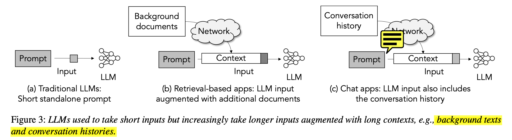

# CacheGen: Fast Context Loading for Language Model Applications

### Reason Why talk about this paper:
1, Now KV-Cache is stored in Server Side, Can we allign then to Client Side.
This Paper Try to do similar things.

### The Problem or Motivation
- BackGrond
1, for Retrieval-based apps, Need to read some background imformation. such as: code-understanding tools. these background imformation can be very large.

2, for chat apps, 1, users may send another requests several hours later;  2, some imformation is belong to another company. 

- Motivations:
1, Because longger requests prompt(more imformation) can increase the answer's accuracy, so the requests' length is becomming longger(from 1k to 100k), the prefilling costs is becoming longger.
2, 

**The Author emphasize the time-to-first-token(TTFT): means the latency of prefilling requests and generate first token.**
the yellow column means the excution latency for different request length.
