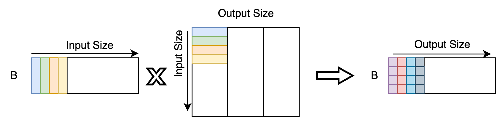

# DeepSpeed Inference

### Paper Information
Title:  Deepspeed-inference: Enabling efficient inference of transformer models at unprecedented scale
Conference: SC 2022
Institution: Microsoft
Paper Link: https://arxiv.org/pdf/2207.00032.pdf
Source code: https://github.com/microsoft/DeepSpeed

Title: ZeRO-Infinity: Breaking the GPU Memory Wall for Extreme Scale Deep Learning
Conference: SC 2021
Institution: Microsoft
Paper Link: https://arxiv.org/pdf/2104.07857.pdf

### Key Point
- DeepSpeed Transformer, a multi-GPU inference solution that minimizes latency and maximizes throughput for both dense and sparse transformer models
- ZeRO-Inference, a heterogeneous GPU+CPU+NVMe based solution that enables massive model inference with limited GPU resources.
  - for less latency sensitive but resource constrained scenarios

### Try to Solve?
Implement a efficient Transfermer Inference.

### Motivation
- Latency Challenge: 
  - small batch-size, inference latency of a model is lower bounded by the time it takes to load all the model parameters from memory to registers.
  - for large model, need optimal parallelism strategies for partitioning the model computation across devices that minimizes the communication overhead across devices.
- Throughput Challenge:
  - high memory bandwidth utilization: overlap the compute with the model weight read.
  - Keep KV-Cache

### Design and Details
- DeepSpeed Transformer: a GPU only solution
  - Chanllenges:
    - With small batch size: the performance is limited by the memory bandwidth utilization in reading model wrights.
      - kernel-invocation overhead
      - when kernel-invocation happend, the date need to be write to global memory; add an additional overhead
      - the prior GeMM libraries are not well tuned for extremely small batch size
    - With large batch size: the performance is limited by compute utilization
      - the kernel launch overheads
      - data transfer between GPU cores and global memory.
- Deep Fusion:
  - Deep-Fusion can fuse not only element-wise operations but also reductions, data transpositions, and GeMMs as long as there are no cross-tile dependencies.
  - Tile: Like 1-D tensor parallelism, Split tensor with output dimension; within each tile, the result intermediate value is not dependent by cross tile input/weight。
    
  - Overall：
  

- SBI-GeMM: Custom GeMM for Small Batch size Inference
  - optimize the utilization of L1 Cache in GPU
    - 128 Byte per L1 Cache Line(a warp); fragmentation happens when storage a single INT8 weight or FP16 activity.
    - along the output tile, split the matrix execution into N thread Blocks and each block contains 4 Warps(a warp contains 32 execution threads).
    - feed the L1 Cache Line full. Rearrange the Weight Tensor to allow each thread read M elements alont the input demention(INT8: M=4, FP18: M=2)
  

- With multiple GPUs
  - Use pipeline parallelism scheduler to hide data dependencies.
  
  - Use Tensor parallelism(1D form Megatron-LM) to automatically scale a dense transformer to multiple devices.
  - The varying requirement for prompt processing and token generation:
    - the prompt processing stage requires more execution than token generation.
    - Use hybrid scheduling where different micro-batch counts are induced: (the overall batch_size is stable; reduce data transmission)
    
  - For KV-Cache, has predictable reuse pattern, can be offload to CPU memory when GPU memory is not enough.
  - To avoid contention between GPUs, Scheduling odd and even layer offloading across GPUs prevents contention on the PCIe link, allowing each GPU to fully leverage the PCIe bandwidth when it needs to offload. 

- Sparse Model Inference(MoE)
  - training multiple FFN layer, and for different input value, choose different FFN Layer.
  - add expert-slicing and arrange different FFN expert-model on different GPUs
  

- ZeRO Inference
  - Build on the offloading techniques of ZeRO-Infinity
  - 