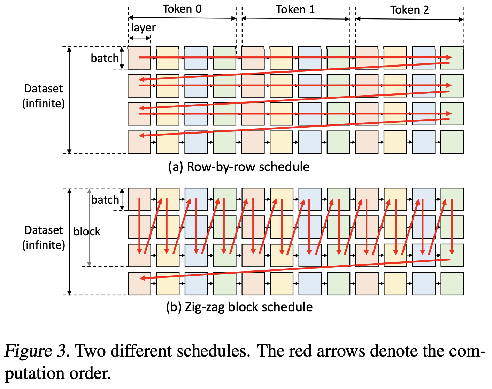
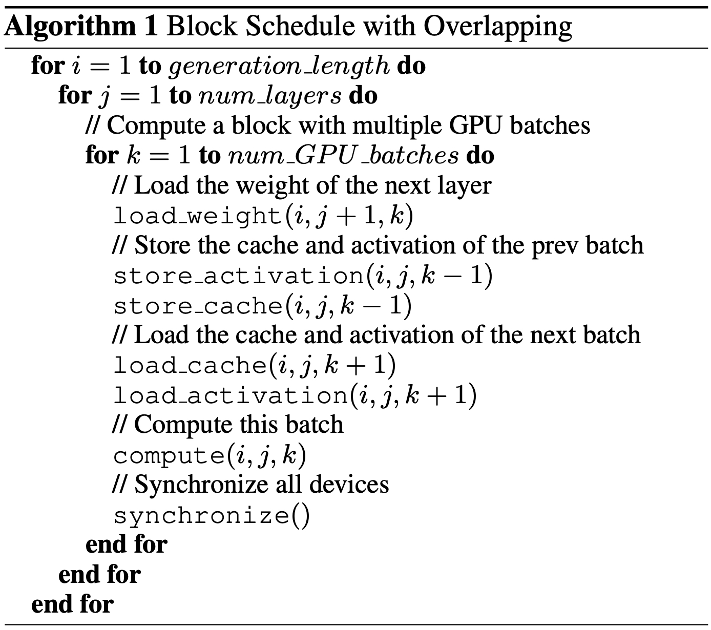

## FlexGen: High-throughput Generative Inference of Large Language Models with a Single GPU

### Paper Information
Conference: ICML 23
Paper: https://arxiv.org/pdf/2303.06865.pdf
Source Code: https://github.com/FMInference/FlexGen

### 论文理解
#### Key Point 
Focus on LLM Inference, and set a strong premise. How to use a single commodity GPU. 
Not care about the latency, only focus on the high-throughput of LLM Inference.

#### Try to Solve
1, Using limited GPU resource to run a LLM Model and do Inference.
2, In common inference situation, because the seq token generation is time dependent. Which lead much weight offload and reduce the throughput.

#### Motivation and Solution
1,When only focus on high throughput, can us data parallelism to reduce the weight offload, and use pipeline strategy to overlap the micro-batch input, KV-Cache, intermedia data offload with calculation.

2,When the KV-Cache was offload to host memory, which means compute the attention scores on CPU can reduce the communication. Only need to offload Q: b * h * 4byte.  