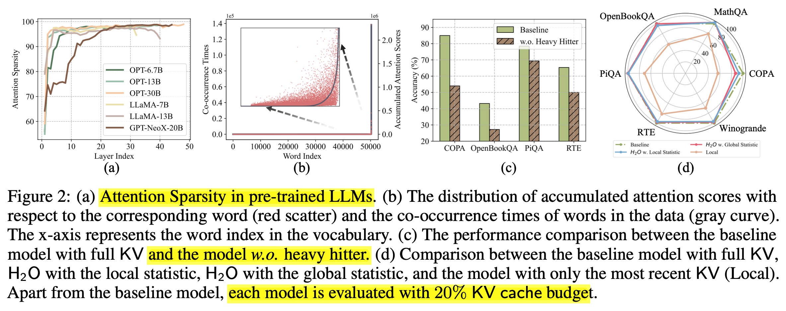
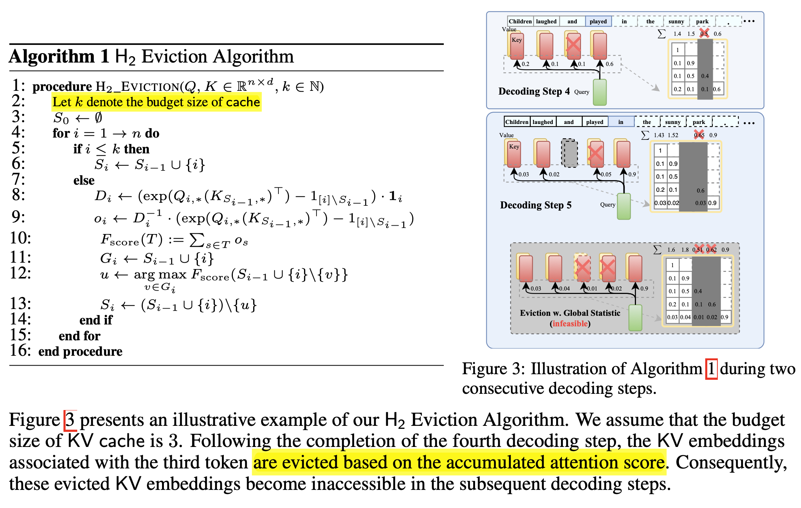
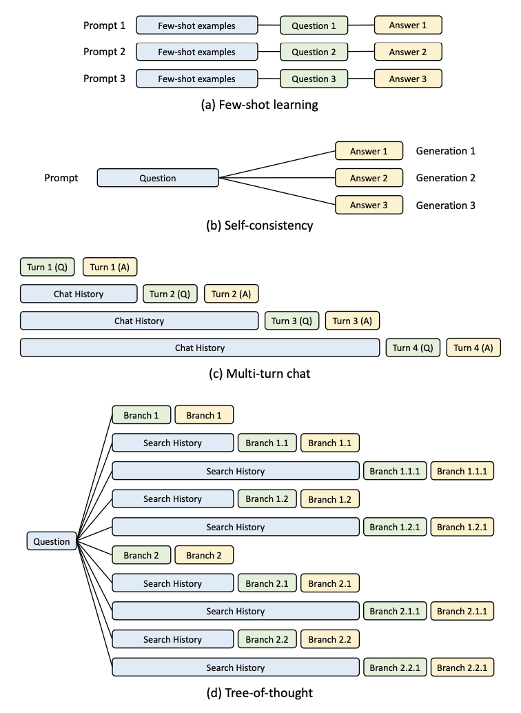
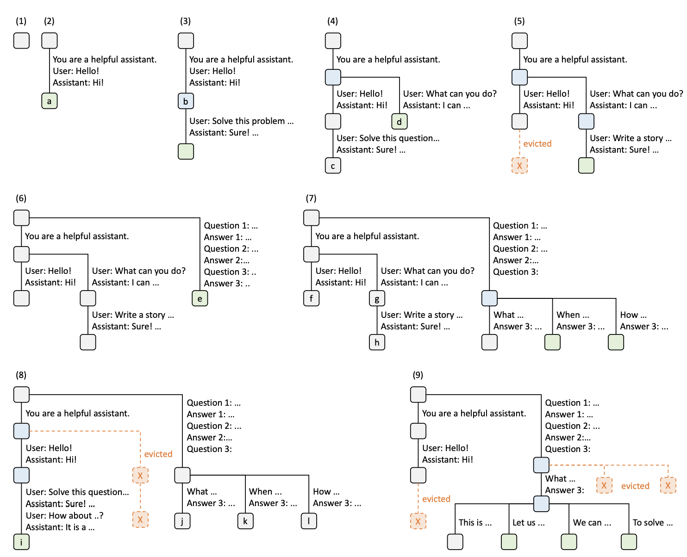
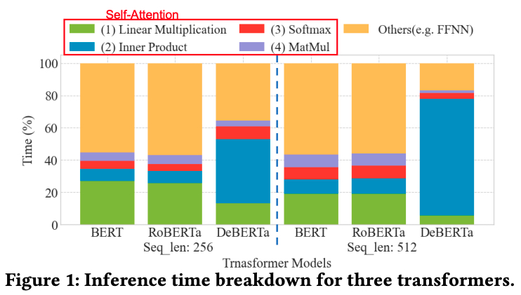
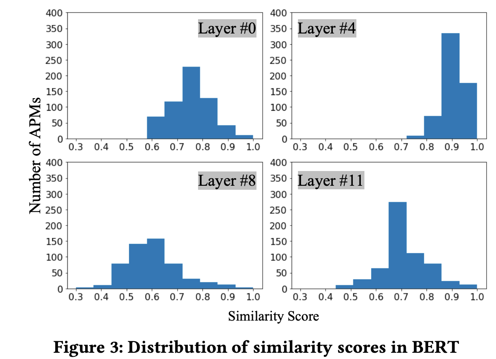
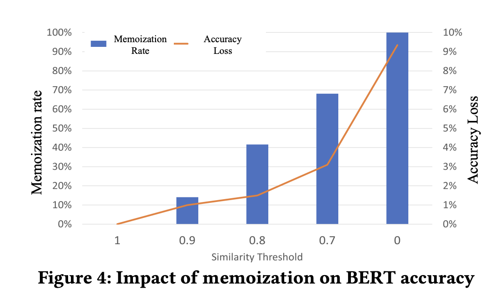
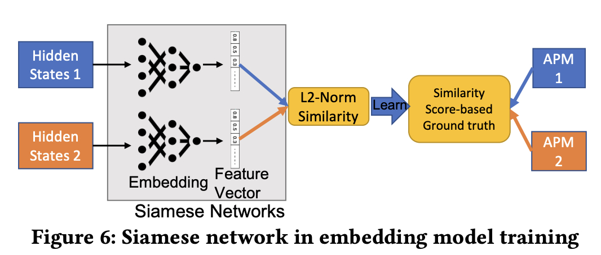

# KV Cache Reuse Cross Multiple Requests

## Contents
  - Prompt Cache: Modular Attention Reuse For Low-Latency Inference [Yale arXiv'23]
  - H2O: Heavy-Hitter Oracle for Efficient Generative Inference of Large Language Models
  - AttMemo : Accelerating Self-Attention with Memoization on Big Memory Systems
  - Efficiently Programming Large Language Models using SGLang (Radix Attention)
  

## Prompt Cache: Modular Attention Reuse For Low-Latency Inference
- Paper Information:
    - Conference: Nov 7 2023, arxiv
    - Intitution: Yale
    - Paper Link: https://arxiv.org/pdf/2311.04934.pdf

### Motivation
- Like KV-Cache, reuse the key-value attention states of input tokens during the autoregressive tokenb generation. 
- Extend attention state reuse across multiple requests
- Key Point: frequently occurring text segments in prompts can be precomputed and stored as attention states on the inference server, allowing for efficient reuse when these segments appear in user prompts. 
- Observation:
    -  different prompts often have overlapping text segments.
    -  some sample: in legal, medical, robotics, and learning tools applications


### Challenges
- Attention States are position-dependent due to the positional encoding in Transformers, So t must allow reuse despite a text segment appearing in different positions in different prompts.
- The system must be able to efficiently recognize a text segment whose attention states may have been cached in order to reuse.


### Solution & Design
- Make the structure of a prompt explicit with a Prompt Markup Language (PML) => each prompt module can be assigned with unique position IDs.
- LLMs can operate on attention states with discontinuous position IDs. 
    -  My understanding: If the original order of the prompt is not changed, insert some empty padding 0 will not affect the generated output.

#### Prompt Markup Language(PKL)
- Key Point: 
    - Split the inserted prompt into small partitions, and treat each partition as the smallist element when reuse.
    - Use Schema to allign the reusable key words between different imported prompts.
    - Example: 
        - Prompt 1: please write a trip-plan for me, and I want go to Beijing?
        - Prompt 2: I want to go to New York for vocation, please give me a trip plan?
    - Use schema: city_info & trip plan to store different cities, and when a new prompt with city "beijing" insert to the service. retrieve the stored KV-Cache of "beijing", and combine with excuted other words as the entire inserted prompt tokens.


    - Note: Schema: A schema is a document that defines prompt modules and delineates their relative positions and hierarchies.
    - Additions:
        - 1, "Union" tag, for example: same word "Beijing" In English or In Chinese
        - 2, "system" tag, for ystem-level prompts; "user" tag for user inserted prompts

##### Experiment
- Use CPU memory or GPU memory to storage Prompt Cache
    - 3x latency reduce when Use CPU memory, while about 8x latency reduce when use GPU memory

- The latency anlysis for transformer.
    - Prompt Cache’s memcpy overhead grows linearly with sequence length.
    - Computing self-attention has quadratic computational complexity with sequence length.


## H2O: Heavy-Hitter Oracle for Efficient Generative Inference of Large Language Models
- Paper Information
  - Conference: ArXiv '23
  - Institution: University of Texas at Austin
  - Paper: https://arxiv.org/pdf/2306.14048.pdf
  - Source Code:  https://github.com/FMInference/H2O.

### Motivation
- Reducing memory usage by dynamically keep newest and more important tokens. (Sparsity)
- Challenges:
  - The increased KV-Cache for LLM Inference
  - **<font color=red>Idea KV-Cache Setting</font>**
    - small cache size to reduce memory foot-print
    - low miss rate to maintain the accuracy
    - low-cost eviction policy

### Observation and Challenges
- Observation: As shown in Figure 2(a), although the LLMs are densely trained, the resulting attention score matrices are highly sparse, with a sparsity over 95% in almost all layers.
- It is possible to evict unessential KV embeddings and reduce the requirement of KV cache during generation.

- Note: The quadratic computational complexity of attention modules is one of the major bottlenecks of transformer inference.

- Prior Works:
  - SpAtten [32] utilizes accumulated attention scores to select important tokens for efficient attention inference while they don’t consider the variance of token importance across attention heads and layers.



### Solutions & Design
- Only keep Heavy Hitter tokens (plays more important roles in activities)
    - denote those tokens as heavy-hitters (H2).
    - recent words typically exhibit stronger correlations with current tokens.
- H2 score is calculated using local statistics at every decoding step by summing up the attention scores of the previous tokens, is equally effective as taking into account the attention of future tokens. As shown in Figure 3.


- Pseudocode
```
def generation_loop(...): 
    # Prologue
    ...
    # Generate
    for i in range(gen_len):
        for j in range(num_layers):
            for k in range(num_gpu_batches): 
                load_weight(i, j+1, k) 
                load_cache(i, j, k+1) 
                store_hidden(i, j, k-1) 
                load_hidden(i, j, k+1) 
                compute_layer(i, j, k) 
                store_cache(i, j, k-1)
                sync()
    # Epilogue
    ...

# h is the hidden states (activations)
def attention_forward(h, ...):
    # the read/write buffer are intermediate stops for prefetching 
    if prefill:
        h, new_k_cache, new_v_cache = compute_attention(h, ...)
        # select K heavy hitters and K recent tokens
        new_k_cache, new_v_cache = select(new_k_cache, new_v_cache, K)
        cache_write_buffer.store(new_k_cache, new_v_cache) 
    else:
        k_cache, v_cache = cache_read_buf.pop()
        # evict_ids track the entries that will be evicted
        h, new_k_cache, new_v_cache, evict_ids = compute_attention(h, k_cache, v_cache, ...)
        cache_write_buffer.store(new_k_cache, new_v_cache, evict_ids) 
    return h

def store_cache(...): 
    if prefill:
        # store cache directly
        ... 
    else:
        k_new, v_new, evict_ids = cache_write_buffer.pop()
        # circular queue for the last K entries
        # extract the index for the oldest token at i-th iteration 
        oldest = ((i - 1) % K) - K
        # update the KV cache (k_home and v_home) 
        cache_replace(k_home, evict_ids, k_new, K, oldest) 
        cache_replace(v_home, evict_ids, v_new, K, oldest)
```

### <font color=red>Source Code Analysis</font>
[H2O SourceCode Analysis](./H2O-SorceCode.md)


## Efficiently Programming Large Language Models using SGLang (Radix Attention)
- Paper Information
  - Conference: arXiv '23 (Dec 12)
  - Institution: Standford (Lianmin Zheng)
  - Paper: https://arxiv.org/pdf/2312.07104.pdf

### Paper Details
#### Key Point
- Focus on KV-Cache reuse across multiple requests.
- RadixAttention: a novel technique that maintains a Least Recently Used(LRU) cache of the KeyValue(KV) cache for all requests in a radix tree, enabling automatic KV cache reuse across multiple generation calls at runtime. 

#### Motivation
- Motivation: In different LLM application patterns, do exist possibility for KV-Cache reused.
- Samples for KV-Cache reuse across different LLM application patterns:
    - Blue boxes represent shareable prompt parts
    - Green boxes indicate non-shareable parts
    - Yellow boxes mark non-shareable model outputs


    - description for different patterns
        - Chain of Thought to guide LLM model to tackle complex questions. 
    
    |category|description|other works|
    |:--|:--|:--|
    |Few-shot learning|Give a example(Q-A) to guide LLM model generated proper answer, widely used(like translator tools) |Prompt-Cache|
    |[Self-Consistency](https://arxiv.org/pdf/2203.11171.pdf)|For some complex Q, there is multiple way to answer it, Can used LLM to generate multi answer and select most proper one for users|--|
    |Multi-turn chat|based on history, Like ChatGPT session|--|
    |[Tree-of-thought](https://arxiv.org/pdf/2305.10601v1.pdf)|Allow LLM model to backtrace when necessay, For some complex Q, one shot generated answer may not perfect, need to backtrace and search better answer(like DFS). for example: to solve puzzle game |--|

#### Solutions
##### RadixAttention
- Overview
  - Support automatic KV cache reuse during runtime. 
  - Use Least Recently Used (LRU) eviction policy to delete former imformation and release memory space.
  - Use Radix Tree (Like a Trie Tree)



- Detail for the Figure
    - Step (1), the radix tree is initially empty.
    - Step (2), the server processes an incoming user message "Hello". The system prompt "You are a helpful assistant", user message "Hello!", and the LLM reply "Hi!" are consolidated into the tree as a single edge linked to a new node（Keeps the generated KV-Cache）.
    - Step (3), a new prompt arrives and the server finds the prefix of the prompt in the radix tree and reuses its KV cache. The new turn is appended to the tree as a new node.
    - Step (4), a new chat session begins. The node “b” from (3) is split into two nodes to allow the two chat sessions to share the system prompt. 
    - Step (5), the second chat session continues. However, due to the memory limit, node "c" from (4) must be evicted. The new turn is appended after node "d" in (4). 
    - Step (6), the server receives a few-shot learning query, processes it, and inserts it into the tree. The root node is split because the new query does not share any prefix with existing nodes. 
    - Step (7), the server receives a batch of additional few-shot learning queries. These queries share the same set of few-shot examples, so we split node ’e’ from (6) to enable sharing.
    - Step (8), the server receives a new message from the first chat session. It evicts all nodes from the second chat session (node "g" and "h") as they are least recently used. 
    - Step (9), the server receives a request to sample more answers for the questions in node "j" from (8), likely for self-consistency prompting. To make space for these requests, we evict node "i", "k", and "l" in (8).

- My understanding and limitation:
  - It looks like only used in GPU Memory, not talking about use CPU memory or external memory in ther paper/experiment
  - Because for common situation, people read the prior answer and insert a new req uest wille take multiple seconds, If only keep them in the GPU memory, I adoubt the efficiency of this way. (Other user's request will make the keeped KV-cache be evicted)


## AttMemo : Accelerating Self-Attention with Memoization on Big Memory Systems
### Paper Information
Conference: arXiv '23
Institution: University of California, Merced (Yuan Feng)
Paper: https://arxiv.org/pdf/2301.09262.pdf

### Paper Details
#### Key Point
- self attention layer is compute-intensive, and takes the largest portion of the total inference time.


- memoize the results of the most time-consuming tensor computation and replace them with lightweight searches in a key-value store (KVS).
    - eg, "I like apple"  and "I like banana". with different meanings but the two sentence is similar.
- Use Big memory(the cheap external memory/Database)

#### Try to Solve
- reduce the self attention execution by selective storage similar input/activations for transfermer layer.
- the existence of computation redundancy (n the total variation (TV) distance - mathematic way)


#### Motivation and Solution
##### Challenges:
- how to judge the similarrities between different Request.
- the expensive memory accesses for storing and fetching pre-populated (memoized) tensors in the KVS
- find the optimal memoization level by considering the tradeoff between inference time (performance) and inference accuracy of transformer model(if the similarity between input and stored data is not high enough, will cause ).


#### Solutions
- designed a lightweight MLP model for embedding to compare two requests(new inserted request and stored requests)
