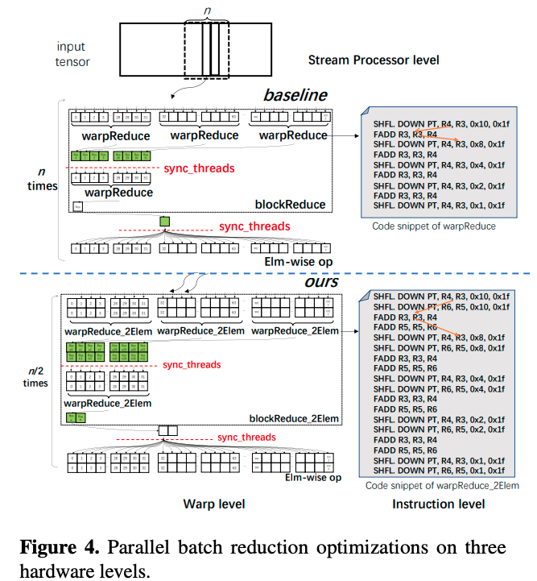

### Faster Transformer

### TurboTransformers
Paper: https://arxiv.org/pdf/2010.05680.pdf
Institution: Wechat AI, Tencent Inc
Conference: PPoPP '21

- Focus on LLM Inference
- Contribution:
  - 1, Kernel fusion: fusing all the kernels between two GEMM kernels into a single one to reduce the number of memory accessesm increase cache locality, and ruduce kernel launch overhead.
      - TurboTransformer implement all the non-GeMM kernels using CUDA.
          - element-wise operation: there is no dependency between the processing of two different tensor elements
              - like activation operation and transpose operation
              - we can process them in parallel
          - reduction operation: batch reduction
              - like Softmax, LayerNorm
  - 2, GPU-based Batch Reduction
      - There is a dependency between shuffle and add instructions(Like following graph, the target regRter R3 in an SHFL DOWN instruction is required immediately as a source register in FADD instruction, need at least 1 cycle latency).
      - Insert X (here X=2) reduction to break up the dependency of registers.
      
  - 3, Memory Management
      - The allocation efficiency, which determined by the number of times and the amount of the memory is allocated and released, affects the overall execution speed of the runtime.
      - Use fixed size memory chunk and reuse scheduler to avoid frequently memory allocation.
      - Following graph, when seq len = 240, need to allocate 1 more memory chunk than seq len = 200.
      
  - 4 batch scheduler
      - dynamic batching with similer requests length.
      