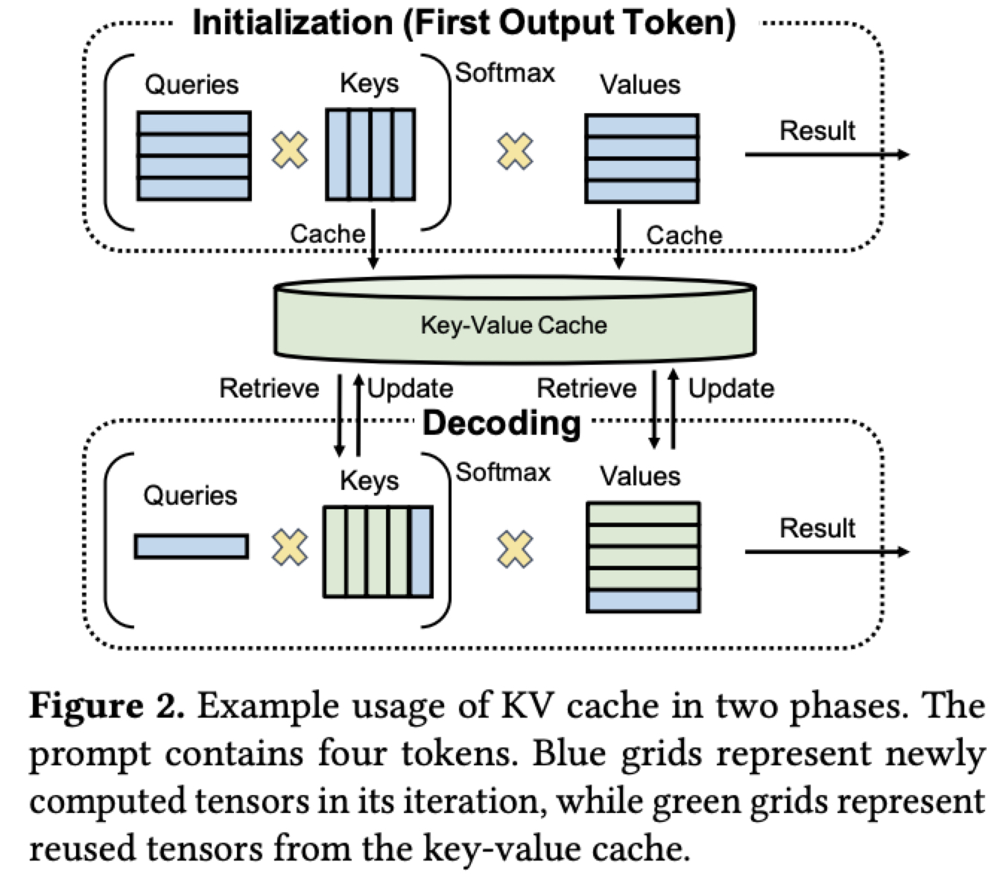
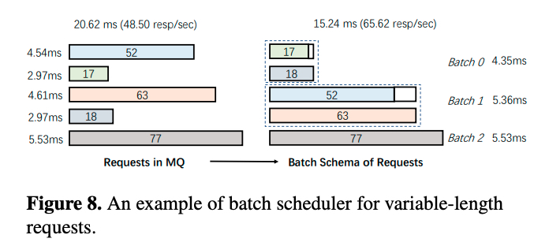
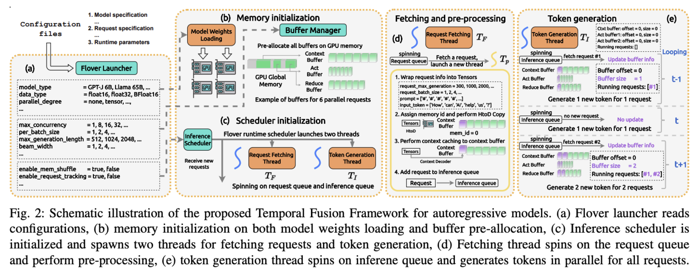
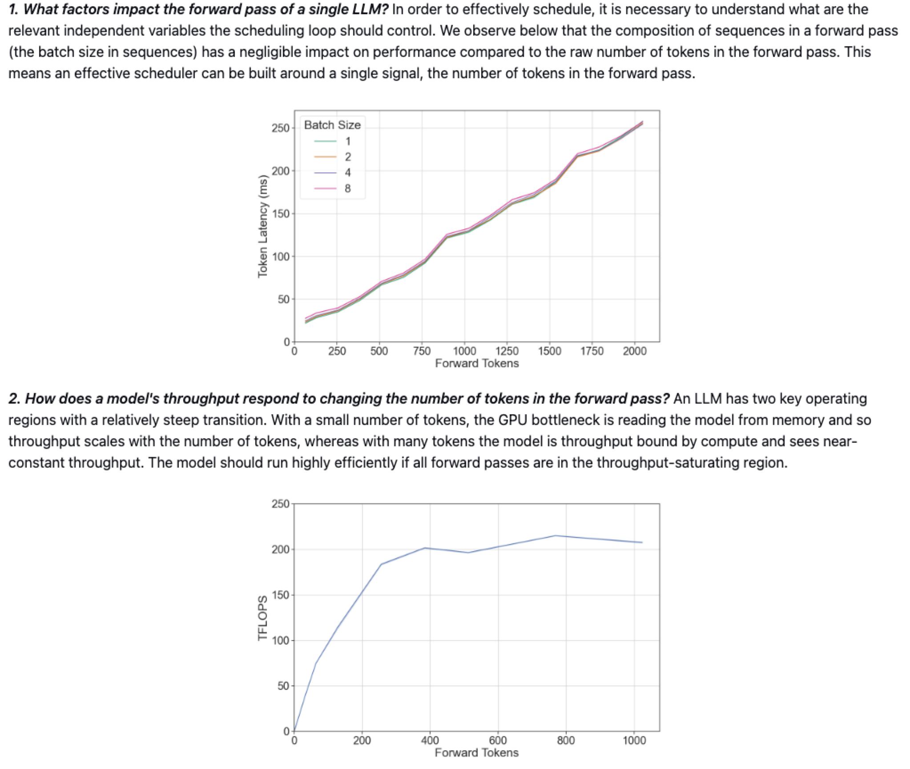
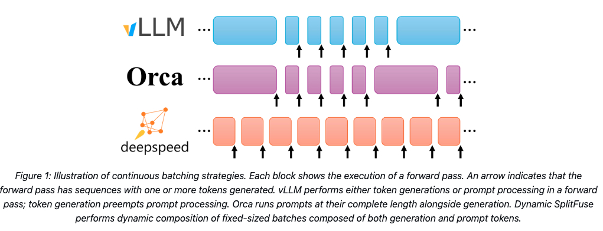

## Memory
### KV-Cache

#### Within GPU Memory
- PageAttention(vLLM)

#### With External Memory
- FlexGen
- Zero-Inference

### Prompt Cache
- reuse the prompts across different inserted prompts

### Question 2 Reuse of the pre-request's KV-Cache
- Here Use the NVIIDA T4 AS the sample GPU
- the parameters for T4 (https://www.nvidia.com/en-us/data-center/tesla-t4/)

|Cate|Parameters|
|:--|:--|
|GPU Arch|NVIDIA Turing|
|Tensor Cores|320|
|CUDA Cores|2560|
|Mixed Precision(FP16/FP32)|65 TFLOPS|
|INT8|130 TFLOPS|
|GPU Memory|16GB GDDR6 300GB/s|
|InterConn bandwidth|32 GB/s|
|System Interface|x16 PCIe Gen3 15.8GB/s for single direction|

- Compare the Execution Latency and the Communication Latency
    - for single layer & pre-processing; 
    - the next layer also require the provior token

|Module|Excution Latency(ms)|Comunication Latency(ms)|
|:--|:--|:--|
|GPT-2 1.5B, hidden_size=1600|0.0824|0.0188|
|Llama2-7B, hidden_size=4096|0.54|0.048|
|Llama2-70B, hidden_size=4096 with GQA|0.54|0.048|

## Continue Batch

### Problems: 
- For LLM Inference, have a multi-iteration token genetion stage
- For requests in single batch, the early finished requests need to wait for all the other requests.
- New request need to wait the prior batch finished

### Motivation:
- Observations:
1, the Inference can be split into two part: pre-processing and token-generation; and they require different resources.

2, the pre-processing excution need more time, because it have more input tokens than token generation stage.

- Motivation:
Can split the promt into smaller part and combine as different request send to execute with token genration.
Reasons:
1, In pre-processing stage, there is no dependency between the excution of two differnet tokens.
2, Only last token need prior inseted tokens's KV-Cache, and they belong to different iteration; There is enough time for data communication across devices.

### Prior Works:

#### Abstract:
    1, Dynamic Batching like Orca and FastServe not split there two part of execution
    2, Sequence-Scheduling(Huawei) combine similer response lengths into micro-batches
    3, Like Flover, it considered these problem, but their work split into two part of execution, may compute GPU resources.

#### Details for Prior works:
- Orca(https://www.usenix.org/system/files/osdi22-yu.pdf)
  - schedule execution at the granularity of iteration: at end of each iteration, check every request in the batch; if finished, return the generated answer, and select a new request in request pool to join the batch.
  - FCFS schedule algorithm （first come first served）
  - In order to minimize the overhead of the control message exchange between CPU and GPU
      - ORCA use NCCL to exchange intermediate tensor data
      - Control message is sent between the engine master and worker controllers by a separate communication channel that does not involve GPU such as gRPC.
  - Costs: Every iteration, GPU wait for the control message from CPU.

- FastServe(https://arxiv.org/pdf/2305.05920.pdf)
  - enable preemption at the granularity of each output token. even within iteration, new requests have higest priority to preemtion the GPU excution, 
      - Problems： like Orca, also need to wait at least one request finish; if the request have a long output length, will block following short jobs.
  - skip-join MLFQ schedule algorithm (multi-level feedback queue)
  - The two phrases of LLM Inference
    
  - New Problem: preemptive scheduling has to keep the key-value cache in the GPU memory for all preempted jobs in the pending state for future token generation. The key-value cache consumes a huge amount of GPU memory. (7X larger than FCFS method)
      - proactive key-value cache swapping: 
          - Instead of reactively offloading jobs when the key-value cache is full, FastServe keeps some idle key-value cache slot for newly arrived jobs. 
          - When the key-value cache space on the GPU is sufficient, FastServe proactively uploads the keyvalue tensors of the jobs that will be used in the near future
  - Distributed Serving
      - Job Scheduler: In single device, the scheduler would schedule the job with the highest priority and executes it until it finishes or is demoted; But in pipeline parallelism framework, When a job finishes the first stage and sends the intermediate result to the next stage, the scheduler cannot follow the traditional MLFQ that keeps scheduling the same job until demotion, because the job is still running. So keep the runing job in the priority queue, and select the highest priotity jon in pending state to execute.
      - Before processing the intermediate result sent from the previous stage, the current stage does the same offloading or uploading action as the previous stage does.
      - The key-value cache swapping mechanism only needs to decide the offloading or uploading of the first stage.

- Sequence-Scheduling(https://arxiv.org/pdf/2305.13144.pdf)
  - Huawei & NUS
  - gathers queries with similar response lengths into micro-batches.
  - Use Prompt to guide the LLM to predict the length of the response in advance.

- TurboTransformers
  - dynamic batching with similer requests length.

- Flover(https://arxiv.org/pdf/2305.13484.pdf)
  - Prior work shortages: 
      - Dynamic Batching: need wait a short time to combine a few request as a batch.
      - Concurrent Instance: for each coming request, launching a new inference instance to start it's excution. In token generation stage, when multiple instances run concurrently, they compete for the same resources, draining the bandwidth, causing frequent context switching on both CPU and GPU sides.
      - Like Orca, dose not support stable generation length.
  - Motivation:
      - For Inference, pre-processing stage need to calculate the input prompt and generate the KV-Cache, is compute requirement, but only happended at the first iteration.
      - For token generation stage generate token iteration by iteration, Not need as much excution costs as pre-processing.
      - Split to two part: use concurrent instance to calculate pre-processing while using dynamic batching for token generation.
      
  - Also have a memory management:
      - Problem: both computing kernels and collective communication can only process contiguous memory buffers.
        - combine with the kernel function
      - Solution: designed a algoritm to move the data to contiguous bufffer.
  - Existing Problems:
      - Every new request come in, the pre-processing operation need to compute GPU execution resources with token generation. When split it into two different operation.
      - contiguous buffer: for KV-Cache, because each request at different token generation stage; the length of their generated KV-Cache is also different? Use contiguous buffer will case a number of padding 0 was read and excuted.
        - **Still Checking the source Code whether the score excution of mini-batch need similer length（for KV-Cache）**

- DeepSpeed-FastGen
  - Link: https://github.com/microsoft/DeepSpeed/tree/master/blogs/deepspeed-fastgen
  - SourceCode: https://github.com/microsoft/DeepSpeed-MII/tree/main

  - Also focus on the difference of pre-processing and token generration
  - Based on observation: token number is the only factor to affect the token generate latency and the throughput of the model.
      
      - Here, based on my understanding, the forward token number means for single layer, the tokens contained by the micro-batch input.
  - Dynamic SplitFuse
      - Long prompts are decomposed into much smaller chunks and scheduled across multiple forward passes (iterations) with only the final pass performing any generation.
      - Short prompts will be composed to exactly fill a target token budget. Even short prompts may be decomposed to ensure the budget is precisely met and the forward sizes are well-aligned.
  
  