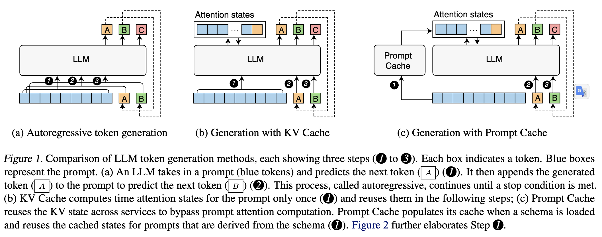
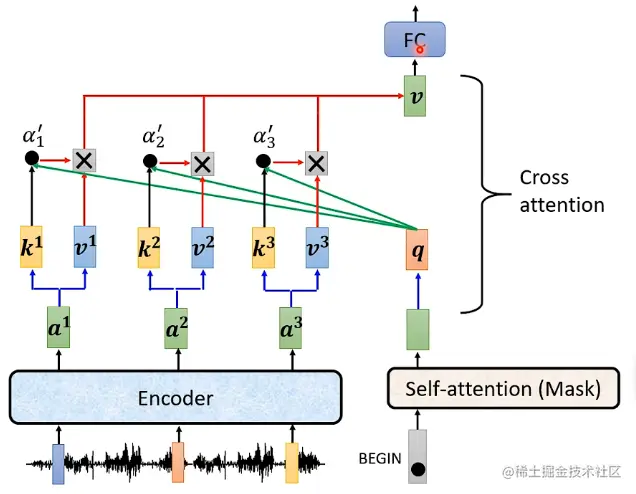
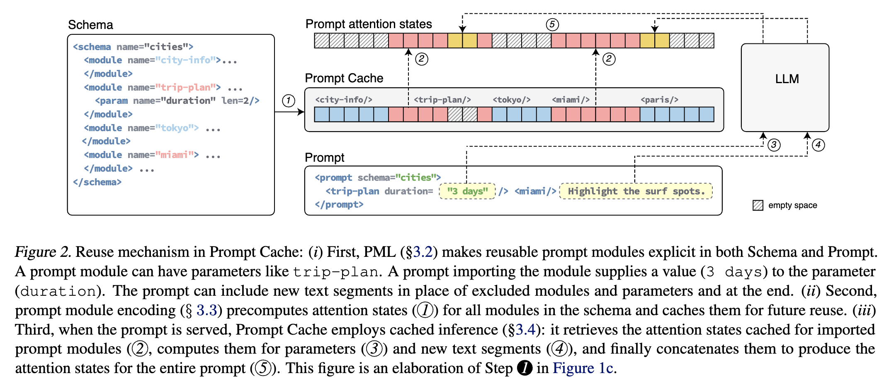
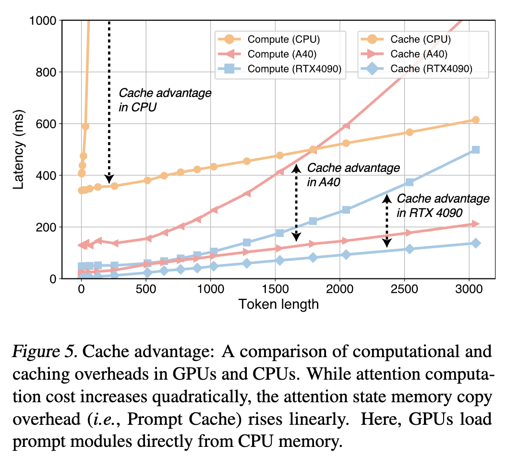

## Prompt Cache: Modular Attention Reuse For Low-Latency Inference

### Paper Information:
Conference: Nov 7 2023, arxiv
Intitution: Yale
Paper Link: https://arxiv.org/pdf/2311.04934.pdf

### Motivation
- Like KV-Cache, reuse the key-value attention states of input tokens during the autoregressive tokenb generation. 
- Extend attention state reuse across multiple requests
- Key Point: frequently occurring text segments in prompts can be precomputed and stored as attention states on the inference server, allowing for efficient reuse when these segments appear in user prompts. 
- Observation:
    -  different prompts often have overlapping text segments.
    -  some sample: in legal, medical, robotics, and learning tools applications

### Challenges
- Attention States are position-dependent due to the positional encoding in Transformers, So t must allow reuse despite a text segment appearing in different positions in different prompts.
- The system must be able to efficiently recognize a text segment whose attention states may have been cached in order to reuse.

### Solution
- Make the structure of a prompt explicit with a Prompt Markup Language (PML) => each prompt module can be assigned with unique position IDs.
- LLMs can operate on attention states with discontinuous position IDs. 
    -  My understanding: If the original order of the prompt is not changed, insert some empty padding 0 will not affect the generated output.

### Design
#### Prompt Markup Language(PKL)
- Key Point: 
    - Split the inserted prompt into small partitions, and treat each partition as the smallist element when reuse.
    - Use Schema to allign the reusable key words between different imported prompts.
    - Example: 
        - Prompt 1: please write a trip-plan for me, and I want go to Beijing?
        - Prompt 2: I want to go to New York for vocation, please give me a trip plan?
    - Use schema: city_info & trip plan to store different cities, and when a new prompt with city "beijing" insert to the service. retrieve the stored KV-Cache of "beijing", and combine with excuted other words as the entire inserted prompt tokens.

    - Note: Schema: A schema is a document that defines prompt modules and delineates their relative positions and hierarchies.
    - Additions:
        - 1, "Union" tag, for example: same word "Beijing" In English or In Chinese
        - 2, "system" tag, for ystem-level prompts; "user" tag for user inserted prompts

##### Experiment
- Use CPU memory or GPU memory to storage Prompt Cache
    - 3x latency reduce when Use CPU memory, while about 8x latency reduce when use GPU memory

- The latency anlysis for transformer.
    - Prompt Cache’s memcpy overhead grows linearly with sequence length.
    - Computing self-attention has quadratic computational complexity with sequence length.
