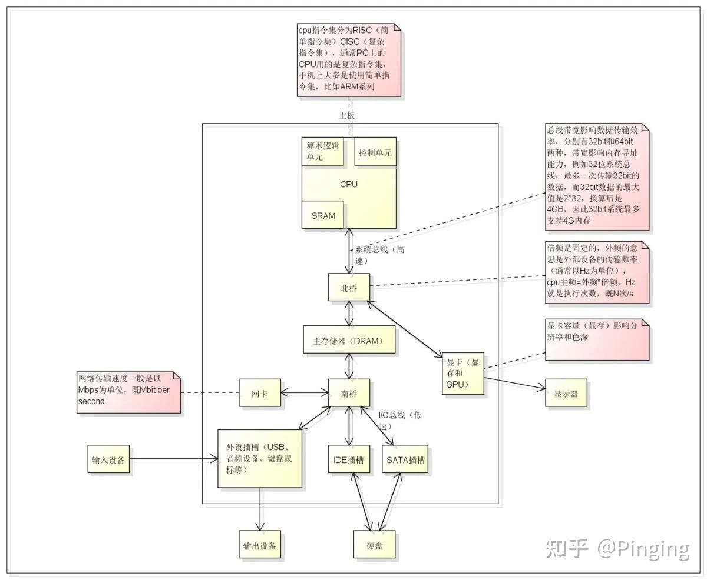
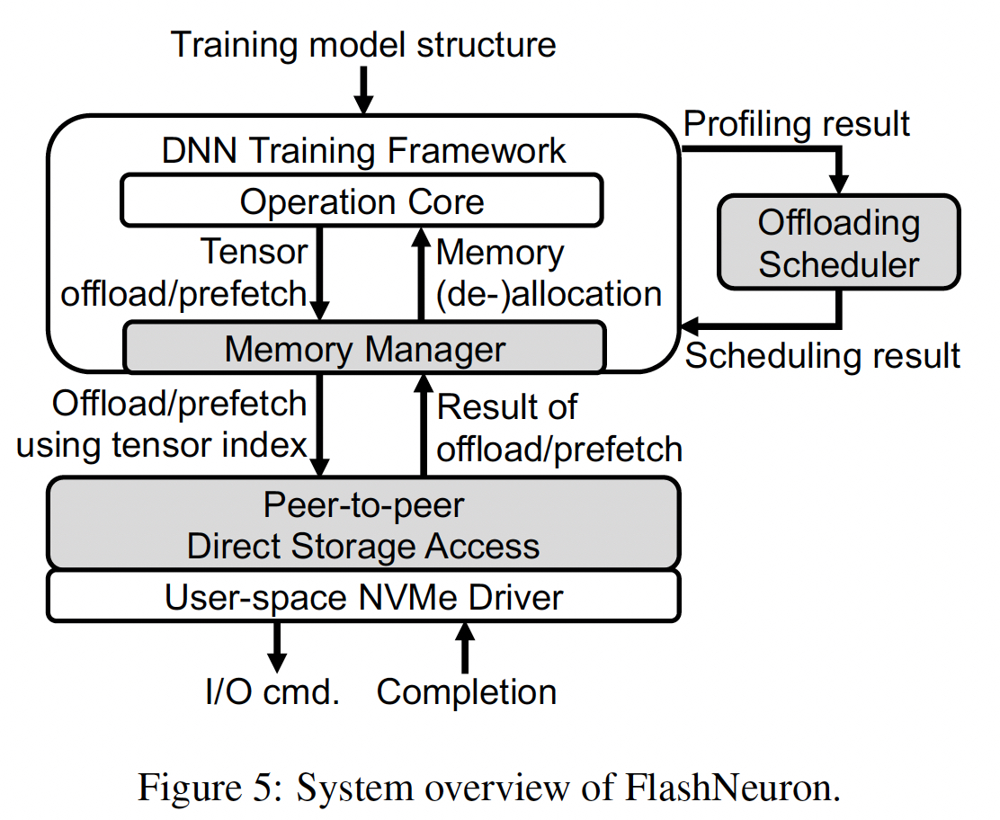

# Flashneuron - SSD

### Paper Information
Title: FlashNeuron: SSD-Enabled Large-Batch Training of Very Deep Neural Networks  
Conference: FAST 2021  
Institution: Seoul National University  
Paper Link: https://www.usenix.org/system/files/fast21-bae.pdf  
Source code: https://github.com/SNU-ARC/flashneuron  

### 论文理解
#### Key Points:
- 1, Use NVMe SSD as backing storage to solve the "memory capacity wall".
- 2, Support direct communication between GPU and SSD. To release the contents.

#### Try To Solve & Background
- DNN models continue to get wider and deeper to improve accuracy, the limited DRAM capacity of a training platform like GPU often becomes the limiting factor on the size of DNNs and batch size called "memory capacity wall". 
- Increasing the batch size is a popular technique to improve hardware utilization.
- Recent proposals address this problem by using the host's memory as the backing storage.
##### Not Satisfied
- 1, the training process on the GPU contends with applications running on the CPU for memory bandwidth and capacity. (带宽和内存抢占) 
- 2, Existing work focus on imporve batch size, not focus on improve GPU throughputs. (因为大batch size的数据传输会拉低整体GPU的效率)
#### 补充知识
- 印象中GPU与DRAM是通过PCIe总线，但是CPU与DRAM是通过内存总线。应该不会出现这里说的CPU应用会抢占GPU的通信带宽。
- Review资料
  - CPU到DRAM： CPU ->(内存总线-前端总线)-> 北桥 ->(内存总线-后端总线)-> DRAM
  - GPU到CPU: GPU-PCIe -> 北桥 -> 内存总线(后端总线) -> DRAM


####  Motivations
- Use GPU-SSD direct communication to solve the bandwidth contents.
- Offload intermediate data to host memory face performance issues due to contention with CPU processes. (during DNN training, CPU running data augmentation – **LLM do not need to do data augmentation**)
 
#### Designs
##### 1, Overview


##### 2, Memory Manager
- Tensor Allocation & Deallocation Criterias:
  - Tensor allocation:
    - a tensor is first created during the forward propagation
    - an offloaded tensor is prefetched from the SSD to the memory during a backward pass. 
  - Tensor deallocation:
    - a tensor is completely offloaded from the memory to the SSD,
    - a tensor is no longer used by any layer during the iteration.
- Memory Fragmentation:
  - Here is for the inter-fragmentation, caused by frequently allocation and deallocation.
  - allocate memory-resident tensors(not offloaded: weights, temporary workspace,etc) from the lowest end of the memory address space
  - allocate other tensors(offloaded: intermediated features) from the highest end of the memory address space.
- Sparsification & Quentification:  CSR + FP16   (reduce the swapped data size)

##### 3, Offloading Scheduler
- At the begining, do "Profiling Iteration" to collect information: 
  - the size of each bufferd tensor;
  - the time it takes to offload each tensor;
  - the excution time for FWD and BWD pass;
  - the total size of resident objects;
  - the expected compression ratio of CSR/FP16.
- 本文还使用了两种方法：
  - Phase 1: directly offload the tensors (within the computation time);
  - Phase 2: Use CSR / FP16 to reduce offload time

##### 4, Peer-to-Peer Direct Storage Access
- based on GDRcopy (based on NVIDIA GPUDirect) and SPDK(Intel);
- maintain a metadata table in GPU’s memory (Logical Block Address)
- the block here was allocated by the sequence length 2048
 
### Code Structure (Actually, It is the structure of Pytorch Code)
Based on pytorch(was contained with Pytorch Code)


- android : Demos of deploying models to android services
- c10 : Core library files that work everywhere, both server and mobile. We are slowly moving pieces from ATen/core here. 
- aten : C++ tensor library for PyTorch (no autograd support)
  - src : contains the low-level tensor libraries for PyTorch.
    - TH : Torch, THC : Torch Cuda, THCUNN - Torch cunn :  Legacy library code from the original Torch. Try not to add things here; we're slowly porting these to native.
      - generic - Contains actual implementations of operators, parametrized over scalar_t.
    - ATen : **A Tensor Library, contains the definition, storage, operation functions here. Was combined with CPU/GPU**
      - core : Core functionality of ATen. This is migrating to top-level c10 folder.
      - native : Modern implementations of operators.
        - cpu : Not actually CPU implementations of operators, but specifically implementations which are compiled with processor-specific instructions, like AVX.
        - cuda : **CUDA implementations of operators.**
        - sparse : CPU and CUDA implementations of COO sparse tensor operations
        - mkl mkldnn miopen cudnn : implementations of operators which simply bind to some backend library.
        - quantized : Quantized tensor operation implementations.
- torch - The actual PyTorch library. Everything that is not in csrc is a Python module, following the PyTorch Python frontend module structure.
  - csrc - C++ files composing the PyTorch library. Files in this directory tree are a mix of Python binding code, and C++ heavy lifting. Consult setup.py for the canonical list of Python binding files; conventionally, they are often prefixed with python_.
    - jit - Compiler and frontend for TorchScript JIT frontend.
    - autograd - Implementation of reverse-mode automatic differentiation.
    - api - The PyTorch C++ frontend.
    - distributed - Distributed training support for PyTorch.
- tools - Code generation scripts for the PyTorch library.
- test - Python unit tests for PyTorch Python frontend.
  - test_torch.py - Basic tests for PyTorch functionality.
  - test_autograd.py - Tests for non-NN automatic differentiation support.
  - test_nn.py - Tests for NN operators and their automatic differentiation.
  - test_jit.py - Tests for the JIT compiler and TorchScript.
  - ...
  - cpp - C++ unit tests for PyTorch C++ frontend.
  - expect - Automatically generated "expect" files which are used to compare against expected output.
  - onnx - Tests for ONNX export functionality, using both PyTorch and Caffe2.
- caffe2 - The Caffe2 library.
  - core - Core files of Caffe2, e.g., tensor, workspace, blobs, etc.
  - operators - Operators of Caffe2.
  - python - Python bindings to Caffe2.
  - ...

### FlashNeuron was combined with GPU memory resouces and SSD-GPU communication => aten/src/ATen/native/cuda/flashneuron.h

- defined a structure of FN_Memory and provide some basic functions
- Structure:
  - aten/src/ATen/native/cuda/flashneuron.h
  - aten/src/ATen/native/cuda/flashneuron.cu 
```
class FN_memory {
  FN_memory();    // init a cuda event

  // malloc memory space on GPU;
  // BLK_SZ = 4096
  // return gpu_ptr : the address of malloced GPU memory space
  void device_malloc(void** gpu_ptr, size_t size);
  void device_malloc_reverse(void** gpu_ptr, size_t size);

  void device_free(void* addr, size_t size);

  size_t device_occupancy_size();
  size_t p2p_occupancy_size();

  // return the free size of device memeory
  double device_occupancy();
  double device_occupancy_future(size_t size);
  double p2p_occupancy();

  // malloc p2p
  void p2p_malloc(void** gpu_ptr, size_t size);
  void p2p_free(void* addr, size_t size);
}
```

### Where the code was called
- Use GPU => aten/src/ATen/native/cuda/Copy.cu 
- FN_copy_kernel_cuda
  - judge the communication type

    ```
    // Copy between CPU and GPU
    cuda::OptionalCUDAGuard device_guard;
    cudaMemcpyKind kind;
    if (dst_device.is_cuda() && src_device.is_cpu()) {
        device_guard.set_device(dst_device);
        kind = cudaMemcpyHostToDevice;
        fn_memorymanager.event_arr_h2d[tid] = true;
    } else if (dst_device.is_cpu() && src_device.is_cuda()) {
        device_guard.set_device(src_device);
        kind = cudaMemcpyDeviceToHost;
        fn_memorymanager.event_arr_d2h[tid] = true;
    } else {
        TORCH_INTERNAL_ASSERT(false, "unsupported devices in GPU copy_()");
    }
    ```
  
  - CPU -> GPU
    - fn_memorymanager.p2p_malloc()
    - cudaMemsetAsync()
    - fn_memorymanager.p2p_free()

  - GPU -> CPU
    - use fn_memorymanager.p2p_malloc() to malloc space
    - use cudaMemsetAsync() to sets device memory to a value. (copy data from host to GPU)

- Every modules do use fn_memorymanager; Like Dropout.cu; save_variable.cpp