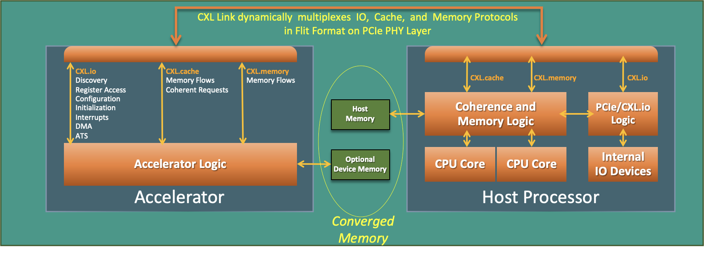
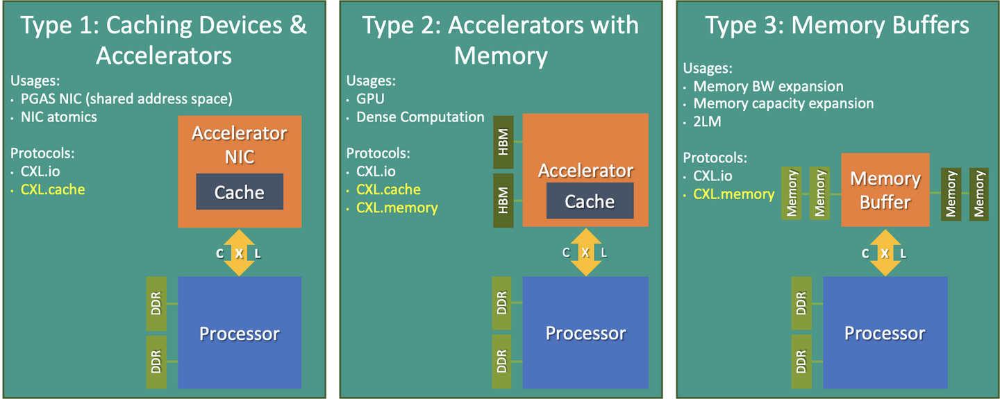
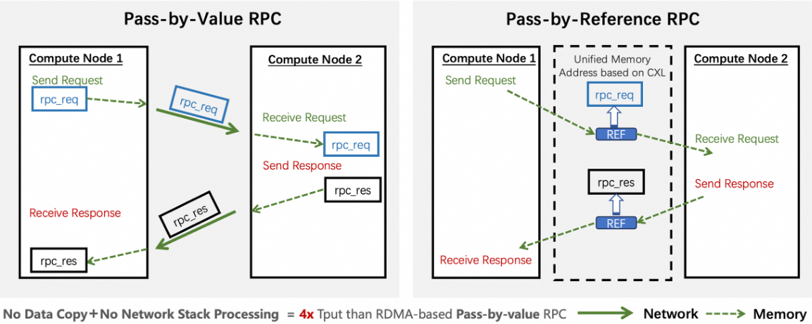
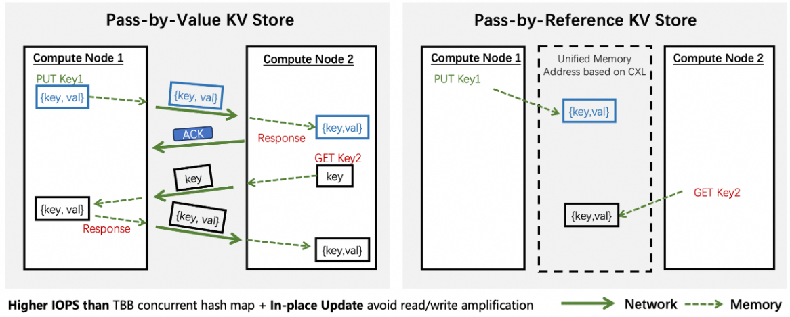

## CXL: Compute Express Link
- 每个服务器上都有巨大的内存池和数量庞大的基于PCIe的运算加速器，但是服务器间无法share内存导致内存的分割，从而导致了内存的浪费和不便。
- CXL技术可以将不同的计算和存储资源进行互联
    - eg. GPU和FPGA等加速器更好的访问存储
- CXL是一种高速串行协议

## CXL 三种模式
- CXL协议包含三个子协议
- CXL.io：可以将内存扩展到外部设备，使得数据的传输速度更快。
    - CXL.io 通过PCIe总线连接CPU和外部设备
    - CPU就可以与外部设备共享内存，并且可以直接访问外部设备的I/O资源。
- CXL.cache：可以通过将内存缓存到外部设备中来提高性能。
    - CXL.cache模式允许CPU在本地缓存中保留最常用的数据，而将不常用的数据保存在外部设备中。
    - Memory Tier
- CXL.memory：可以将外部设备作为主内存使用，从而实现更大的内存容量。
    - CXL.memory模式允许CPU将外部设备看作是扩展内存，从而可以存储更多的数据。
    - 这种方式可以提高系统的可靠性，因为即使发生了内存故障，CPU仍然可以通过外部设备继续运行。

## CXL.io
- CXL.io是CXL规范中定义的物理层接口，可以提供比传统PCIe更低的延迟、更高的带宽和更好的可扩展性。
- CXL.io通过使用SerDes技术（串行数据 <-> 并行数据），在单个物理通道上同时传输多个不同的数据流。
- CXL技术的三种类型：
    - Type 1：通过 PCIe 插槽安装的加速卡或附加卡。这些卡可以与现有系统集成，并通过 CXL 接口与 CPU 直接通信以提供更快的数据传输速度。用于网卡这类高速缓存设备。
    - Type 2：具有所有 Type 1 设备的功能，通常用于具有高密度计算的场景。比如 GPU 加速器。
    - Type 3：一种专用的存储设备，与主机处理器直接通信，并且可以使用 CXL 协议来实现低延迟、高吞吐量的数据传输。用作内存缓冲器，用于扩展内存带宽和内存容量。

## CXL优势
- 高带宽，数据传输速度更快
- CXL技术可以将CPU、GPU、FPGA等计算设备与内存直接连接，避免了传统的I/O总线带来的时延
- CXL技术支持在多台计算设备之间共享内存，降低了内存冗余
- CXL支持内存虚拟化，可以根据应用负载动态分配内存资源
- 更好的拓展性，热插拔

## Revisiting Distributed Memory in the CXL Era
- blog: https://www.sigops.org/2024/revisiting-distributed-memory-in-the-cxl-era/
    - Tsinghua
    - DSM vs MP : 
        - DSM 提供了一个同一的内存空间，从而消除了显示数据通信的开销 (不再需要将数据从一个node向另一个node copy，而是只需要交换 reference 即可)
        - CXL 2.0 开始引入 memory pool, 可以创建全局memory pool，优化整体内存利用率。
            - 通过 CXL交换机 + 内存控制器实现
        
    

    

    - 基于CXL的DSM面临的挑战
        - 本质上，我们面临的挑战源于共享分布式对象和引用它们的客户端的独立故障域。这种分离允许客户端在操作期间自由加入、离开甚至失败，因为它们会创建、释放和交换对远程内存的引用。虽然这种灵活性对用户友好，但它对内存管理提出了重大挑战。我们将其称为部分故障弹性 DSM (RDSM)，以将其与所有客户端同时失败的情况区分开来。我们认为有效处理部分故障对于扩大 DSM 的使用至关重要。
    
        - https://dl.acm.org/doi/10.1145/3600006.3613135 
    
    - Latency
        - TCP/IP 需要 100us+ 的latency
        - RDMA 需要 ~2us 的access latency
        - CXL 需要 < 400ns 的access latency