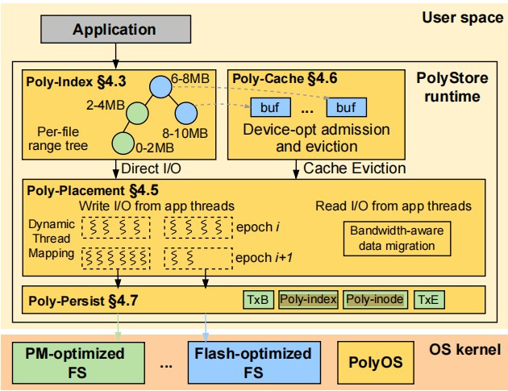

## PolyStore: Exploiting Combined Capabilities of Heterogeneous Storage

```
Conference: FAST'25
Insitution: Rutgers University
```

### Key Points
- Heterogeneous Storage Devices (HSDs)
    - Caching
        - 数据存储在 slow-tier 中，fast-tier当Cache使用，存储frequent accessed data
    - Tiering
        - data只存储一份：fast-tier or slow-tier
        - periodically assess data usage metrics (e.g., hotness) for deciding on data placement across tiers.
    - Application-directed

- Try to Solve?
    - Exising approaches 优先使用fast-tier memory, 而避免应用直接访问slow-tier memory (带宽未被使用)
    - Hierarchical architecture 优先使用fast-tier memory, 容易导致多线程I/O密集程序对单一设备的争用，频繁的fast <-> slow 数据交换也会消耗带宽
    - 传统的静态资源分配（DRAM作为cache）无法适应HSDs设备之间的性能gaps

- Motivation & Challenges
    - combined bandwidth of HSDs
        - 动态数据放置
        - 细粒度data indexing 和 file system operation
    - 异构缓存管理
        - 针对不同设备的性能差异(PM 高读带宽, SSD高写延迟)
        - 差异化的缓存策略
    - 跨设备Consistency 
        - 数据在多个设备和文件系统间的原子性、持久性和崩溃一致性
        - Coordinated persistence and recovery
        - Secure metadata update delegation to the OS

- Design：

    
    
    - Poly-inode: represent a logical file
        - maintains a mapping between the logical file and one/more physical files in 
    - Poly-index：分布式索引结构，管理跨设备的文件块映射。
        - range tree 支持范围查询
        - 2MB (default) per node
    - Poly-placement：动态数据分布策略，优化带宽利用。
    - Poly-cache：异构感知的DRAM缓存，降低访问延迟。
    - Poly-persist：跨设备持久化机制，确保数据一致性。


### Additional Info
- POSIX: Portable Operating System Interface
    - 是由IEEE制定的操作系统接口标准，旨在确保不同类Unix系统的兼容性。定义了一组核心API (eg. open, read, write, fsync, 进程管理，线程同步等)
    - 遵循POSIX标准的应用程序可以在不同系统间无缝移植
    - POSIX规定了文件操作的原子性，顺序性和一致性
        - 追加写入O_APPEND: 确保多线程/进程并发追加时数据不会覆盖
    - PolyStore
        - 使用Poly-index维护全局写入顺序 和 时间戳
        - 通过PolyOS协调跨设备的原子操作(rename，unlink)，确保原子性和奔溃一致性
        - PolyStore通过细粒度的Poly-index节点锁来实现高并发，避免竞争

|POSIX 要求|PolyStore 的挑战|解决方案|
|--|--|--|
|原子追加写入|数据分散在多设备，需全局顺序保证。|通过 Poly-index 维护时间戳，确保跨设备追加操作的全局顺序。|
|并发读取一致性|数据块分布在多设备，需避免脏读。|使用 Poly-cache 的 DRAM 缓存与写回策略，结合 Poly-index 的版本控制。|
|崩溃一致性|跨设备的持久化需协调。|	Poly-persist 机制通过事务日志（journal）确保元数据与数据的原子提交。|
|元数据操作（如 rename）|跨设备文件需原子更新多个物理文件的元数据。|内核组件 PolyOS 通过两阶段提交（先更新物理文件，再提交 Poly-inode）。|