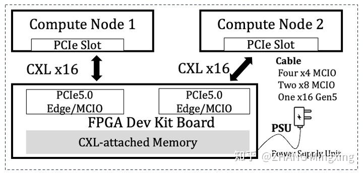
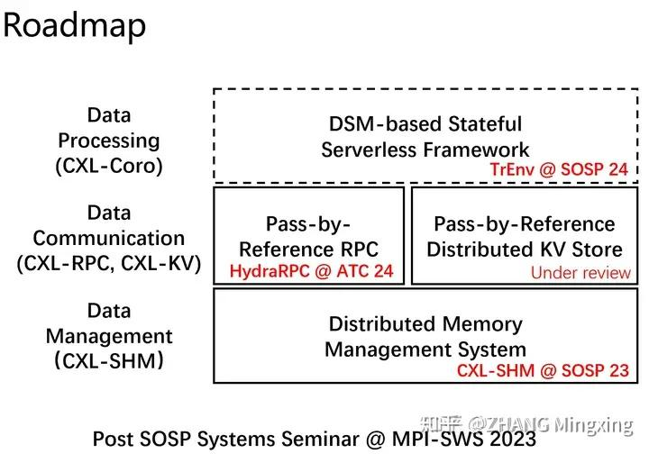

## DSM & Serverless

###  TrEnv: Transparently Share Serverless Execution Environments Across Different Functions and Nodes

```shell
Institution: Tsinghua
Confertence: SOSP'24
```

- blog: https://zhuanlan.zhihu.com/p/5224128384

- FaaS的现实 (有一些非论文内容的补充)
    - FaaS的目标是：1，高资源利用率；2，按需计费
    - 对于资源利用率而言，由于物理机上CPU和Memory是按照固定比例配置的，云上很容易出现low resource utilization.
        - CPU 满载 + 部分Memory还有空闲，这部分内存被浪费了。
        - 内存占满 + CPU 利用率不足
        - 同一个函数在高负载或突发请求下会创建多个实例进行invocation，这些实例之间（包括一个实例内部）都可能存在大量相同的内存页面，这些冗余也降低了内存利用率。
    - 对于用户体验（latency + money）来说，‘cold start’是主要问题。
        - 应用会被拆解成多个独立 且 相对小的子模块，分别部署成function
        - 启动容器环境
        - 函数初始化
        - 执行真正的用户请求 (执行时间相对较短)
    - function特点
        - function 执行时间变化范围大（几 ms ~ 几秒）
        - hot/cold 少量function占据的大部分请求，导致资源利用率不均
        - 单个function的到达率具有突发性
    - container资源隔离
        - 使用Linux的cgroups和命名空间等技术来隔离不同函数的资源使用；提供细粒度的资源控制，防止资源争用

- 现有方案的不足
    - 针对内存资源利用的问题，传统的方案是 RDMA 内存池，多台计算节点通过 RDMA 网络共享后端内存节点的资源，以动态利用闲置的内存。然而 RDMA 无法 CPU 直接访问，依赖 Page Fault 发送 RDMA 请求，往往引入较高的延迟，难以被高效地使用。
        - RDMA并不支持CPU直接load/store，需要显式的换页。
        - 通过OS的page fault来做，对用户更透明
    - 针对冷启动：
        - 缓存方案
            - 为每个函数维护一个容器池，每个容器接受多次用户请求，均摊冷启动的开销。
            - 缺点
                - cache的容器是 type-specific 的，只能服务于同一种类的function，引入资源预留开销
                - 需要有效的策略来确定哪些容器应该被缓存
                - 当函数调用模式发生变化时，缓存方案表现不佳
        - Snapshot方案（Checkpoint/Restore）
            - 通过对初始化后的实例生成快照，在后续冷启动时不要从头创建了，而是根据快照进行恢复，从而跳过耗时的初始化流程。
            - 标准实现的 CRIU，以来数据拷贝来恢复内存状态，对于大内存应用恢复的latency相比于cold start没有优势
            - Lazy Restore方法，即推迟到到应用使用某个对应资源的时候再去进行恢复，但这不过是将延迟从恢复阶段推迟到了执行阶段，其耗时并没有真正得到消除。
            - 存储snapshot需要memory开销

- Motivation
    - CXL Memory的优势
        - CPU可以直接访问
        - CXL multi-headed device的出现，是的CXL memory可以被多台机器共享
        

    - Motivation:
        - 将snapshot保存在shared CXL memory上
        - 利用CXL可以通过CPU直接访问的特性，避免CRIU中的内存copy
        - 利用multi-node共享的特性平摊其内存占用开销
    
- Challenges & Solution
    - 目前 OS 对于 CXL 的接口支持主要是为了单机扩展，而没有充分考虑到多机的内存共享。
    - TrEnv设计了一个新的内核接口 mm-template
        - 支持将一个function的多种内存区域(包括堆，栈等区域)的snapshot卸载到CXL memory上；并通过Copy-on-Write在主机、多函数实例上安全的共享
        - 为了减少容器环境创建的开销，构建了 type-agnostic (类型无关的) sandbox，是的一个function的容器环境可以被不同类型的函数使用。
            - 对每个容器的核心隔离组件(Namespaces, Cgroups) 进行了单独设计，以支持跨函数的复用

- 整体RoudMap
    - 不同层上的工作
    


### ServerlessLLM: Low-Latency Serverless Inference for Large Language Models
```shell
Conference: OSDI'24
Github: https://github.com/ServerlessLLM/ServerlessLLM
blog: https://zhuanlan.zhihu.com/p/3477976759
```
- Questions
    - 将LLM用于Serverless带来的主要问题是 启动开销(模型下载+模型载入) 远大于 模型计算开销。
        - eg. LLama2-7B: 下载10.8s，load 4.8s，token decode 0.8s (模型越大越悬殊)

- Challenge & Solution
    - 将模型训练场景 和 模型推理场景分开
        - 训练：persist many，load few
        - 推理：persist once，load many
    - LLM推理的 Live Migration 
        - 在serverless中，相比于通信资源，GPU计算资源更cheap
        - KV Cache的迁移开销太大，使用token migration (将已经处理完的 token 和原先的 prompt 合并成一个新的长 prompt，这样可以充分利用 GPU 设备的计算红利)

### Mooncake
```shell
Conference: FAST'25 BestPaper
```
- 解耦架构：MOONCAKE 将预填充（prefill）和解码（decoding）阶段分离到不同的资源池中，使每个阶段可以进行专门的优化，同时在系统中更有效地管理计算资源。
- 以 KVCache 为中心的全局缓存：系统利用分布式 KVCache 池，将 GPU 集群中 CPU、DRAM、SSD 和 RDMA 资源的闲置部分汇聚在一起。这个全局缓存通过重用键值缓存，减少了长上下文查询的计算开销，显著提升了性能。
- 高效调度：一个名为 Conductor 的全局调度器根据缓存利用率和系统负载，将请求分配到预填充和解码实例，确保在满足 SLO 的同时，减少延迟。
- 优化数据传输：MOONCAKE 使用**基于 RDMA 的传输引擎**进行高速缓存数据的移动，支持在分布式缓存资源之间高效传输数据，确保即使在大规模系统中，缓存传输也能高效进行。
- 调度算法：MOONCAKE 采用缓存感知调度算法，平衡预填充和解码节点的负载，优化 KVCache 的重用，减少请求的等待时间。

- blog: https://www.zhihu.com/question/6101603990/answer/117591041642 (提到了多篇论文，值得一读)

## Ideas
- Serverless + DSM 可以用来解决哪些问题
    - cold start问题
        - 从remote memory中恢复container，减少cold start
        - 将容器的snapshot卸载到共享内存(CXL)中，TrEnv-SOSP'24
        - 将keep alive的container，逐步卸载 数据到remote memory (RDMA) FaaSMem-ASPLOS'24
        - **空间 + 时间的考虑？**
        - 分层 - init, runtime 等 rainbowcake
        - RDMA write remote memory (sharing)
        - container的放置/数据的放置
        - memory page的sharing + 使用DM来解决什么问题；以及有什么场景。
    - 有状态 task状态同步
        - 有状态 functions依赖message或者global storage同步states
        - 通过RDMA直接访问remote memory中的状态
    - local cache一致性
        - multi-node local cache
        - Concord-HPCA'25 通过invalidation-based version来，读可以限制在single node内；写/container变化会涉及向global的写； write intensive 负载集中。
        - FAA$T 通过在global memory上存储version信息，每次读都确认version信息 (read global data size小)
    - container资源自动扩展
        - 水平扩展：增加实例
        - 垂直扩展：增加单个实例的memory，CPU等资源
            - 同一个Node内, 同一个应用的不同function运行在同一个container中(Concord 有个例子)；不同进程处理不同function
                - 共享 库文件 等资源
                - 通过 copy-on-write 机制，不同function实例可以共享memory page，仅当写的时候才创建私有副本
                - 可以合并多个function对global storage的访问，减少I/O bandwidth开销
                - 共享内存的问题：数据一致性(多个数据访问/修改同一块数据) + 高并发场景下的资源争用
            - 可能的问题：
                - memory fragmentation
                - 垂直扩展 - 影响正在执行的container 中的 function
                - 资源争用 - 多个容器都需要进行垂直扩展时
                - yifan： 垂直扩展要更好


## Disaggregated Memory 做的好的
- Pengfei Zuo (Huawei)
- Mingxing Zhang (Tsinghua)
- Xingda Wei (SJTU)
- Chengxi Wang (ICT)

## 其他值得读的Paper：
- https://zhuanlan.zhihu.com/p/28475636063
    - 核心思想，DSA
    - 不再基于Top-K，而是使用累计注意力权重(95%)
    - 每一层分开管理

- https://zhuanlan.zhihu.com/p/718212654
    - DSM中元数据的管理