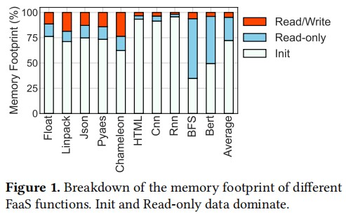
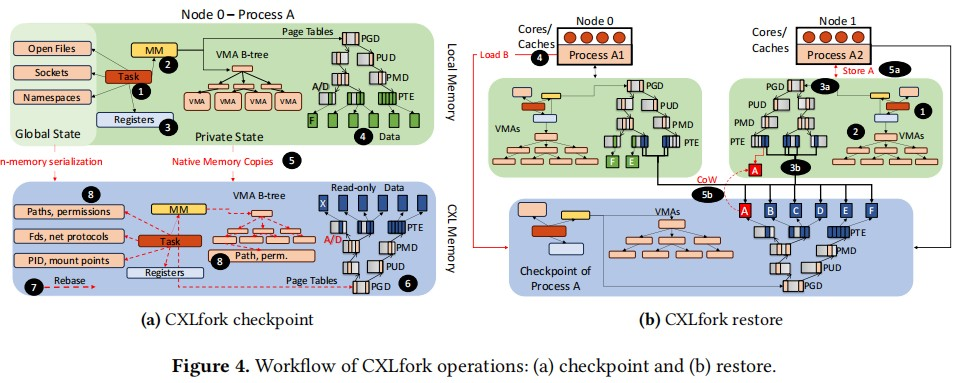

# DSM & Serverless

## ColdStart + RDMA/CXL
### CXLfork - ASPLOS'25
```shell
Mitosis: No Provisioned Concurrency: Fast RDMA-codesigned Remote Fork for Serverless Computing 
Conference: OSDI'23
Institution: SJTU Haibo Chen

CXLfork: Fast Remote Fork over CXL Fabrics
Conference: ASPLOS'25
Institution: UIUC Tianyin Xu
```
- Existing works
    - CRIU (Checkpoint and Restore in Userspace)
        - checkpoint: 
            - 借助storage 传递states
            - 借助protocol buffer将process state(virtual memory areas, page tables, open files, namespaces, and CPU registers) + memory page serialize to file
        - restore: load file + deserialize the checkpoints
        - 开销高：fork BERT instance，比local fork消耗2.7X Lat + 42X Mem
    - Mitosis, based on RDMA
        - avoids (de)serializes by use RDMA lazy copy (for memory page)
        - checkpoint阶段依旧需要serialize OS-managed states
        - restore阶段：parent node通过One-side RDMA将序列化的OS-managed state传输给remote node，remote node对齐反序列化 + 创建新process
        - skip the serialization, checkpoint states和创建node + parent process耦合在一起，导致parent process在其所有(remote) child processes终止之前无法退出；使得进程的生命周期管理变得复杂
- Idea
    - 在CXL共享内存中checkpointing + restoring可以避免state serialization + transfer开销
        - decouple process state with process/OS
        - 不需要序列化，cloned node可以直接并发访问
    - Observation: 不同 function's footprint 划分为： Init (平均72.2%), Read-Only (23%), and Read/Write (4.7%). => Init + Read-Only的数据存储到CXL-memory + be shared 可以避免重复存储
    

    - Challenges:
        - how to checkpoint the process state to CXL memory without resorting to serialization
        - how to efficiently share the checkpointed state between concurrent cloned process in the cluster
    - Solutions:
        - CXLfork 使用memory copies checkpoints process data and most of the OS-maintained process states(eg. page table)
        - 对于挑战2：
            - 默认情况下，CXLfork并不load这些process state到本地内存，而是让cloned process直接读CXL中的checkpoined process state
            - 对于state update，每个cloned process使用Copy-on-Write来处理修改
            - 问题：访问CXL memory的Lat比访问本地内存慢

- 实现
    - CXLfork checkpoint: distinguishes private and global process states
        - private
            - process 唯一拥有的所有数据和元数据，可以将其与OS的其余部分解耦：进程的任务结构(1)、内存描述符(2)（如虚拟内存区域树和页表）、CPU寄存器内容(3)以及进程私有内存和私有文件映射(libs)的物理页面(4)等
            - 使用native momory copies(5)将这些数据结构和进程数据页面直接复制到CXL内存中 (checkpoint 期间)
            - memory copy之后，page table中的PTE会更新(6)，以映射到CXL物理地址空间中存储checkpoint数据的新地址，并标记为read-only
            - 内部pointer也会改变(7)，指向CXL设备上对应的偏移量；从而允许其他cloned process使用它们
        - global
            - 同一个node上由多个process共享的OS-managed states: open files, sockets, namespaces
            - global states包含指向全局OS数据结构的指针；they are neither standalone nor portable.
            - checkpoint期间，CXLfork将必要的信息serialize到CXL memory上(8)，以便在remote node上重新实例化global states
            - restore期间，CXLfork deserialize这些信息，并redoes operations来恢复global os-managed states
            - 例如：CXLfork会序列化打开文件或内存映射文件的路径和权限等信息。在恢复时，使用这些检查点数据结构中的路径和权限重新打开文件描述符。

    

    - CXLfork Restore
        - 1. 在目标node上创建新process; 
        - 2. 使用checkpoint中的metadata重建process的virtual memory mapping; 
        - 3. 将checkpoint中的物理内存映射到新进程的地址空间(只读，避免copy + Copy-on-Write); 
        - 4. deserialize + 恢复全局状态
        - 注意：CoW带来的copy开销：CXLfork prefetch checkpoint中被标记为dirty的页到local memory <= Observation: over 95% of the pages that were written by the parent are also written by its children

    - CXL Tiering
        - 访问CXL memory速度比访问local memory慢；tradeoff between 数据共享 和 cloned process性能
        - Migrate-on-Write (default): CoW
        - Migrate-on-Access
        - Hybrid Tiering: relies on the A bits in the checkpointed page. (select hot page)
            - a CXL page with a clear 𝐴 bit is assumed not to be heavily-accessed and, therefore, on access, is not fetched to local memory

## ColdStart + Cache
- RainbowCake: Mitigating Cold-starts in Serverless with Layer-wise Container Caching and Sharing
```shell
Institution: Louisiana State University
Conference: ASPLOS'24
```
- TrEnv: Transparently Share Serverless Execution Environments Across Different Functions and Nodes
```shell
Institution: Tsinghua, Mingxing Zhang
Confertence: SOSP'24
```
- FaaSMem: Improving Memory Efficiency of Serverless Computing with Memory Pool Architecture
```shell
Institution: SJTU, Minyi Guo
Conference: ASPLOS'24
```
- [论文整理](./TrEnv_FaasMem_RainbowCacke.pptx)

## Multi-Node Cache
### Concord: Rethinking Distributed Coherence for Software Caches in Serverless Environments
```shell
Concord: Rethinking Distributed Coherence for Software Caches in Serverless Environments
Institution: UIUC
Conference: HPCA 2025

Faa$T: A Transparent Auto-Scaling Cache for Serverless Applications
Institution: Standford
Conference: SoCC'21
```
- Try to Slove?
    - 在FaaS中，为了scalability，functions经常被实现成 stateless => all the data be discarded from node once the the function is unloaded. => 所有持久化的数据需要存储在global storage中
    - 造成大量对global storage的读写(Remote Procedure Calls - RPCs)：35-93%的end-to-end response time on storage reads/writes in different applications
    - cache data locally
        - cache within single node
            - 没有一致性问题
            - 其他node对data item的读写需要频繁访问其home node (82%的total response time)
        - cache within multiple nodes
            - 每个node都保留本地cache，最大程度local reads
            - 一致性问题 (本文要解决的核心问题)
            - Existing works: [Faa$T](https://dl.acm.org/doi/pdf/10.1145/3472883.3486974?casa_token=BcxUpVrvrykAAAAA:GYMj1ukpJHNiMOoULarXvv9gBntaeaSR3M9lODh1hfp2BaY14zP4EhIk4myW6__4d9xEIKycu2GY) 通过version number的方式确保一致性，但是会造成频繁会version number的访问(global storage)中. 这种方法对于big data item的reads优化有效果，但是对于small data items的reads效果一般 (Test发现对于 <= 64KB 的data item, 效果不明显).
            - 在Production-level Azure functions中，80%的reads data items 都不超过12KB
    - Key: 解决multiple cache中的一致性问题

- Motivations
    - 在serverless中，77% of the storage accesses are reads, 可以考虑 **invalidation-based distribution coherence** 来减少remote reads (当write发生时，invalidate node中的local cache) 
    - write data时的数据同步开销：serverless中 the total number of nodes sharing the same data item is typically less than a few 10s. 不会很大

- Insights
    - Accesses to global storage limit the performance of FaaS functions. Per-application data caches can mitigate these costs transparently and, if designed properly, for free — by utilizing applications’ allocated but unused memory. (Trace from Huawei, 50%的function中，user会分配5X甚至更多的memory，使用率很低)
    - FaaS distributed software caches require coherence, and the protocol should be optimized for read operations(77%) on small data items(80%) that commonly hit in local caches.
    - The observed number of sharers per data object and the inherent robustness of serverless functions on failures allow us 考虑 invalidation-based coherence
    - Prior cache designs are suboptimal for FaaS, as  they induce remote accesses to either data or **metadata**.

- Design Details for Concord
    - per-application cache：
        - function instances from the same application taht are co-located on a node share a cache instance
        - data sharing occurs only within an application, caches of different applications are isolated from each other
    - consistent hashing
        - 为每个 data item 分配一个home node (不影响其他node 内保存local cache，知识在write时，均由home node来执行remote write操作)
        - the home of a data item is decided via consistent hasing
        - Why consistent hashing?
            - 一致性hash为 nodes 计算hash，并维护一个logical hash ring
            - data item hash之后，将其映射到hash ring中，选择第一个node_hash_value > data_hash_value 的node存储数据
            - 优点：node的增加和移除 只影响hash ring中相邻的node，不影响其他node，最小化迁移开销
        - 移除node时，将以当前node作为home node的数据迁移向相邻的 next node
        - 新增node时，从last node中将hash value映射到当前node的数据迁移过来
    - write through
        - 对data item的写是write through
        - 确保global storage中的数据为最新，避免home node异常导致的数据错误
    - application controller
        - 管理每个application在哪些node上
    - cache agent
        - 管理per-application的cache，通过状态 E,S,I 来确定当前node中cache的有效性，尽可能避免remote reads
        - 当writes/read 无效local cache，通过cache agent转发给对应data item的home node中的cache agent来处理
        - 通过Directory来管理以本node为home node的data item的状态 + 被哪些node share，用于write之后更新对应node中的状态 (invalidation-based)
    - two-phase commit protocol
- coherence Operations
    - local read hit
    - remote read hit
    - read miss
    - local write hit
    - remote write hit
    - write miss

- fault tolerant distributed coherence protocol
    - unexpected node fail
        - periodically sends heartbeats to all the cache agents
        - zookeeper, hierarchical namespace 来模拟 per-application coherence domain (不影响node上其他application的cache agent)
        - 将以 failed cache agent 为home node的data item 状态标记成`I`, 从cache ring中删除nodes (Directory中指向last node)
    - node failures during reads
        - reads at most change the directory state
        - evict data items
    - node failures during writes
        - home node fails while processing a write: could have updated global storage but fails to invalidate all the cached copies (invalidate-state)
            - some nodes reads updated value while the others gets old one
        - **no cache instance is allowed to read the gloable storage for a data item that was homed in the failed node until the recovery is complete** 

- Coherence-Aware Invocation Scheduling
    - 不同于传统的随机选择live node, Concord's load balancer 通过给invocation input计算hash来选择 node，尽可能提升 local cache hits
        - two hash function，避免过载node
        - 都过载了，picks a random non-overloaded node

- Concord supports Transaction
    - 事务执行期间，先在local cache中处理，再commit给global storage；并且再local cache中将data item标记为   
        - Speculatively-Read: 记录read ops + 事务ID
        - Speculatively-Write: 记录写入的新值 + 事务ID；暂不更新global storage
        - Speculatively-Write数据仅对当前事务可见，其他事务/操作无法直接访问
    - 冲突检测：
        - within node (local cahce) + cross nodes (the Concord cache coherence protocol)
        - 写-读冲突：local-cached speculatively-read data 收到 其他thread的write(local)/an external invalidation(remote: 其他node完成了对global storage的更新，发送invalidation给相关node) 
        - 读-写/写-写冲突： local-cached speculatively-write data 收到 其他thread的读/写(local)/an external read or an invalidation.
        - 处理：Squash当前事务，丢弃speculative data and re-execute事务
        - 个人理解：write操作发生在data item的home node上，其他node的ops会经过它
    - 事务提交和回滚
        - commit
            - grab global lock, 确保commit操作的原子性
            - locks the directory entries for the data items accessed in the transaction
            - 将speculatively-write数据写入global storage
            - clear local-cached speculatively-write data, release directory 和 global lock
        - recovery
            - 事务失败或终止，丢弃local-cache中的speculatively-write data
            - 清除相关data item的speculatively mark， 允许事务重试

- Communication-Aware Function Placement
    - 之前的方法独立的决定function的placement => performance suffers due to communication overheads while two functions is interact in a producer-consumer manner.
    - 通过monitor coherence来获取function之间的interact关系：func A 频繁写 data item X, func B 频繁读 X；则识别其为一组 producer-consumer, 记录在PCT table中。
        - 当cluster收到function F的新调用时，首先检查是否由可用的F实例，如果有，重新使用它来避免冷启动
        - 如果没有，检查PCT table，获取与F匹配的function 实例，并将F实例放置在同一个node上


- blog: https://zhuanlan.zhihu.com/p/5224128384

- FaaS的现实 (有一些非论文内容的补充)
    - FaaS的目标是：1，高资源利用率；2，按需计费
    - 对于资源利用率而言，由于物理机上CPU和Memory是按照固定比例配置的，云上很容易出现low resource utilization.
        - CPU 满载 + 部分Memory还有空闲，这部分内存被浪费了。
        - 内存占满 + CPU 利用率不足
        - 同一个函数在高负载或突发请求下会创建多个实例进行invocation，这些实例之间（包括一个实例内部）都可能存在大量相同的内存页面，这些冗余也降低了内存利用率。
    - 对于用户体验（latency + money）来说，‘cold start’是主要问题。
        - 应用会被拆解成多个独立 且 相对小的子模块，分别部署成function
        - 启动容器环境
        - 函数初始化
        - 执行真正的用户请求 (执行时间相对较短)
    - function特点
        - function 执行时间变化范围大（几 ms ~ 几秒）
        - hot/cold 少量function占据的大部分请求，导致资源利用率不均
        - 单个function的到达率具有突发性
    - container资源隔离
        - 使用Linux的cgroups和命名空间等技术来隔离不同函数的资源使用；提供细粒度的资源控制，防止资源争用

- 现有方案的不足
    - 针对内存资源利用的问题，传统的方案是 RDMA 内存池，多台计算节点通过 RDMA 网络共享后端内存节点的资源，以动态利用闲置的内存。然而 RDMA 无法 CPU 直接访问，依赖 Page Fault 发送 RDMA 请求，往往引入较高的延迟，难以被高效地使用。
        - RDMA并不支持CPU直接load/store，需要显式的换页。
        - 通过OS的page fault来做，对用户更透明
    - 针对冷启动：
        - 缓存方案
            - 为每个函数维护一个容器池，每个容器接受多次用户请求，均摊冷启动的开销。
            - 缺点
                - cache的容器是 type-specific 的，只能服务于同一种类的function，引入资源预留开销
                - 需要有效的策略来确定哪些容器应该被缓存
                - 当函数调用模式发生变化时，缓存方案表现不佳
        - Snapshot方案（Checkpoint/Restore）
            - 通过对初始化后的实例生成快照，在后续冷启动时不要从头创建了，而是根据快照进行恢复，从而跳过耗时的初始化流程。
            - 标准实现的 CRIU，以来数据拷贝来恢复内存状态，对于大内存应用恢复的latency相比于cold start没有优势
            - Lazy Restore方法，即推迟到到应用使用某个对应资源的时候再去进行恢复，但这不过是将延迟从恢复阶段推迟到了执行阶段，其耗时并没有真正得到消除。
            - 存储snapshot需要memory开销

- Motivation
    - CXL Memory的优势
        - CPU可以直接访问
        - CXL multi-headed device的出现，是的CXL memory可以被多台机器共享
        

    - Motivation:
        - 将snapshot保存在shared CXL memory上
        - 利用CXL可以通过CPU直接访问的特性，避免CRIU中的内存copy
        - 利用multi-node共享的特性平摊其内存占用开销
    
- Challenges & Solution
    - 目前 OS 对于 CXL 的接口支持主要是为了单机扩展，而没有充分考虑到多机的内存共享。
    - TrEnv设计了一个新的内核接口 mm-template
        - 支持将一个function的多种内存区域(包括堆，栈等区域)的snapshot卸载到CXL memory上；并通过Copy-on-Write在主机、多函数实例上安全的共享
        - 为了减少容器环境创建的开销，构建了 type-agnostic (类型无关的) sandbox，是的一个function的容器环境可以被不同类型的函数使用。
            - 对每个容器的核心隔离组件(Namespaces, Cgroups) 进行了单独设计，以支持跨函数的复用

- 整体RoudMap
    - 不同层上的工作
    


### ServerlessLLM: Low-Latency Serverless Inference for Large Language Models
```shell
Conference: OSDI'24
Github: https://github.com/ServerlessLLM/ServerlessLLM
blog: https://zhuanlan.zhihu.com/p/3477976759
```
- Questions
    - 将LLM用于Serverless带来的主要问题是 启动开销(模型下载+模型载入) 远大于 模型计算开销。
        - eg. LLama2-7B: 下载10.8s，load 4.8s，token decode 0.8s (模型越大越悬殊)

- Challenge & Solution
    - 将模型训练场景 和 模型推理场景分开
        - 训练：persist many，load few
        - 推理：persist once，load many
    - LLM推理的 Live Migration 
        - 在serverless中，相比于通信资源，GPU计算资源更cheap
        - KV Cache的迁移开销太大，使用token migration (将已经处理完的 token 和原先的 prompt 合并成一个新的长 prompt，这样可以充分利用 GPU 设备的计算红利)

### Mooncake
```shell
Conference: FAST'25 BestPaper
```
- 解耦架构：MOONCAKE 将预填充（prefill）和解码（decoding）阶段分离到不同的资源池中，使每个阶段可以进行专门的优化，同时在系统中更有效地管理计算资源。
- 以 KVCache 为中心的全局缓存：系统利用分布式 KVCache 池，将 GPU 集群中 CPU、DRAM、SSD 和 RDMA 资源的闲置部分汇聚在一起。这个全局缓存通过重用键值缓存，减少了长上下文查询的计算开销，显著提升了性能。
- 高效调度：一个名为 Conductor 的全局调度器根据缓存利用率和系统负载，将请求分配到预填充和解码实例，确保在满足 SLO 的同时，减少延迟。
- 优化数据传输：MOONCAKE 使用**基于 RDMA 的传输引擎**进行高速缓存数据的移动，支持在分布式缓存资源之间高效传输数据，确保即使在大规模系统中，缓存传输也能高效进行。
- 调度算法：MOONCAKE 采用缓存感知调度算法，平衡预填充和解码节点的负载，优化 KVCache 的重用，减少请求的等待时间。

- blog: https://www.zhihu.com/question/6101603990/answer/117591041642 (提到了多篇论文，值得一读)

### rFaaS
- microsoft，rdma as a Faas，核心是完全用rdma 换掉一般faas 常用的rpc


## Ideas
- Serverless + DSM 可以用来解决哪些问题
    - cold start问题
        - 从remote memory中恢复container，减少cold start
        - 将容器的snapshot卸载到共享内存(CXL)中，TrEnv-SOSP'24
        - 将keep alive的container，逐步卸载 数据到remote memory (RDMA) FaaSMem-ASPLOS'24
        - **空间 + 时间的考虑？**
        - 分层 - init, runtime 等 rainbowcake
        - RDMA write remote memory (sharing)
        - container的放置/数据的放置
        - memory page的sharing + 使用DM来解决什么问题；以及有什么场景。
    - 有状态 task状态同步
        - 有状态 functions依赖message或者global storage同步states
        - 通过RDMA直接访问remote memory中的状态
    - local cache一致性
        - multi-node local cache
        - Concord-HPCA'25 通过invalidation-based version来，读可以限制在single node内；写/container变化会涉及向global的写； write intensive 负载集中。
        - FAA$T 通过在global memory上存储version信息，每次读都确认version信息 (read global data size小)
    - container资源自动扩展
        - 水平扩展：增加实例
        - 垂直扩展：增加单个实例的memory，CPU等资源
            - 同一个Node内, 同一个应用的不同function运行在同一个container中(Concord 有个例子)；不同进程处理不同function
                - 共享 库文件 等资源
                - 通过 copy-on-write 机制，不同function实例可以共享memory page，仅当写的时候才创建私有副本
                - 可以合并多个function对global storage的访问，减少I/O bandwidth开销
                - 共享内存的问题：数据一致性(多个数据访问/修改同一块数据) + 高并发场景下的资源争用
            - 可能的问题：
                - memory fragmentation
                - 垂直扩展 - 影响正在执行的container 中的 function
                - 资源争用 - 多个容器都需要进行垂直扩展时
                - yifan： 垂直扩展要更好


- 针对local cache一致性
    - multi-node local cache
    - Concord-HPCA'25 通过invalidation-based version来，读可以限制在single node内；写/container变化会涉及向global的写； write intensive 负载集中。
    - FAA$T 通过在global memory上存储version信息，每次读都确认version信息 (read global data size小)
    - Concord的问题：
        - 1, 目录分布式一致性协议；目录的存储开销
        - 2, 在数据写频繁的场景下(), home node 会成为瓶颈 (对数据的写都会经过home node)  -- 数据访问pattern发生变化时
        - 3, home node释放，或者其他node的释放都会导致重新hash (ring hash); node cache的释放也需要通知home node
    - 思路：
        - 相对写频繁场景有哪些？
            - [Huawei FaaS Trace Data](https://github.com/sir-lab/data-release/tree/main)
                - Observation1: ，不同地区在冷启动时间、CPU 使用率和内存使用率方面存在显著差异，拥堵程度较低的地区可能提供更便宜、更快速的工作负载运行选项 [论文](https://dl.acm.org/doi/pdf/10.1145/3689031.3696073)。
        - home node动态分配；根据数据的访问模式和频率，动态地将某些数据的home node分配到负载较轻的node上。
        - 多 home node 协作，分摊负载
        - 纯写频繁是否不借助缓存更好，考虑一些更复杂的workload的场景
            - 有哪些workflow:、
            - Trace from [Azure](https://github.com/Azure/AzurePublicDataset):
                - 30% of Azure applications的invocation访问相同的data.
                - 99.7% of the data objects 存在 global storage中
                - 77.3% of access are reads, 大部分access是bursty的
                    - 对同一data objective的write access也是burst的
                    - 占write trace的 ~1.5%

    - 挑战：
        - 1. 多个node触发写操作时，一致性怎么维护 (一致性要求高；不适合MVCC)
            - 分布式乐观并发控制
            - [Sundial](https://dl.acm.org/doi/pdf/10.14778/3231751.3231763?casa_token=BUjVhvhzS9IAAAAA:f4zfU12qK1X3CgpyCQ0IFUJKn71cuY08sXrHD_7NFvSx9rk4hm-6WTDmIiOqOhiFizwvy9_dxFon)
            - [Falcon](https://ieeexplore.ieee.org/stamp/stamp.jsp?arnumber=9820697&casa_token=9gE0NZsWE60AAAAA:3FZRiZ44JJsB49DXN6Opwis-8woxhJ5lgslnnoNSP2HVLrB5jcw8A7PwBTXVsrR57mrLITwQ&tag=1)
        - 2. 写入更新之后怎么同步
            - 多目录节点协作更新；在local cache中标记数据条目为无效
            - 主动失效
        - 3. node 故障/销毁;？ (Concord中使用一致性ring hash)
            - ？

        - 4. trade off： 根据node负载调整 home node数量和分布
            - ？

## Disaggregated Memory 做的好的
- Pengfei Zuo (Huawei)
- Mingxing Zhang (Tsinghua)
- Xingda Wei (SJTU)
- Chengxi Wang (ICT)

## 其他值得读的Paper：
- https://zhuanlan.zhihu.com/p/28475636063
    - 核心思想，DSA
    - 不再基于Top-K，而是使用累计注意力权重(95%)
    - 每一层分开管理

- https://zhuanlan.zhihu.com/p/718212654
    - DSM中元数据的管理