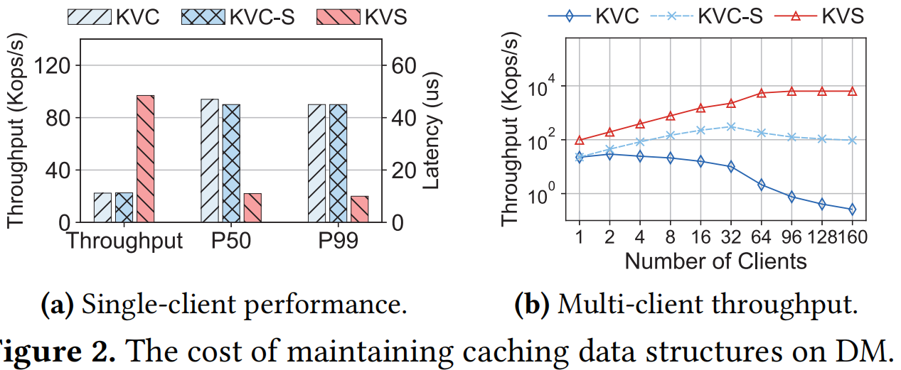
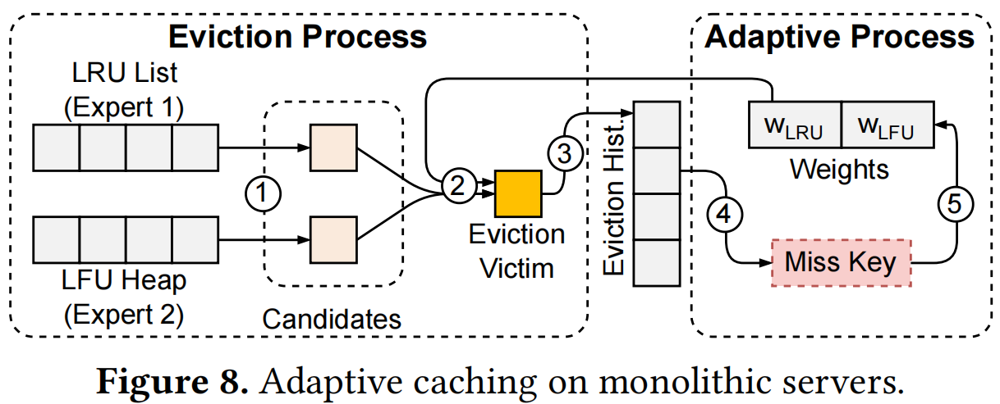
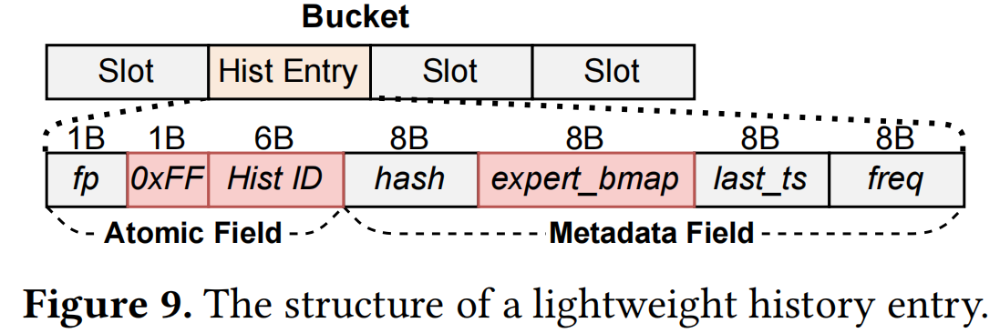
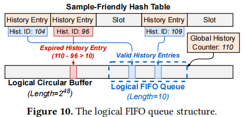
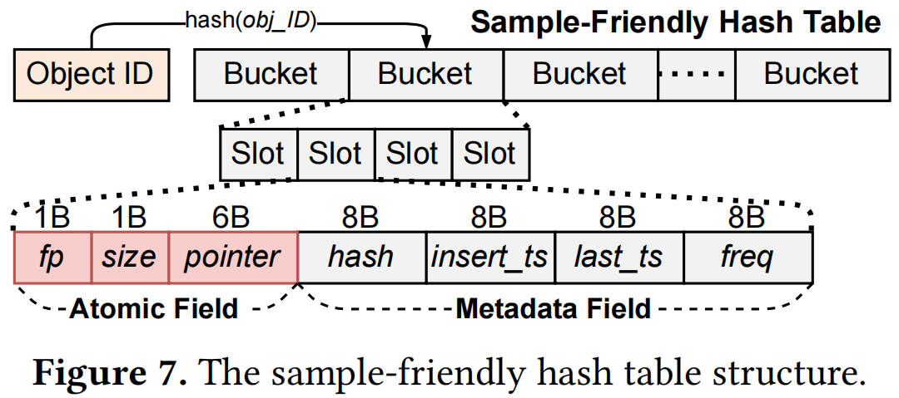

## Ditto: An Elastic and Adaptive Memory-Disaggregated Caching System

```
Institution: The Chinese U of HK & Huawei Cloud
Conference: SOSP 2023
```

## Key Point
### Try to Solve
- Existing caching system couple CPU and memory resouce, while in practice, services may only want to add more memory or CPU cores.  -> resource inefficiency
- Slow resource adjustments 
    - coupled CPU and memory
    - time consuming data migration
    - Example with Redis, when scaling 32 to 64 nodes, Redis takes 5.3 minutes to migrate data; back to 32 nodes, takes 5.6 minutes to migrate data.
- Disaggregated memory (DM) can decouple memory and CPU

### Challenges
- Bypassing remote CPUs hinders the execution of caching algorithms
    - 现有caching algorithm relys on CPUs to be centralized hotness monitor on data path  —— DM中，client执行在compute pool，bypass memory pool中的CPUs
    - DM中维护Cache 数据结构（eg.linked-list for LRU）的高开销：relay on RDMA Ops + lock争用
    - Example: KVC/KVC-S (Linked-list based LRU, KVC-S with 32 sub-list); KVS: simple kv store

    

- Adjusting resources affects hit rates of caching algorithms
    - Compute-Resource
        - more compute resource -> more client / more concurrent client -> data access pattern 变化 (例如LRU的client增加导致整体access pattern靠近LRU)
    - Memory-Resource
        - Cache Size
    - Different caching algorithms maintain various caching data structure: lists, heaps, and stacks

- 不同client端持有不同的cache policy，怎么选择该被evict的data block.

### How to Slove these challenges
- Client-Centric Cache System
- 不同client端持有不同的cache policy，how to choose eviction candidate?
    - run multi-policy (expert) per object (LRU/LFU)
    - priority function （weight） per policy
        - 强化学习的方式优化weight：当发生cache miss时，先检测evict history(近期), 如果某个policy evict了它，对对应policy的weight加一个regret
    
    

    - 新挑战1：需要管理 + 遍历evict history，造成多次RDMA OPs
        - 将evict history存入hash-table中，避免维护额外的FIFO队列和hash索引的开销
        - 当一个object被evict，利用hash-table中的“size”, "pointer", "insert_ts" 块存储标记(OxFF), history_id, 和evict当前object的expert id (expert_map)   —— History Entry
            - RDMA CAS更新OxFFF 和 history ID (step2)
            - async RDMA Write bitmap (step3)
        
        

        - 上面存储了evict his，但不能确定当前object是否是近期被evict？ 以及如何避免history entry被覆盖？
            - logical FIFO queue
            - 6-bit Global History Counter 在每次evict时生成一个 history ID （step1 RDMA FAA）
            - cache miss时，通过比较存储的history ID和当前的Global History Counter来判断 history entry是否过期
    
    

    - 新挑战2：更新本地缓存的priority func(Weight)同步其他client
        - penalty buffer 在client本地存储 regred 信息
            - 不存储更新后weight，我理解是担心中间其他client同步了regret
        - when the number of buffered penalties exceeds a threshold，client send these regrats to the controller of memory node (which holds the gloable weights) with an RDMA-based RPC request
        - MN先更行global weights，然后replies the updated global weights to clients.

- 如何解决 DM 中维护Cache Data Structure的高开销
    - 不考虑不同cache policy的data structure, 只存储meta-data (freq, last_ts, ...) => LRU等policy无法获取全局 candidate？
        - sample-based eviction: 从client端random samples K object -> priority evaluation 
    
    - 新问题：sample造成随机读取 —— require多次 RDMA Ops
        - local-/global-information, latency/cost被存储在client本地，不用同步
        - Sample-friendly hash table (RACE Hashing)
            - 将常用object的meta数据存放在hash-table中，而不是跟object一起存储，这样从任意地址进行一次RDMA READ就可以 “random” get多个object的meta-info (解决了读)
            - 更新meta-date： 分开 stateless info 和 stateful info
                - stateless: update by overwriting the old value (insert_ts/last_ts) —— RDMA_WRITE 通过batch-write减少次数(stateless的数据存在连续address上)
                - stateful: update based on the old value (freq) —— RDMA_FAA；增加 FC-Cache 在client端缓存object的freq = batch_write

            

- Adjusting resources affects hit rates of caching algorithms
    - 修改resource会影响access pattern；但是通过 multi-policy + priority function + update的方式可以解决

## Details
### Motivation
- client-centric caching framework
    - distributed hotness monitoring: 
        - use one-sided RDMA verbs to record the access information
        - use eviction priority to describe object hotness
    - sample-based eviction
        - sampling multiple objects and selecting the one with the lowest priority on the client side
- distributed adaptive caching scheme -> address dynamic resource change
    - simultaneously executes multiple caching algorithms with the client-centric caching framework

## Ditto Design
- Get and Set Operations
    - Gets need two RDMA READs (search the address from hash table + access object)
    - Sets need an RDMA READ to search the slot, an RDMA WRITE to write the new object to a free location, and atomically modifies the pointer in the slot with an RDMA CAS
- Client-Centric Caching Framework
    - evaluating object hotness and selecting eviction candidates when executing caching algorithms on DM
    - metadata to record access information, which is updated by clients with one-sided RDMA verbs after each Get and Set (metadata can be extend)
    - Ditto adopts sampling with client-side priority evaluation. (avoid maintaining caching data structure); on each eviction, Ditto randomly sample K objects in the cache and execute priority.
    - Sample-friendly hash table
        - directly sampling from DM require multiple RDMA READs to fetch the metadata.
        - co-designs the sampling process with the hash index
            - stores the most widely used metadata together with the slots in the hash index. (instead of storing all the metadate together with its object)
            - sampling -> only one RDMA_READ by directly fetching continuous slots, these slots with a random offset in the hash table
            - The overhead of update access-information
                - local information
                - global information: has to be included in the metadata
                    - stateless: update by overwriting the old value (insert_ts/last_ts) —— RDMA_WRITE
                    - stateful: update based on the old value (freq) —— RDMA_FAA
                    - group the stateless information together in the metadata. -> update the metadata with single WRITE + FAA
    - frequency-counter cache
        - reduce the number of RDMA_FAA to update freq in metadata
        - similar with "write-combining"
- Distributed Adaptive Caching
    - adapt to changing data access patterns (changing workloads and dynamic resouce settings)
    - Recent approaches formulate adaptive cache as a multi-armed bandit(MAB) problem. 
    - Problems In DM: 1, the overhead of global FIFO eviction history —— additional resource
        - an embedded history design that reuses the slots of the sample-friendly hash table to store and index history entries.
        - use a logical FIFO queue with a lazy eviction scheme
    - Problems In DM: 2, managing expert weights on distributed clients is costly - synchronized
        - lazy expert weight update
            - let clients batch the regrets locally (frequently)
            - when the number of buffered penalty exceeds a threshold, the client sends all the penalties to the controller (update global weights and sychronize)