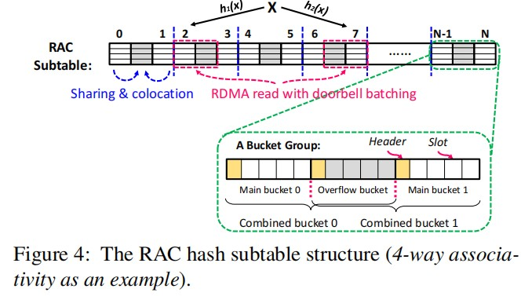
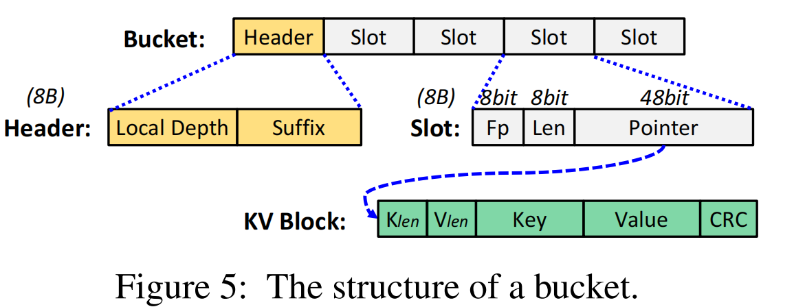
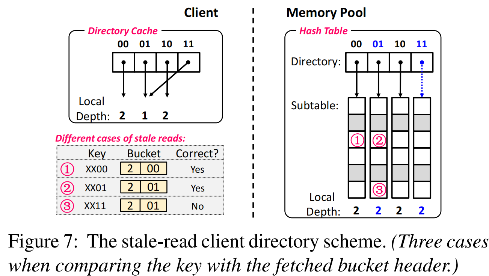
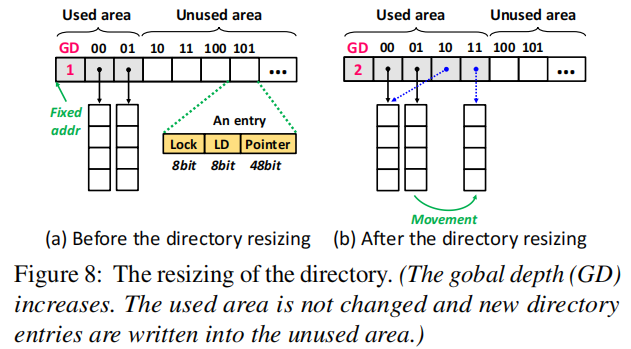

# One-sided RDMA-Conscious Extendible Hashing for Disaggregated Memory
```shell
Institution: Huazhong University of Science and Technology
Conference: ATC 2021
```

## Key Point
### Try to Solve?/Motivation
- Problem:
    <!-- - traditional hashing indexes become ineffificient for disaggregated memory since the computing power in the memory pool is too weak to execute complex index requests -->
    
    - Hashing System可以快速定位数据，优化RDMA访问性能 (本地 ns-level latency, RDMA remote access ms-level latency)
    - existing works (FaRM, DrTM) 在处理 Insert, Delete, Update时需要remote CPU在本地执行。这与disaggregated memory系统冲突：memory pool侧的计算能力很低，无法满足要求

    <!-- - 数据分布在存储节点之间分布不均（负载不均衡），当添加/移除存储节点时，导致大量的数据迁移
    - 扩展性差，扩展hash table时需要重新hash所有数据
    - 高网络开销：需要多次网络往返来解决哈希冲突或进行数据查找 -->

- Challenges:
    - Many remote reads&writes for handling hash collisions. (move data to make room for newly inserted items, these remote access produces RDMA network round-trip) —— 解决hash冲突的过程会导致大量remote读写
    - Concurrency control for remote access. (lock for local hashing indexes have low overhead(ns-level); remote locking requires RDMA "ATOMIC" verbs with ms-level latency) —— 远程操作并发控制，如果用lock，当发生lock竞争时，会导致高latency
    - Remote resizing of hash tables,
        - **full-table resizing** needs to move all key-value items from old-hash to new-hash
        - for extendible resizing, it reduced the number of moved items, but it need **one extra RDMA READ**(first accessing the directory of the hash table)
        - it is challenging to concurrently access the hash table during resizing. —— resize的同时保持并发访问

- How to solve these Challenges
    - 解决hash冲突导致的大量remote读写
        - 问题的原因：
            - 发生hash冲突 -> no empty slot in the bucket to keep new inserted key-value -> 将existing key-value驱逐到其他bucket中，或者为新key-value寻找新的empty slot （需要数据移动）. 这在已有的方法中，都需要遍历多个bucket，造成大量的 RDMA 读写。
        - 解决方法：
            - RDMA-conscious Hash Subtable, 不允许数据移动。 => 如何解决hash冲突？
            - 1，k-way association: 一个bucket中有多个slot，且地址连续，可以在一次RDMA READ 中读取全部slot。 —— 减小hash冲突的概率
            - 2，2-choice：同时使用两个hash function，insert new key-value item 可以插入两个bucket中 负载较小的那个。 —— 减少冲突的概率
            - 3，overflow colocation: 在两个main bucket之间加上overflow bucket，并被前后两个bucket share。地址连续可以通过一次RDMA READ访问。
                - 即使有1，2中的冗余slot，但是随着数据访问的增加，hash冲突无法避免；所以当hash重复发生时，局部化hash冲突，写入overflow bucket. —— 避免移动数据
                - 当overflow bucket被填满，RACE Hashing触发 extendible resizing
        
        
    
    - lock-free 远程并发控制
        - Note: 
            - key-value block是一个存储实际key-value数据的内存块，在memory pool中。 存储了key, value, key_len, value_len等
            - slot是hash table中的最小memory块，存储 fingerprint (hash tag), length, 指向实际key-value block的地址，也存储在memory pool中
        - 直接 lock-free，多个client可能会同时修改hash表，导致数据不一致。比如同时插入相同数据导致数据重复
        - 通过RDMA CAS原子操作来确保当前client对slot修改时，slot内的数据没有被其他的client修改
        - Insert，Delete，Update Ops 第一时间都不修改原key-value block
            - lock-free Insert
                - 先将key-value写入memory pool，得到一个address。
                - search bucket并通过RDMA CAS来写key-value block到bucket中的一个empty slot
                - CAS失败说明其他client修改了当前slot中的address, client会重试
                - 无法避免写入重复数据，增加一个re-read bucket处理，只保留一个valid key (最小bucket id 和 最小slot id)
            - lock-free Delete
                - 先通过RDMA CAS修改slot为null，成功后clent端将key-value block设置为全0 并释放
            - lock-free Update
                - client先将新的key-value 写入remote memory pool, 得到一个新的key-value block地址
                - 通过RDMA CAS将slot内的地址更新为指向新的key-value block, 成功后client释放原本的key-value block
        - 如果RDMA READ 和 IUD 操作同时发生，可能会读到修改中的key-value block, 增加校验位 CRC
        
        
    
    - remote-resizing
        - extendible resizing instead of full-table resizing

        - 解决增加的 one extra RDMA READ to get Subtable
            - client 端缓存 directory 来定位Subtable
        - 解决resize过程中，memory pool weak compute resource的问题
            - RACE 将扩容操作交给CPU client
            - client 计算完之后，将新的subtable和directory同步给memory pool
            - 新问题：当前client修改memory pool，导致其他client数据“过期”
                - existing works通过广播 和 主动更新的方式会增加开销
                - RACE中，先继续使用旧directory，但是增加校验 (校验local depth 的长度)
        
        

        - 解决resize的同时支持并发访问
            - 保证目录的初始地址不变 -> resize不影响原有数据的访问
            - 分成used area 和 unused area. 其他client保存了used area的directory。通过global depth(GD 固定地址)来获取directory used area的深度
            - resizing的同时，lock entry来避免其他clent对当前entry修改，但是对原本读写不受影响。

        

## Details
- Motivation:
    - fully relies on one-sided RDMA verbs to effificiently execute all index requests
    - for resizing, RACE hash table consists of multiple subtables and a directory which is used to index subtables.
        - subtable is one-sided RDMA-conscious (RAC)
        - RACE hashing caches the directory at the client side(CPU blade), eliminates the RDMA access to the directory. (cause accessing old-version directory when resizing)
    - for remote concurrency, a lock-free remote concurrency control scheme for the RAC hash subtable, which achieves that all index requests except failed insertions are concurrently executed in a lock-free manner.

- Contribution:
    - One-sided RDMA-conscious table tructure, both RSF and IDU friendly.
    - Lock-free remote concurrency control
    - Extendible remote resizing

### Existing Works 
- RDMA-search-friendly hashing indexes (RSF)
    - execute search requests by using one-side RDMA "READs" to fetch data from remote memory without involving remote CPUs
    - for insertion, deletion, and update (IDU) requests, are sents to the remote CPUs to execute them locally. (But the weak computing power in the memory pool)
    - in existing RSF hashing indexes, IDU requests can be executed in compute blades by using one-sided RDMA "WRITE" and "ATOMIC" verbs to operate on remote data. (But incurs large performance degradation <- large number of network round-trips and concurrent access conflicts)
- Pilaf Cuckoo Hashing: 
    - execute 3 different hash buckets for each key (search sequentially)
    - may cause miss while the server is handling its eviction -> the server calculates all affected buckets before moving keys.
    - an insertion is executed by using a large number of RDMA CASes (a alrge number of locks) and WRITEs,
- FaRM Hopscotch Hashing
    - chained associative hotscotch hashing, each bucket has a nerberhood .
    - insertion or move empty slot may access the whole hash table.
- DrTM Cluster Hashing
    - chained hashing with associativity
    - inertion may traversal the linked bucket list one by one, and need lock/unlock the bucket list.

- Resizing Hash Table
    - full-data resizing
    - extendible resizing
        - including multiple subtables, for 64-bit hash value, use M bits for directory to locate a subtable, and the remaining 64-M bits are used to locate target buckets within the subtable.
        - when a subtable is full, split the subtable into two by adding a new subtable.
        - global depth(GD) vs local depth(LD)
        - challenges:
            - compare to full-data resizing, the extendible resizing incurs one extra memory access for each search request, to obtain the address of the target subtable before accessing it. (one more RDMA round-trip)
            - there is no powerful compute resource in the disaggregated memory to execute the complex resizing -> has to be triggered and executed by a remote client (CPU blade)
            - concurrent access to the hash table during resizing

## RACE Hashing
- the RACE hash table is stored in the memory pool
- each client maintains a local cache to store the directory of the RACE hash table, to reduce one RDMA READ for getting the address of subtable.
- the RDMA-conscious (RAC) hash subtable structure
    - for IDU friendly, RAC does not allow any movement operations, evictions, or bucket chaining to handle hash collisions <- these operations incurs a large number of remote writes.
    - instead, provide following method to solve hash collisions.
    - 1, Associativity
        - each bucket has multiple slots
        - for one-sided RDMA operations, multiple items within one bucket can be read together in one RDMA read (continuous).
    - 2, Two Choices  ->  better load balance and low hash collisions
        - RAC subtable uses two independent hash functions h1() and h2(), to compute two hash locations for each key
        - RAC inserts a new item into the less-loaded bucket between its two hash locations
    - 3, Overflow Colocation
        - Overflow buckets can be shared by the other two main buckets to store conflicting items for better load balance. (incur extra RDMA READs)
        - three continuous buckets are considered as a group, the first and last buckets are main buckets (can be addressed by the hash function). the middle one is shared overflow bucket. -> one RDMA READ can fetch one main bucket and its overflflow bucket together, reducing the number of RDMA READs.
    
    

- a lock-free remote concurrency control scheme
    - remote locking implemented by using ms-level latency RDMA CAS.  -> lock-free
    - to support variable-length keys/values -> pointers are stored inside the hash table.
    - Bucket Structure:
        - 8-bit fingerprint(Fp): the hash of a key
        - 8-bit key-value length(Len), unit is 64B, maximum 16KB per block.
        - 48-bit pointer of value
    - Lock-free Insertion
        - reading buckets and writing the key-value block may execute in parallel.
        - find an empty slot in combined-buckets. (main-buckets + overflow buckets, if no empty slots -> resizing)
        - for the problem of duplicate keys, the client re-read the two combined buckets to check duplicate keys after writing. -> only keep one
    - Lock-free deletion
        - once searched, the client sets its corresponding slot to be null by using an RDMA CAS
        - the client then sets the key-value block to full-zero
    - Lock-free update
        - the client write the new key-value item while seach the target key
        - the client use an RDMA CAS to change the content of the slot to point to the new key-value item.
    - Lock-free search
        - compare Fp -> then read key-value block -> compare whole key
        - add a 64-bit checksum in each key-value block to enhance the self-verifification and check the integrity of a key-value block
    - if CASing a slot fail(means it been changed by another client), RACE hashing re-search the target key and then re-executes the failed insertion/deletion/update request.

- a client directory cache with stale reads scheme
    - caching the directory in clients incurs the data inconsistency issue between the directories in the memory pool and client caches.  -> a stale-read client directory (SRCD) cache scheme
    - by using SRCD, clients still using stale directories in their caches, but can verify whether the obtained data is correct based on the "local depth" and "suffix bits" in the bucket header.
        - only in Case “3) Both local depth and suffix bits mismatch”, the client needs to fetch new directory entries and update the local directory cache
    - concurrent access during resizing
        - during resizing, need move slots form old-subtable to new one.  -> concurrency problem
        - lock the directory entry of the resizing subtable in the memory pool, only prevent resizing by other clients. allow other S + IDU requests
        - Three Steos:
            - updating the suffix bit
            - inserting all items with Suffix "11" in this bucket into Subtable "11"
            - deleting all items with Suffix "11"

