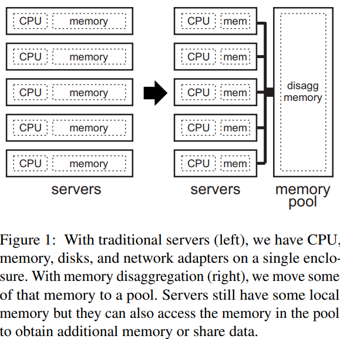
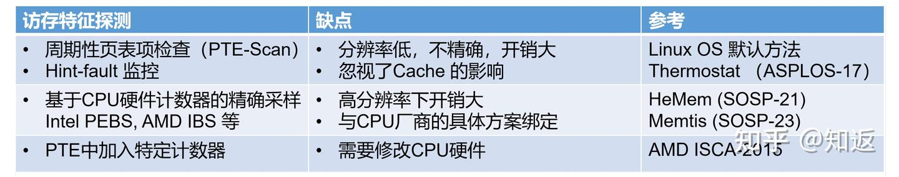

## Memory Disaggregation
- memory pool

- Why memory disaggregation?
    - memory can dominate the cost of the system. In fact, cloud operators report that memory can constitute 50% of server cost and 37% of total cost of ownership [https://dl.acm.org/doi/10.1145/3606557.3606563].

- Technologies:
    - RDMA on Ethernet networks
    - CXL allows devices to provide cache-caherent memory on the PCIe Bus

- Challenges
    - memory allocation: memory tiering
        - local memory: faster but private
        - disaggregated memory: larger but shared
        - A solution is to handle all allocations centrally at one of the servers; another solution is to allocate memory in a distributed fashion, which requires efficient coordination across servers. 
    - scheduling
    - addressing
    - OS state

- CXL
    - [CXL](./CXL.md)
    - CXL内存相比传统DDR接口内存，拥有更高的访问延迟
    - 内存分层系统
        - 第一种：将Fast Memory 和Slow Memory 的地址空间打平，Linux用不同的NUMA Node抽象进行管理，CPU可以直接访问Slow Memory。
        - 第二种：将Fast Memory 看作Slow Memory 的Cache，CPU只能访问Fast Memory 中cache住的Slow Memory 数据，如果不存在的话需要进行换入换出（可以做到cacheline粒度）
        - 机制上：访存分析 -> 冷热页识别 -> 冷热页迁移
            - linux 提供了 migrate_page()

- 如何发现hot page
    - PTE-Scan： 判断PTE中的access bit
        - shortage 1: 只能区分页面是否被访问过，获取访问频率需要多轮scan
        - shortage 2: set Access bit 的行为发生在TLB内，其实还没有经过cache，所以也并不知道该页面的数据是否cache hit。如果一个页面经常被访问，但是局部性很好，总是在CPU cache中hit，其实并没有引起大量的Slow memory 访问，也没有必要把这个页面迁移到Fast memory。

        

## Software-Managed Tiering
- represent tiers as NUMA nodes: allocate memory from a NUMA node and migrates pages between nodes
    - [Towards an adaptable systems architecture for memory tiering at warehouse-scale.](https://dl.acm.org/doi/pdf/10.1145/3582016.3582031)

    - [Pond: CXL-based memory pooling systems for cloud platforms.](https://dl.acm.org/doi/pdf/10.1145/3575693.3578835)

    - [TPP: Transparent page placement for CXL-enabled tiered-memory](https://dl.acm.org/doi/10.1145/3582016.3582063)

    - [NUMA Balancing/AutoNUMA](https://mirrors.edge.kernel.org/pub/linux/kernel/people/andrea/autonuma/autonuma_bench-20120530.pdf)

    - [AutoTiering](https://www.usenix.org/system/files/atc21-kim-jonghyeon.pdf)

## Benchmark & Platform
    - 