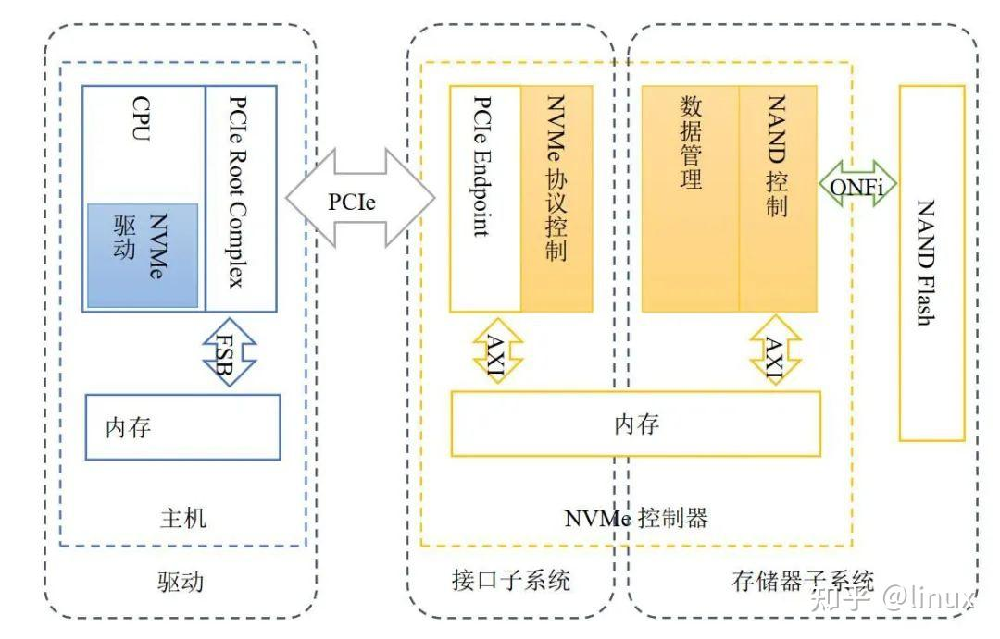
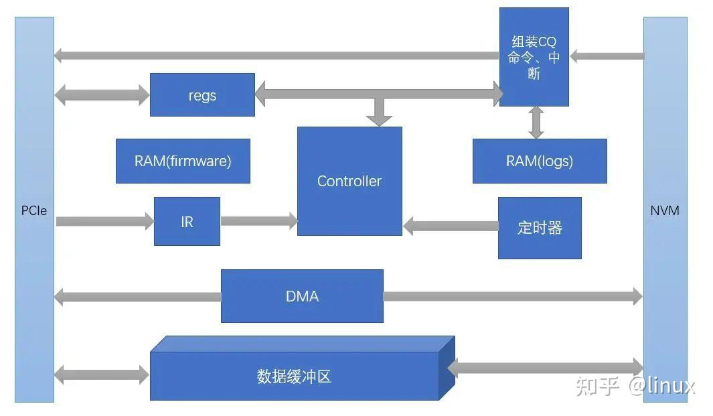

### 什么是NVMe
- Non-Volatile Memory Express, 是一种非易失性内存主机控制器**接口规范**，或者说是运行在PCIe接口设备上的通信协议，用于规范计算机和存储设备之间的数据传输
- 接口 + 协议
    - 接口
        - SATA接口，eg. 一些3.5寸/2.5存的硬盘，SATA3最大带宽 6Gb/s
        - PCIe接口，eg. M.2硬盘等，速度比SATA快，如4X PCIe的M.2接口最大带宽可达 32Gb/s
        - SAS(串行SCSI) 和 FC(Fibre Channel)接口，一般只在服务器或者数据中心中使用
    - 协议
        - 用于SATA接口的AHCI或者ATA协议
        - 用于PCIe接口的NVMe协议

### NVMe协议的原理
- 基本架构
    - host端的驱动
    - PCIe + NVMe实现的控制器(*)
    - FTL + NAND Flash存储

    

- NVMe控制器
    - DMA + multi Queue
        - DMA 负责数据传输（指令 + 用户数据）
        - multi Queue 负责发挥flash的并行能力

    


- Benchmark 测试
    - benchmark tools
    ```shell
    sudo apt-get update
    sudo apt-get install fio

    # 替代基准测试tools
    git clone https://github.com/earlephilhower/ezfio
    cd ezfio
    ./ezfio.sh --device /dev/nvme0n1
    ```
    - List NVMe Storage Devices
    ```shell
    lsblk
    ```
    - Test Information
        - Sequential Read and Write
            - 不同的request rate
            - 多个connection
        ```shell
        # 控制请求率 IOPS： --rate
        sudo fio --name=seq_read_rate --filename=/dev/nvme0n1 --rw=read --bs=1M --size=10G --numjobs=1 --rate=100m --time_based --runtime=60 --group_reporting

        # 控制连接数 --numjobs
        sudo fio --name=seq_read_4jobs --filename=/dev/nvme0n1 --rw=read --bs=1M --size=10G --numjobs=4 --time_based --runtime=60 --group_reporting

        # 不同请求大小 --bs
        sudo fio --name=seq_read_4k --filename=/dev/nvme0n1 --rw=read --bs=4k --size=10G --numjobs=1 --time_based --runtime=60 --group_reporting

        sudo fio --name=seq_write --filename=/dev/nvme0n1 --rw=write --bs=1M --size=10G --numjobs=1 --time_based --runtime=60 --group_reporting
        ```
        - Random Read and Write
        ```shell
        sudo fio --name=rand_read --filename=/dev/nvme0n1 --rw=randread --bs=4K --size=10G --numjobs=1 --time_based --runtime=60 --group_reporting

        sudo fio --name=rand_write --filename=/dev/nvme0n1 --rw=randwrite --bs=4K --size=10G --numjobs=1 --time_based --runtime=60 --group_reporting
        ```
        - 读写混合场景
            - 一般的，读写混合场景下，NVMe的性能会有严重下降
            - 不同的读写比例

        - MQ的框架提升性能最主要的将锁的粒度按照硬件队列进行拆分，并与底层SSD的队列进行绑定，理想的情况每一个CPU都有对应的硬件发送SQ与响应CQ，这样可以并发同时彼此之前无影响。(eg. 按照NVMe SPEC协议中的标准，硬件最多支持64K个队列，实际由于硬件队列的增加会给NVMe SSD带来功耗的增加，所以不同的厂商在设计硬件队列个数时的考量是不同的，比如intel P3600支持32个队列，intel最新的P4500支持16384个，但是SUMSUNG PM963却只支持到8个。）那么当CPU的个数超过硬件的队列个数，就会出现多个CPU共用一个硬件队列的情况，对性能就会产生影响。
            - 调整CPU个数

        - 长尾Latency
            - 当MQ的队列深度很高时

        - requests 的 length 不同

    - Output Metrix
        - Bandwidth
        - Latency
        - Input/Output Operations Per Second(IOPS)