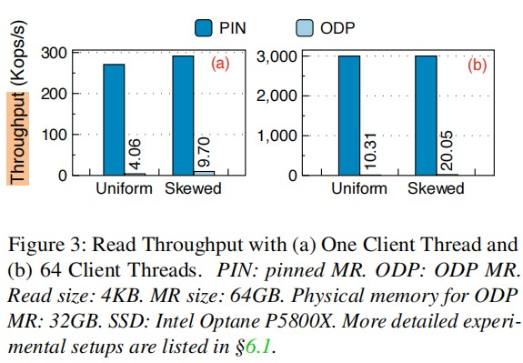

## TeRM: Extending RDMA-Attached Memory with SSD

```
Conference: FAST'24
Institution: Tsinghua University & Huawei (Youyou Lu)
```

### Key Point
- Try to Solve?
    - Spin MR 虽然能提供高性能，但是受到physical memory's capacity的限制
    - ODP MR可以支持使用SSD扩展 RDMA-attached memory size, 但是现有的方法 性能太差：RNIC page fault 570 us <-> 3.66 us. Throughput 也差很多

    

- Background: Spin MR vs. ODP MR
    - Memory Region(MR): 在RDMA中，MR定义了server端允许client端通过RNIC直接访问的内存区域
    - Spin MR(pinned MR): 
        - 在初始化时，将所有内存页锁定在物理内存中，防止被操作系统换出
        - RNIC page table直接记录虚拟地址到物理地址的映射，RNIC可以直接访问数据
        - 优点：low access latency (3.66 μs); 无页故障开销
        - 缺点：内存容量受限，无法超出DRAM容量限制；不支持动态内存扩展 (如从SSD交换到内存)
    - ODP MR(On-Demand Paging MR): 
        - 内存页按需load，支持虚拟内存 > 物理内存容量
        - 允许OS自由换页（如从SSD交换到内存），无需在初始化时固定
        - 缺点：访问未map的内存页时会触发 RNIC page fault 和 CPU page fault，导致high latency (570 μs)
        - 优点：内存利用率高
        - 同步机制：
            - Invalidation：OS换出内存页时，需通知RNIC驱动失效对应page表项
            - Advising：应用主动请求预加载数据到RNIC页表

- Motivations
    - 作者进一步拆分 ODP MR page fault latency 组成；如图所示
    - hardware's long latency 是来资源处理exception较慢; 因为limited compute and memory resources of the RNIC => **onload exception handling from hardware to software**
    - software's long latency is caused by CPU page fault; => **eliminate CPU page faults from the critical path**