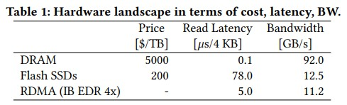

## 基础调研
- RDMA vs NVMe-oF
    - RDMA (InfiniBand/RoCE) 
    - NVMe-oF (NVMe/RDMA, NVMe/TCP)
        - NVMe/RDMA协议，基于RDMA网卡，无需CPU和内核干预 (~20-50 us)
            - 使用RNIC卡，会与RDMA-DRAM竞争带宽等
        - NVMe/TCP协议 使用标准Ethernet和TCP/IP传输；不需要RDMA网卡但协议开销更高 -> higher latency (~50-200 us)

- 不同硬件的速度比较
    

## 关注的问题：
- DSM中DRAM高成本问题：
    - in-memory DBMSs requires that all data must be memory resident.
    - require larger capacity while data sets grow. -> 硬件成本高
    - NVMe 更便宜 => 以成本更低的 NVMe SSD 来扩展远程内存
- 使用NVMe扩展DRAM带来哪些问题？
    - Latency & Bandwidth
    
    ||RDMA-DRAM|NVMe-oF|
    |--|--|--|
    |Access Lat|12.5-25GB/s|受限于网络带宽+PCIe设备带宽，~7.88GB/s for PCIe 4.0x4|
    |Bandwidth|InfinniBand ~1-2 us|~50-100 us|

    - 内存管理：NVMe按照page管理 -> 写放大，hot/cold page迁移会引入更高的传输延迟 (需要细粒度的hot/cold page识别，分层迁移，和预取策略)
    - 缓存一致性问题：NVMe-oF并不原生支持缓存一致性，依赖DSM或者用户态协议层来实现
    - NVMe的有限寿命远低于DRAM (MLC NAND 3000+次 vs. 10^12) ，如作为频繁写的远程内存扩展，易造成快速磨损
    - 使用NVMe-oF over RDMA 会与 RDMA-DRAM在RNIC和PCIe上做争用; RDMA QP也会被占用

- 补充：NVMe NAND Flash 的 program/erase period:
    - NAND Flash 单元（cell）在每次 “page program + block erase” 周期后都会产生微小的损伤，随着擦写次数的增加，单元可靠性下降、错误率上升。
        - page program: 将新数据写入一个空闲(已擦除)的page. (~200-800 us)
        - block erase：如果写入的目标页之前存有旧数据，则必须先整块擦除（≈1–3 ms）
    - 不同制程与存储多级程度的 Flash 耐久度相差很大：
        - SLC（1 bit/cell）：可承受 50k–100k 次 P/E 周期
        - MLC（2 bits/cell）：可承受 5k–10k 次
        - TLC（3 bits/cell）：可承受 1k–3k 次
        - QLC（4 bits/cell）：可承受 ∼100–1k 次

## 使用 DRAM-RDMA + NVMe 的相关论文：
### [CXL-Enabled-SSD](https://www.usenix.org/system/files/atc23-yang-shao-peng.pdf)
```shell
Title: Overcoming the Memory Wall with CXL-Enabled SSDs
Conference: ATC 2023
Institution: Syracuse University
```
- 解决的问题：
    - memory wall between CPU and DRAM(capacity and bandwidth)
    - DRAM 扩容成本高，Flash SSD成本低
- Motivation：
    - 使用CXL互联，将Flash SSD作为“扩展内存”来提供更大的容量和扩展性
    - 通过软硬件协同设计来掩盖flash的高延迟和有限寿命
- 挑战：
    - granularity mismatch -> write amplification
    - microsecond-level latency
    - flash的有限寿命
- 设计：
    - 主要是硬件设计
    
    - adding DRAM cache in front of flash memory: cache frequent accessed data,提供高性能和低traffic(to flash)
    - 增加 MSHR (miss status holding registers)
        - services multiple 64B memory access from a single flash memory read
        - 合并对同一地址的blocks I/Os: 当多个64B的细粒度访问落在同一个page中，只有第一次回触发page access
    - 增加prefetch，提前将数据预取到DRAM
        - Next-N-line(NL): 空间局部性
        - Feedback-directed: 实时跟踪prefetcher的accuracy, timeliness, pollution等指标，自适应调整预取的深度
        - Best-offset：实时学习访问流中的"最佳偏移量"(两次连续访问之间最常用的距离)，用这个偏移来预取下一个block。(自适应访问模式变化)
        - Leap: 融合了Best-offset + Next-N-line方法，以可调整的offset，一次预取一个可变长度(windows)的blocks
    - Evict policy
        - FIFO
        - Random
        - LRU
        - CFLRU: prefer to evict clean data over modified ones.

### [ScaleStore](https://dl.acm.org/doi/pdf/10.1145/3514221.3526187?casa_token=sCIPsEH5sm0AAAAA:KrSacrrEKb8DKmjrP0fhigrfTey0uQdEjgAz_7zlegcW1-wSajrtJOmYcHeqHviIlx3GMILU060f)
```shell
Title: ScaleStore: A Fast and Cost-Efficient Storage Engine using DRAM, NVMe, and RDMA
Conference: SIGMOD'22
```
- 解决的问题：
    - in-memory DBMSs 对DRAM容量的需求越来越高，但是DRAM更贵 (容量越大越贵)
    - 当数据的hot datasets 小于 whole dataset时，全部存在DRAM上浪费DRAM资源
- Motivation: 
    - NVMe更cheap；使用它可以减少硬件开销
    - 利用DRAM存储hot data； 使用NVMe存储cold data；借助RDMA完成cross node的数据交换
    - Core Idea: 根据工作负载动态的决定哪些数据需要存储在DRAM上，哪些存储在SSD上

- 挑战：
    - 数据如何放置：
        - local DRAM, local SSD, remote DRAM, remote SSD
        - 不断变化的工作负载(冷热数据)
        - 需要支持弹性扩缩容
    - 数据分布在多个存储设备和节点上；如何实现一致性


- Design: 
    - 基于RDMA的分布式缓存协议
        - local 缓存：为了使具有高访问局部性的工作负载实现高性能，ScaleStore 会同时在多个节点的 DRAM 中动态缓存频繁访问的页面。
        - 一致性协议：受MESI协议启发; 通过invalid message来去报一致性
            - Modified
            - Exclusive (独占)
            - Shared
            - Invalidated
        - 以page为单位管理；Translation table中存储了页的lock + ownership metadata
            - 当Node A访问一个不在local DRAM中的page时，解析page ID(高8bits)获取该page的node ID(assume Node B)； Then，Node A向Node B发送"ownership request"请求，Node B接收请求后，检查local Translation Table, 如果page已经在DRAM中，直接通过RDMA将这一页数据写入Node A的local DRAM buffer；否则，Node B先从NVMe SSD上读取数据到local DRAM (也会更新local Translate table)，然后再通过RDMA写入Node A. Node A 拿到数据之后，将数据cache在local DRAM中，同时更新local Translate table，标记已经缓存了此page.
            - 写-互斥锁 + optimistic READ(版本号检查冲突)
            - ownership metadata
                - node-exclusive/node-shared
                - 当前哪些node上持有该页
                - 写操作需要获取node-exclusive；读操作不用 
            - ownership迁移：node A 通过translation table查询 page的 ownership(如 Node B)；向NodeB请求成为新的owner(如果有冲突：node C已经请求过，B不再是owner了)；Node B在本地evict或者invalidate，同时将page数据传回node A. A 在本地set自己为新的owner，并向所有当前以node-shared模式持有该页的node发送 invalidation message。通过RDMA，广播 (实践中每个page的共享者通常很少)
            - metadata更新 在request到达时变更所有权
            - 修改后并不立即更新NVMe，页面保持在DRAM中，只有当该page被evict时，才会写回NVMe SSD.(由local node写)
        - RDMA：use one-side RDMA verbs for all inter-node communication
            - data tranfer
            - implement efficient RPC-based message passing(invalidation， ownership change)
        - 地址查询：所有访问都是基于全局唯一的页面标识符 PID，PID 高 8 bit 编码了“目录节点 ID”，低 56 bit 指明该页在目录节点上的 SSD slot。
        

    - high performance eviction policy
        - 将access moniter 与 eviction分离
        - 基于Epoch的LRU近似
            - LRU 全局双向链表的维护成本高
            - 思路：
                - 维护一个全局周期$gEpoch$，并以固定周期自增
                - 在每个页面被访问时，将当前的$gEpoch$写入page metadata->lastEpoch
                - 区分冷热：
                    - hot page: lastEpoch == gEpoch
                    - warm page: lastEpoch == gEpoch - 1
                    - cold page: lastEpoch < gEpoch -1
        - 使用专门的后台线程(Provider)，通过采样的方法来选择evict candidates
            - Provider 周期性唤醒，执行采样，冷热数据区分，和异步eviction
            - 随机采样
                - 从translation table随机采样固定数量(1024 or 4096)的matadata
            - 异步eviction
                - clean page: 无需写回SSD，释放local DRAM
                - dirty page: 
                    - 当前node是owner (directory)，直接写回SSD
                    - 当前node不是owner，向owner node发送evict请求； owner node对page加锁；通过RDMA从 shared node这里读取dirty page数据到local DRAM；调用异步I/O (libaio) 将数据写回owner node的DRAM.

    - 易于使用的编程抽象

### [AdaCache](https://arxiv.org/pdf/2306.17254)
```shell
Title: AdaCache: A Disaggregated Cache System with Adaptive Block Size for Cloud Block Storage
Institution: Samsung \& Arizona State University
Conference: ArXiv'23
```
- 解决什么问题？
    - cloud block storage中，NVMe SSD通常作为其中的cache方案，以提高IO性能 (云块存储再云基础设施中被广范使用，使用块存储，数据被划分为固定大小的块并存储在底层存储介质上。这些块可以由应用程序直接访问，也可以通过挂载的文件系统访问，从而允许快速修改特定块以高效地处理 I/O 请求。)
    - 传统的NVMe SSD cache无法主机共享，与compute host一起部署 => 整体利用率低(一些node上SSD cache过载，另一些node上空闲)
    - 固定大小cache block的局限：small block 降低了cache miss惩罚，但是metadata开销大； big block则会导致读写放大。
- Motivation
    - block尺寸可变的缓存策略
    - 再rack级别通过NVME-oF实现 SSD 资源池化，提升SSD 利用率
- 新的挑战
    - 可变block size会带来内存碎片化
    - 支持多种size，metadata管理更复杂
    - NVMe-oF的远程访问开销，需要限制再可接受范围内
- Design
    - AdaCache 基于用户态 SPDK 框架，将所有本地 NVMe SSD 作为虚拟缓存设备（cache bdev）池化，由集中缓存服务器通过 NVMe-oF 为机架内各计算节点提供服务


## 相关度没那么高的论文
### [NOMAD](https://www.usenix.org/system/files/osdi24-xiang.pdf)
```shell
Title: NOMAD: Non-Exclusive Memory Tiering via Transactional Page Migration
Conference: OSDI'24
Institution: The University of Texas at Arlington \& Intel Labs
```
- 解决的问题：
    - 当快速内存面临压力时，基于页面迁移的exclusive memory tiering会显著降低性能；频繁的数据迁移会导致memory thrashing
- Motivation
    - non-execlusive memory tiering设计
    - hot page迁移到fast tier之后，slow tier仍然保留shadow副本, 避免数据迁移(unmap-copy-remap)操作阻塞访问.
- 新的挑战：
    - 如何再迁移过程中维持"可访问"：传统unmap之后就会阻塞访问
    - 维持迁移过程的"可访问"，会导致"迁移期间"page被写脏，如何检测和处理(回滚/重试)
    - 当fast-tier 空间不足时，有限回收 "shadow" page
    - 实现完全异步的迁移，不影响征程执行路径
- Design
    - 非独占分层（Page Shadowing）：仅对从慢层（CXL/SSD）晋升到快层（DRAM）的页保留影子副本，读冷页可直接在慢层访问，无需迁移。
    - 事务性页迁移（Transactional Page Migration, TPM）：在不解除旧页映射的情况下启动复制，复制后检查写位（dirty bit）；若无写入则将新页映射到页表并丢弃旧页，否则撤销并稍后重试。
    - Matryoshka 页面管理：引入影子页回收优先级，确保在慢层压力下先回收影子页，再驱逐普通页；并全链路异步迁移，将迁移从程序关键路径中剥离。

### [Rcmp](https://dl.acm.org/doi/pdf/10.1145/3634916)
```shell
Rcmp: Reconstructing RDMA-Based Memory Disaggregation via CXL
Source-Code:https://github.com/PDS-Lab/Rcmp
Huazhong University of Science and Technology & Huawei
ACM Transactions on Architecture and Code Optimization 2024
```
- Key Points
    - 内存分解是现代数据中心的一种很有前途的架构，它将计算和内存资源分离成由超快网络连接的独立池，提高内存利用率，降低成本，并实现计算和内存的弹性扩展
    - Problems:
        - 现有的基于 RDMA 的DSM面临 高延迟：RDMA可以提供1.5∼3 μs的延迟，但DRAM延迟为80∼140 ns
        - 基于 RDMA 的DSM：
            - 基于Page：页错误处理和读/写放大
            - 基于Object：接口修改和源代码级别的修改
        - 现有的基于CXL的DSM面临 物理距离限制，不能跨racks部署
    - 思路：在rack中构建基于CXL的小型memory pool，并使用RDMA来连接rack形成更大的memory pool.
    
    - 挑战：
        - 粒度mismatch：CXL支持缓存行粒度的访问；RDMA需要Page/Object粒度。
        - 通信不匹配：RDMA通信依赖RNIC和消息队列(QP和CQ)；CXL依赖CXL高速链路和缓存一致性协议
        - 性能不匹配：RDMA的Latency 远大于CXL(约10倍)；将导致不一致的访问模式（类似于NUMA架构）。访问本地机架中的内存比访问远程机架快得多，机架之间的RDMA通信成为主要的性能瓶颈。
    - 实现方法：
        - 全局内存管理：
        - 通信优化：
        - 优化remote rack的访问：

### TeRM: Extending RDMA-Attached Memory with SSD
```shell
Conference: FAST'24
Institution: Tsinghua University & Huawei (Youyou Lu)
```
- Try to Solve?
    - Spin MR 虽然能提供高性能，但是受到physical memory's capacity的限制
    - ODP MR可以支持使用SSD扩展 RDMA-attached memory size, 但是现有的方法 性能太差：RNIC page fault 570 us <-> 3.66 us. Throughput 也差很多

    

- Background: Spin MR vs. ODP MR
    - Memory Region(MR): 在RDMA中，MR定义了server端允许client端通过RNIC直接访问的内存区域
    - Spin MR(pinned MR): 
        - 在初始化时，将所有内存页锁定在物理内存中，防止被操作系统换出
        - RNIC page table直接记录虚拟地址到物理地址的映射，RNIC可以直接访问数据
        - 优点：low access latency (3.66 μs); 无页故障开销
        - 缺点：内存容量受限，无法超出DRAM容量限制；不支持动态内存扩展 (如从SSD交换到内存)
    - ODP MR(On-Demand Paging MR): 
        - 内存页按需load，支持虚拟内存 > 物理内存容量
        - 允许OS自由换页（如从SSD交换到内存），无需在初始化时固定
        - 缺点：访问未map的内存页时会触发 RNIC page fault 和 CPU page fault，导致high latency (570 μs)
        - 优点：内存利用率高
        - 同步机制：
            - Invalidation：OS换出内存页时，需通知RNIC驱动失效对应page表项
            - Advising：应用主动请求预加载数据到RNIC页表

- Motivations
    - 作者进一步拆分 ODP MR page fault latency 组成；如图所示
    - hardware's long latency 是来资源处理exception较慢; 因为limited compute and memory resources of the RNIC => **onload exception handling from hardware to software**
    - software's long latency is caused by CPU page fault; => **eliminate CPU page faults from the critical path**


## 故事线
- 解决什么问题？
    - DRAM 容量收到硬件插槽限制(容量有限) + 大容量的DRAM往往价格更贵
    - Existing works在DSM场景下使用SSD扩展DRAM，主要集中在优化local access，没有跨节点共享
    - cross node负载均衡：当node A上 SSD I/O饱和时，可以动态调整一些node A上的hot数据读写请求到空闲node
- Motivation是什么？
    - 借助NVMe-oF技术，将cross node的NVMe资源share成第三级 storage pool，支持cross node的share和访问 (按需动态分配)
    - Compute -> RDMA-DRAM Pool -> NVMe-oF Storage pool
- 有哪些新的挑战？
    - 延迟问题：
        - local DRAM in Compute Node: ns级别延迟 (或者只考虑compute，不考虑local DRAM？)
        - RDMA-DRAM Pool access：~1-2 us； 带宽 ~12.5-25GB/s
        - NVMe-oF Storage Pool: ~50-200 us(TCP) / ~20-50 us(RDMA); 大容量
    - 带宽竞争：
        - NVMe-oF over TCP 速度慢(~50-200 us(TCP)), while NVMe-oF over RDMA速度快(~20-50 us(RDMA))
        - 使用 NVMe-oF over RDMA
            - RDMA-DRAM 和 NVMe-oF over RDMA 走同一条 RNIC 和同一块物理网络（InfiniBand 或 RoCE）；竞争链路带宽
            - RNIC 只有有限数量的QP和WQE(work queue engine); 两者同时高并发会导致排队和latency thrashing
            - PCIe链路带宽竞争：RDMA-DRAM: PCIe-DRAM-PCIe; NVME-oF: PCIe-SSD-PCIe (PCIe上的流量综合不超过PCIe的带宽: eg.PCIe 4.0*4 ~= 7.88GB/s)
        - 使用NVMe-oF over TCP
            - 不会抢占RDMA-specific资源，影响RDMA-DRAM的性能 (PCIe)
            - 增加CPU开销：经过内核网络栈，触发NIC中断，涉及多次：用户态-内核态切换
            - TCP协议处理：校验，拥塞控制，滑动窗口管理等
            - 更高的延迟
    - NVMe 寿命limitation + granularity mismatch (这个需要再想想)
        - 减少NVMe上的写频繁
- 技术方案？
    - Latency 优化
        - hot/cold数据分布: hot数据在RDMA-DRAM上，cold数据在NVMe SSD上
        - prefetch：
            - prefetch algorithm：首先看一下已有的prefech方法是否试用：Next-N-line, Feedback-directed, Best-offset, Leap 等.
        - asynchronize transfer：
            - evict policy：已有的：LRU, random, FIFO, CFLRU, 基于Epoch近似的LRU,
    - 负载均衡(缓解带宽竞争)
        - 对负载重的node 的数据读/写；迁移到负载轻的node上
        - 写SSD
        - 写DRAM
        - 读DRAM/SSD
        - (待定) NVMe-oF RDMA 和 NVMe-oF TCP的动态调整？
    
    - 减少SSD写频率：仅当从DRAM中evict时，才将更新写入SSD

- 需要的motivation test？
- benchmark 和 测试？