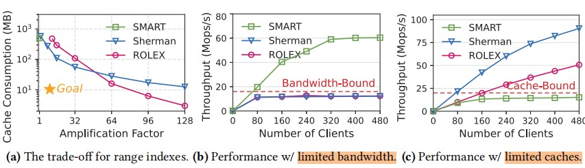
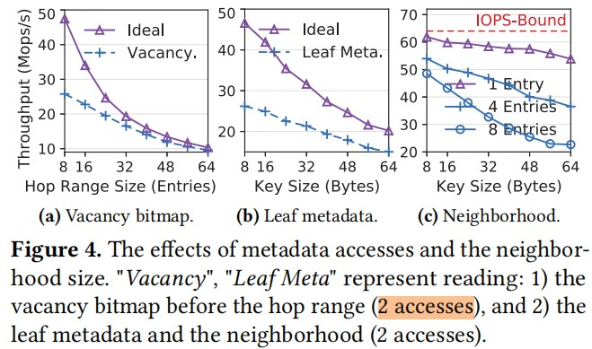
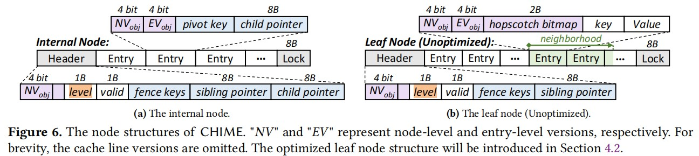
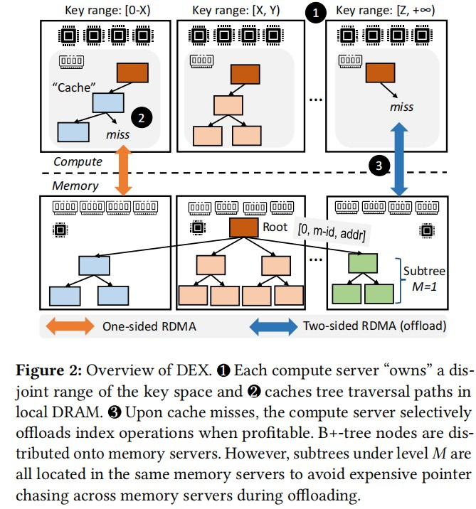
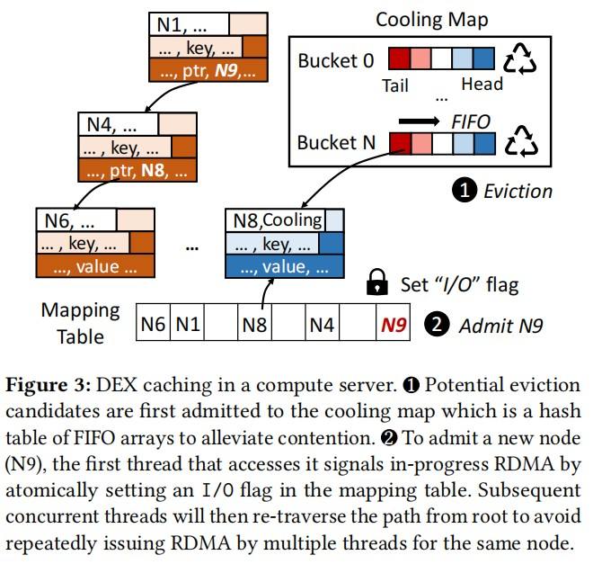

# CHIME Cache-efficient and High-performance hybrid Index on Disaggregated Memory

```shell
Conference: SOSP24
```

## Key Idea
### 解决什么问题?
- 解决Disaggregated Memory系统中range index的问题: 同时实现low read amplification and cache consumption in compute pool

### Range index
- range index 目的是加速范围查询, 在Database and key-value store system 的核心组件。
- 现有方法: (分为两类, 各有优缺点)
    - KV-discrete indexes
        - 每一个Key-Value item map到一个独立的address, 可以减少read amplification(cache的每一个address存储一个item, 放大系数为1)
        - 需要compute侧 cache 更多的address, cache consumption高 —— Compute pool with limited local mem.
        - Memory-Size Bound in CN
        - eg: SMART(Adaptive Radix Tree)
    - KV-contiguous indexes
        - 每个B+ tree的leaf node中存储多个KV item (连续存储), 可以减少需要被cache的address数量, 降低cache consumption
        - 读取KV item需要遍历selected leaf node, 造成read amplification (放大系数 = N, N means the number of KV items per leaf node)
        - Bandwidth-Bound
        - eg: Sherman(B+树)和ROLEX(Learned Index)



### Motivation
- combine B+ tree with hash-table-based leaf node
    - leaf node不在存储Key-Value Item, 而是存储hash-table
    - B+ Tree 减少cache consumption
    - Hash-Table 解决遍历leaf-node的READ amplification problem.

- 比较了多种hash方法, 选择了hotscotch hashing
    - 这里的hashing方法, 不在于怎么计算hash, 而在于怎么解决hash冲突
    - hotscotch hashing 的核心是为每个hash buchet分配一个固定大小的neighborhood。当新KV item发生hash collision时, 将item存在neighborhood中.
    - 如果对应bucket的neighborhood里没有empty slot, 可以通过一系列“跳跃”操作快速将empty slot移动到当前bucket的neighborhood中, 效率高
    - 优势: 
        - 1, **search时仅再neighborhood内遍历** => Read Amplification从O(size of leaf node) 降低到 O(size of neighborhood); 
        - 2, neighborhood在内存中连续 => 缓存友好
    - 劣势：
        - 在insert时，需要extra remote memory accesses to read and write the bitmap
        - 下图测试了仅Read Ops下，bitmap开销

        

- CHIME中, If there is no feasible hopping, a node split and up-propagation are performed, similar to a B+ tree, to create new space in the hopscotch leaf node.

### New Challenge
- Complicated optimistic synchronization.
    - Hybrid index中包含多种读写粒度: READ KV-item, READ node, Update KV-Item, Update node(node split).
    - 在DM架构 + 并发处理中, 如何高效的协调不同粒度的读写？ —— lock会阻塞其他client => lock-free的乐观同步
- Extra metadata accesses
    - maintain/access extra metadata
        - bitmap
- Read amplifications of hopscotch hashing
    - O(size of leaf node) -> O(size of neighborhood)

### Solve these Challenges
- 整体数据结构 (B+ Tree architecture)
    - internal node: for searching
    - leaf node: stores hotscotch hash table(KV items address)
    - Header: 
        - NV: node-level version
        - level: the leaf-nodes' level = 0, 往根节点, level = 子节点level + 1
        - fence keys: the lower and upper bound of keys in the node
        - sibling pointer: 指向兄弟节点like B-link tree
        - child pointer: 指向子节点 (为什么header要有child pointer)
    - Entry in Internal-Node:
        - EV: entry-level version
        - pivot key: to guide the search direction
        - child pointer: 
    - Entry in Leaf-Node:
        - hotscotch bitmap: 2-Byte, 记录长度为16的neighberhood 是否被占用
        - key-value
    - 8-bytes Lock: 
        
    

- CHIME中如何协调不同粒度的读写操作？
    - 3-level optimistic synchronization
        - Node-Level Version(NV)
        - Entry-Level Version(EV)
        - hotscotch bitmap
    - lock-free read
        - read $NV_{obj}$ in Leaf-Node Header and $EV_{obj}$ in Entry
        - 读数据(Read Node or Read KV-Entry)
        - 再次读取版本号，跟之前读取的版本号对比，如果一致，说明数据没有被修改，否则，说明数据被修改，需要重试
    - lock-based write
        - 8-bytes lock per leaf node
            - 写操作时，通过CAS操作获取leaf node的lock (修改值)、
            - 写操作完成后，client通过写回操作释放锁 (重置value)
        - node-level write
            - update 节点内所有Entry的NV + Header中的NV，写回整个Node
        - entry-level write
            - $hash(key)%len_node$ 确定插入entry的起始位置
            - 读取entry的bitmap;
                - 问题：增加一次remote memory access 获取bitmap，如何优化？
                - 优化：piggybacking method，在获取锁的过程中，leverage the unused bits in the lock(8-bytes) to represent the vacancy bitmap. 
            - 根据bitmap获取neighborhood中的empty entry
            - 如果存在empty entry, 则插入; 否则, 选择最远的bitmap[15]作为main-entry, 尝试将main-entry[0]位置的数据交换给neighborhood中的empty entry, 清理main-entry[15]来存储待插入的key-value.
            - update Entry中的EV, 并且讲整个Entry写回Memory
        
- 如何管理bitmap在内的metadata?
    - bitmap 读开销
        - piggybacking method
    - bitmap 写开销
        - node-level write
            - 更新node中所有Entry的bitmap，写回node
        - entry-level write (eg:Entry0, Entry1, Entry2, Entry3)
            - hash key确定初始entry为Entry0, 通过Entry0中的bitmap确定新数据插入位置Entry3
            - key-value 插入Entry3, 更新Entry0的bitmap (bitmap[3] = 1)
            - 此时 Entry1, Entry2 中的bitmap也需要同步更新.
            - 如果发生“跳跃”, 也要同步更新相关entry的bitmap
        - piggybacking method 将bitmap的写操作与lock的释放一起完成
        - 问题：**维护bitmap增加了额外的更新bitmap的开销？**
            - 修改 entry 需要修改对应 "neighborhood" 的entery的bitmap
            - 文章中没有提，代码中来看 bitmap 的管理是 leaf-node level的(64 entry per node)
        ```C++
        // https://github.com/dmemsys/CHIME
        // CHIME/include/Metadata.h
        uint64_t vacancy_bitmap  : define::vacancyMapBit;

        void update_vacancy(int l, int r, const std::vector<int>& empty_idxes, bool is_leaf=true) {  // [l, r]
            int span_size = is_leaf ? define::leafSpanSize : define::internalSpanSize;
            int l_bit = find_bucket(l, span_size), r_bit = find_bucket(r, span_size);

            if (l_bit <= r_bit) for (int i = l_bit; i <= r_bit; ++ i) vacancy_bitmap |= (1ULL << i);
            else {
            for (int i = 0; i <= r_bit; ++ i) vacancy_bitmap |= (1ULL << i);
            for (int i = l_bit; i < (int)define::vacancyMapBit; ++ i) vacancy_bitmap |= (1ULL << i);
            }
            for (int empty_idx : empty_idxes) {
            int i = find_bucket(empty_idx, span_size);
            if (l_bit <= r_bit) assert(i >= l_bit && i <= r_bit);
            else assert((i >= 0 && i <= r_bit) || (i >= l_bit && i < (int)define::vacancyMapBit));
            vacancy_bitmap &= ~(1ULL << i);
            }
        }
        ```

    - 如果读bitmap过程中，发生了entry的移动/插入?
        - 读取bitmap时, client根据实际读到的neighborhood中的key-value来重构bitmap (status(keys)), 来检测在读取过程中的改变。
    


# DEX: Scalable Range Indexing on Disaggregated Memory

```shell
Conference: VLDB'24
Institution: Microsoft Research
```
## Key Idea
### 解决什么问题?
- 针对Disaggregated Memory下的B+ tree range index; 
- RDMA access开销比local access开销高 + range index会导致从root node到leaf node的指针跟随 => 利用compute local memory cache node.
- (缓存一致性)被cache的node之间的同步： client A cache了node 1；此时client B更新了memory pool中的node 1 (change pointer)  => Existing work(Sherman和SMART)发现对internal 节点的变更不频繁，local cache只cache internal node
    - RDMA read leaf node
    - inefficiency of local cache
- 并发更新下的lock，incur low efficiency

- 核心：减少client对remote memory pool的RDMA access frequency

### Motivation
- 利用local cache，将index过程中的 pointer chasing 限制在local memory中

### Challenges
- cache coherence：
    - index 的 update 需要同步所有client
    - SMART/Sherman only cache interal node, trades the benefits of caching leaf nodes for reduing coherence overhead

- higher replacement frequency in DM Caching
    - latency gap between local DRAM and RDMA is smaller than that between local DRAM and SSD 
    - multi-client造成高并发

- Cache offloading， evict policy (low compute capability in MN)

- Consistency
    - lock-based write need extra two RDMA READ operations for get/release lock

### Solve these challenges
- 整体结构：
    - 核心：允许local cache leaf-node需要客服coherence问题，尤其是insert触发的 remote pointer chasing. 为了避免remote pointer chasing, 使用partition思路
    - memory pool侧也是多个memory server，避免在需要 pointer chase 的时候跨多个memory server (B+ tree中一个sub-tree的数据落在一个memory server中，对于这个sub-tree的scale，pointer chasing都limit在一个memory server中)
    - compute侧尽可能利用local cache, 使一个compute server 只处理一个sub-tree相关的operation（How?）
    - 优势：reduce cross compute consistency overhead, improve cache locality
    - 需要cross memory server的只有root 和 near root nodes, limited and can be cached within local cache.
    - when cache-miss occurs, DEX still necessitates 𝑂(ℎ) remote accesses, where ℎ represents the height of the sub-tree in remote memory server.
    
    

    - 新挑战：load imbalance for compute server
        - logical partion, can directly re-partitioning (compute server write dirty page back to memory server + re-partition)
        - 还有一个点：no-data transfer，bandwidth imbalance

- 数据结构(Node)
    - header: lock/metadata
    - key-array for search
    - pointer-/value-array
        - pointer address: [swizzled, memory-server-id, address]
        - swizzled: 标记此地址是否为remote地址
        - memory-server-id: 15-bit, 记录数据所在的remote memory server
        - address： local address in that memory server
    
- Compute-side Caching
    - B+ tree 在本地保存在hash table里 nodeID (the global address) -> local node address
    - 已经cache的node，修改其parent node(in local cache)中address的swizzled bit，标记已经cache
    - 因为compute partition，操作该node的client都在当前compute server。当cache mis发生时，current client set I/O flag in hash table, 避免重复创建RDMA read。
    - evict policy：
        - 当free space不足时，compute server randomly sample a set of nodes, 标记成colding (FIFO)； 
        - 需要evict时，从colding里offload一个，write dirty page 同 memory server
        - 如果标记成cooling的被再次使用，再标记成hot
    - maintain cooling FIFO
        - 全局cooling FIFO会导致 FIFO head/tail pointer 频繁变化，造成CPU开销
        - 对bucket内部处理FIFO (one cache line)
        - 不同bucket之间独立
    - Path-way caching
        - B+ tree 从root向leaf search, 在evict时，如果cooling node是 internal node，向leaf-node传导，直到没有child node，才offload
    
    

- Addition: 如何支持logical memory partition
    - key-space partition, 将不同的key-space分配给固定的server
    - 借助 partition mapping实现
    - compute侧，通过task dispatching 来实现
        - client发起一个index ops，确定key-space，将ops转发给对应的server
    - 类似的技术： 分布式hash表